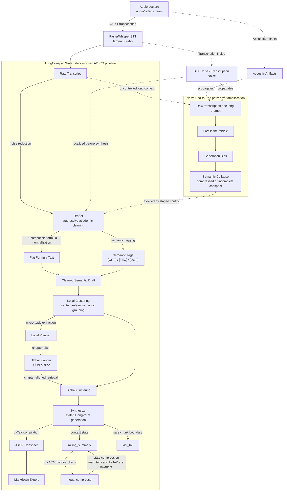

# LongConspectWriter


README.md on english | [README.md на русском](README.ru.md) 

LongConspectWriter is a research prototype of a multi-agent system for **Audio-to-LongConspect Generation (A2LCG)**: translating an unstructured lecture audio stream into a long-form academic conspect in Markdown. The project treats conspect generation not as a single language-model call, but as a sequence of observable stages: transcription, cleaning, semantic normalization, hierarchical planning, topic-aware clustering, synthesis, and export.

The central hypothesis is that long STEM lectures require a decomposed architecture with explicit control over intermediate states. Speech-recognition errors, local acoustic artifacts, and conversational noise should not be passed directly into the final long-form generator: otherwise they amplify context loss and collapse educational facts into a short summary.

The implementation is designed for reproducible local execution. LLM stages run through `llama.cpp` with GGUF weights, and intermediate artifacts are written to disk for manual inspection, ablation studies, and later evaluation.

## Problem Statement: Audio-to-LongConspect Generation (A2LCG)

**Audio-to-LongConspect Generation (A2LCG)** is the task of converting a long audio lecture into a structured academic conspect that preserves definitions, theorems, formulas, examples, and logical dependencies between topics. Unlike ordinary summarization, the target output is not a short overview, but an extended educational text suitable for reading and checking against the lecture material.

A2LCG introduces a specific error class that cannot be reduced to the independent sum of STT and language-model errors. After primary transcription, acoustic artifacts, incorrectly recognized terms, omitted formulas, speech repetitions, and fragments of organizational communication form a noisy textual stream. When such a stream is passed into a long-context LLM, **cascading error accumulation** appears: local transcription defects begin to affect the global structure of the answer.

On long and poorly structured inputs, the **Lost in the middle** effect becomes stronger: the model retains facts located in the middle of the lecture less reliably, especially when they are surrounded by repetitions, false starts, and incomplete formulations. In addition, **Generation bias** appears as a tendency of the generator to quickly complete a coherent output, smooth over heterogeneous material, and replace detailed lecture reconstruction with a stylistically fluent but factually incomplete text.

Therefore, the classical `audio -> transcript -> LLM -> conspect` scheme is unstable for long academic lectures. LongConspectWriter treats A2LCG as a controlled translation task between modalities and structures, where each stage must localize its own error type and pass a more regular state to the next module.

## Why End-to-End Generation Fails

A naive **End-to-End** approach assumes that it is enough to obtain a transcript and send it to an LLM with an instruction to generate a long conspect. This can be acceptable for short and clean inputs, but long STEM lectures produce systematic failures:

- STT noise becomes false terminology, incorrect notation, and broken reasoning;
- speech repetitions increase input length without adding new educational facts;
- the middle of the lecture is statistically less stable in a long context;
- formulas spoken aloud are poorly compatible with embedding models and require intermediate normalization;
- the generator prefers compact exposition and may collapse independent semantic blocks;
- the final Markdown becomes difficult to verify when intermediate artifacts are absent.

This implies an engineering constraint: the A2LCG pipeline must be decomposed into stages, each with an explicit input, output, and set of verifiable invariants.

## LongConspectWriter Method

LongConspectWriter implements a decomposition-first pipeline. The system does not attempt to synthesize the final conspect directly from the raw transcript. Instead, it builds intermediate representations step by step:

- raw transcript with VAD filtering;
- cleaned academic draft with conversational noise removed;
- flat textual formula representation suitable for embedding models;
- semantic tags `[ОПР]`, `[ТЕО]`, `[ФОР]`, `[ПРИМ]`, `[СЛЕД]`;
- local clusters and micro-topics;
- global JSON section plan;
- global clusters aligned with chapters;
- final JSON conspect;
- Markdown export with LaTeX markup.

This design makes it possible to evaluate the system not only by the final Markdown, but also by observable states between agents. This is especially important for A2LCG, where an early-stage error may become visible only after several subsequent transformations.

## System Architecture



#### Drafter

- TODO: describe input artifacts, cleaning invariants, mathematical meaning preservation rules, and rejection criteria for fragments without academic content.
- TODO: define requirements for the flat formula representation used by later embedding-based clustering.

#### Planners

- TODO: describe the division of responsibility between Local Planner and Global Planner.
- TODO: formalize the expected structure of local micro-topics and the global JSON outline.

#### Synthesizer

- TODO: describe the rules for compiling flat mathematics into LaTeX and producing academic Markdown layout.
- TODO: define factual-consistency invariants between global clusters and the final JSON conspect.

#### State Management

- TODO: describe `rolling_summary`, `mega_compressor`, and `last_tail` as mechanisms for stabilizing long-form synthesis.
- TODO: specify the history-compression policy above `1024` tokens and the immunity rule for mathematical tags and LaTeX.

## Deploying LongConspectWriter

### Hardware Requirements

The minimum practically testable configuration is intended for local execution on a consumer NVIDIA GPU:

- NVIDIA GPU with CUDA;
- recommended lower bound: RTX 3050, 8 GB VRAM;
- enough system RAM to load STT, embedding models, and intermediate artifacts;
- local storage for audio files, GGUF weights, and outputs in `data/`.

Q5_K_M is not presented as a separate scientific contribution. It is an engineering compromise between quality and memory consumption: 5-bit quantization through `.models/T-lite-it-2.1-Q5_K_M.gguf` reduces the risk of VRAM spillover on consumer GPUs while preserving local `llama.cpp` inference.

### Software Requirements

- Python `3.12+`
- `uv`
- CUDA-compatible environment for accelerated STT and embedding stages
- local GGUF weights `.models/T-lite-it-2.1-Q5_K_M.gguf`
- FasterWhisper `large-v3-turbo`
- LLM backend: `llama.cpp`

### Installation

```bash
uv sync
```

### Run the Full A2LCG Pipeline

```bash
uv run python __main__.py --action all --path_to_file "data/example-audio/your_lecture.mp3"
```

`all` runs STT, Drafter, clustering/planning, Synthesizer, and Markdown export.

### Run Individual Stages

```bash
uv run python __main__.py --action stt --path_to_file "data/example-audio/your_lecture.mp3"
uv run python __main__.py --action drafter --path_to_file "data/example-transcrib/your_transcript.txt"
uv run python __main__.py --action local_clustering --path_to_file "data/example-transcrib/your_transcript.txt"
uv run python __main__.py --action local_planner --path_to_file "data/example-clusters/example-local-clusters/your_clusters.txt"
uv run python __main__.py --action global_planner --path_to_file "data/example-plan/example-local-plan/your_local_plan.txt"
uv run python __main__.py --action planner --path_to_file "data/example-clusters/example-local-clusters/your_clusters.txt"
uv run python __main__.py --action clustering --path_to_file "data/example-transcrib/your_transcript.txt"
uv run python __main__.py --action global_clustering --global_plan_path "data/example-plan/example-global-plan/your_global_plan.json" --local_clusters_path "data/example-clusters/example-local-clusters/your_clusters.txt"
uv run python __main__.py --action synthesizer --path_to_file "data/example-clusters/example-global-clusters/your_global_clusters.json"
```

The `--config_path` argument exists in the CLI, but custom configuration loading is currently reserved and should not be treated as a production-ready interface.

## CLI Actions

| Action | Input | Output |
| --- | --- | --- |
| `all` | Lecture audio or video file | Full A2LCG pipeline with Markdown export |
| `stt` | Audio or video file | Raw transcript |
| `drafter` | Raw transcript | Cleaned semantic draft |
| `local_clustering` | Cleaned transcript | Local semantic clusters |
| `local_planner` | Local clusters | Micro-topic list |
| `global_planner` | Local plan | JSON chapter outline |
| `planner` | Local clusters | Local and global planning |
| `clustering` | Cleaned transcript | Local clustering, planning, and global clustering |
| `global_clustering` | Global plan JSON + local clusters | Chapter-aligned clusters |
| `synthesizer` | Global clusters JSON | Final JSON conspect |

## Output Artifacts

LongConspectWriter writes timestamped intermediate states. These files are part of the system's research interface: they make it possible to localize cascading A2LCG errors and run stage-wise ablations.

| Directory | Artifact |
| --- | --- |
| `data/example-transcrib/` | raw transcripts after FasterWhisper |
| `data/example-conspect/` | cleaned drafts and Synthesizer JSON outputs |
| `data/example-clusters/example-local-clusters/` | local semantic clusters |
| `data/example-plan/example-local-plan/` | local plans and micro-topics |
| `data/example-plan/example-global-plan/` | global JSON plans |
| `data/example-clusters/example-global-clusters/` | clusters aligned with chapters |
| `data/example-final-conspect/` | final Markdown export |

## Configuration

The main configs are located in `src/configs/config-agents/`:

- `stt/config_stt.yaml` - FasterWhisper, VAD, and transcription parameters;
- `drafter/config_drafter.yaml` - model, generation parameters, and Drafter prompt path;
- `local_planner/config_local_planner.yaml` - Local Planner parameters;
- `global_planner/config_global_planner.yaml` - Global Planner parameters;
- `synthesizer/config_synthesizer.yaml` - Synthesizer parameters;
- `*/prompt_*.yaml` - agent system prompts and user templates.

Current default configuration:

| Component | Default |
| --- | --- |
| STT | `large-v3-turbo` |
| LLM backend | `llama.cpp` |
| GGUF model | `.models/T-lite-it-2.1-Q5_K_M.gguf` |
| LLM context | `n_ctx: 8192` |
| Local embeddings | `cointegrated/rubert-tiny2` |
| Global embeddings | `intfloat/multilingual-e5-small` |

Additional dataclass config definitions live in `src/configs/ai_configs.py`; undesirable generation fragments are listed in `src/configs/bad_words.py`.

## Evaluation Methodology

A2LCG should be evaluated stage by stage, not only through the final Markdown. This makes it possible to separate STT errors from planning errors and synthesis errors.

| Stage | Suggested metrics and checks |
| --- | --- |
| STT | WER/CER when a reference transcript exists; manual checking of terms, named entities, and spoken formulas |
| Drafter | semantic preservation; conversational-noise removal; correctness of flat formula representation; presence of `[ОПР]`, `[ТЕО]`, `[ФОР]` tags |
| Planners | local-cluster coherence; global-plan completeness; absence of undesired merging between independent topics |
| Synthesizer | factual consistency; LaTeX validity; structural completeness; absence of semantic block collapse |
| Full A2LCG | preservation of critical educational facts; no degradation of the long conspect into a short summary; human review or LLM-as-a-Judge with a fixed rubric |

For final evaluation, a combination of automatic checks and expert validation is preferred. ROUGE-like metrics can be useful for some individual stages, but they poorly reflect the quality of academic synthesis, where correct reformulation is often more important than surface n-gram overlap.

## Limitations

- The current system is primarily tuned for Russian STEM lectures.
- Output quality depends on audio quality, diction, terminology density, and FasterWhisper robustness in the target domain.
- The system does not include a full hallucination detector that formally checks the final Markdown against the original audio or transcript.
- Current embedding models and clustering rules may be insufficient for lectures with complex cross-topic returns.
- `mega_compressor` reduces context pressure, but it is not a provably lossless mechanism for every type of mathematical material.
- Custom `--config_path` in the CLI is reserved and does not yet implement a full external-configuration system.

## Reproducibility Notes

For reproducible experiments, record:

- repository version and `uv.lock`;
- GGUF weights and quantization type `Q5_K_M`;
- STT model `large-v3-turbo` and VAD parameters;
- YAML configs for all agents;
- prompt files;
- input audio file or reference transcript;
- all intermediate artifacts from `data/`;
- generation parameters, including `max_tokens`, `temperature`, `repeat_penalty`, `min_p`, and `presence_penalty`.

Intermediate states should be stored together with the final Markdown: in A2LCG, they are not a byproduct, but the basis for diagnosing cascading error accumulation.

## Repository Structure

```text
src/
  agents/      # Drafter, Planners, Synthesizer
  core/        # STT, clustering, pipeline, utilities, Markdown export
  configs/     # dataclasses, prompts, bad words, YAML configs
  tests/       # test-oriented config fixtures

data/
  example-audio/
  example-transcrib/
  example-conspect/
  example-plan/
  example-clusters/
  example-final-conspect/

.models/
  # local GGUF weights for llama.cpp
```

## Citation

```bibtex
@misc{longconspectwriter2026,
  title  = {LongConspectWriter: A Multi-Agent Pipeline for Audio-to-LongConspect Generation},
  author = {TODO},
  year   = {2026},
  note   = {Research prototype; replace with final arXiv metadata}
}
```

## License

This repository is released under the [MIT License](LICENSE).
