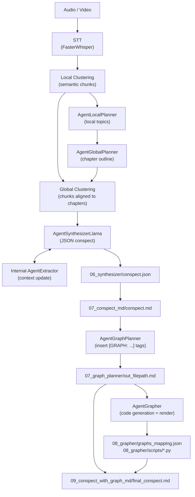

# LongConspectWriter: Local Multi-Agent System For Generating Long Academic Conspect

README.md in English | [README.ru.md in Russian](README.ru.md)

## Table of Contents

- [System Architecture](#system-architecture)
- [Installation and Run](#installation-and-run)
- [CLI Actions](#cli-actions)
- [Output Artifacts](#output-artifacts)
- [Configuration](#configuration)
- [Evaluation](#evaluation)
- [Cases](#cases)

## System Architecture

LongConspectWriter turns audio or video lectures into Markdown conspects. The pipeline transcribes the recording with FasterWhisper, builds local semantic clusters, creates a global lecture outline, assigns transcript fragments to chapters, and synthesizes an academic JSON conspect. During synthesis, the internal `AgentExtractor` updates the lecture context so that later chunks do not duplicate entities and topics that have already been extracted.

After synthesis, the JSON is converted to Markdown. A separate `AgentGraphPlanner` analyzes the finished Markdown and inserts `[GRAPH: ...]` placeholders only where visualization is useful and can be generated with code. Then `AgentGrapher` finds these placeholders, generates Python scripts for matplotlib/networkx, renders images, and assembles the final Markdown with local asset links.



### Main Agents and Components

| Component | Responsibility |
| --- | --- |
| `FasterWhisper` | Transcribes audio/video into text in a separate process. |
| `SemanticLocalClusterizer` | Splits the transcript into local semantic clusters. |
| `AgentLocalPlanner` | Builds local topics from clusters. |
| `AgentGlobalPlanner` | Combines local topics into a global chapter outline. |
| `SemanticGlobalClusterizer` | Assigns local clusters to chapters from the global outline. |
| `AgentSynthesizerLlama` | Generates an academic JSON conspect and uses the extractor for context. |
| `AgentExtractor` | Extracts entities from the current synthesis chunk to deduplicate later chunks. |
| `AgentGraphPlanner` | Analyzes the finished Markdown and inserts `[GRAPH: ...]` placeholders. |
| `AgentGrapher` | Generates Python visualization code, runs it with `MPLBACKEND=Agg`, and saves the graph mapping. |

## Installation and Run

### Dependencies

- Python `3.12+`
- `uv`
- CUDA-compatible environment for local model execution
- GGUF models for LLM agents

Dependencies are defined in `pyproject.toml`. PyTorch uses the CUDA 12.1 index:

```toml
[[tool.uv.index]]
url = "https://download.pytorch.org/whl/cu121"
```

LLM agents support two ways to load GGUF models:

- `repo_id` + `filename` - the model is downloaded with `llama_cpp.Llama.from_pretrained()` into `.models/`;
- `model_path` - an already downloaded local file is used.

With the current configs, T-lite and Qwen Coder are loaded from HuggingFace into `.models/`. If the `.models/` directory does not exist, it is created automatically.

### Run the Full Pipeline

```bash
uv run python __main__.py --action all --path_to_file "data/example-audio/your_lecture.mp3"
```

`all` runs the full scenario:

```text
STT -> local clustering -> local planner -> global planner -> global clustering -> synthesizer -> JSON to Markdown -> graph planner -> grapher -> final Markdown with images
```

### Run Individual Pipeline Stages

```bash
uv run python __main__.py --action stt --path_to_file "data/example-audio/your_lecture.mp3"
uv run python __main__.py --action local_clustering --path_to_file "data/example-transcrib/your_transcript.json"
uv run python __main__.py --action local_planner --path_to_file "data/example-clusters/example-local-clusters/your_clusters.json"
uv run python __main__.py --action global_planner --path_to_file "data/example-plan/example-local-plan/your_local_plan.json"
uv run python __main__.py --action planner --path_to_file "data/example-clusters/example-local-clusters/your_clusters.json"
uv run python __main__.py --action global_clustering --global_plan_path "data/example-plan/example-global-plan/your_global_plan.json" --local_clusters_path "data/example-clusters/example-local-clusters/your_clusters.json"
uv run python __main__.py --action clustering --path_to_file "data/example-transcrib/your_transcript.json"
uv run python __main__.py --action synthesizer --path_to_file "data/example-clusters/example-global-clusters/your_global_clusters.json"
uv run python __main__.py --action convert_json_to_md --path_to_file "data/runs/YYYY.MM.DD/HH.MM.SS/06_synthesizer/conspect.json"
uv run python __main__.py --action graph_planner --path_to_file "data/runs/YYYY.MM.DD/HH.MM.SS/07_conspect_md/conspect.md"
uv run python __main__.py --action grapher --path_to_file "data/runs/YYYY.MM.DD/HH.MM.SS/07_graph_planner/out_filepath.md"
uv run python __main__.py --action add_graph_in_conspect --path_to_file "data/runs/YYYY.MM.DD/HH.MM.SS/07_graph_planner/out_filepath.md" --graphs_path "data/runs/YYYY.MM.DD/HH.MM.SS/08_grapher/graphs_mapping.json"
```

Each CLI run creates a new session directory under `data/runs/<date>/<time>/`. If you run stages manually, pass paths to artifacts from the intended session explicitly.

## CLI Actions

Each pipeline component can be run separately for testing and debugging.

| Action | Input | Output |
| --- | --- | --- |
| `all` | Audio/video | Final Markdown conspect with images |
| `stt` | Audio/video | `01_stt/out_filepath.json` with raw transcription |
| `local_clustering` | STT transcript | `02_local_clusters/out_filepath.json` |
| `local_planner` | Local clusters | `03_local_planners/out_filepath.json` |
| `global_planner` | Local topics | `04_global_planners/out_filepath.json` |
| `planner` | Local clusters | Global outline via `local_planner -> global_planner` |
| `global_clustering` | Global outline + local clusters | `05_global_clusters/out_filepath.json` |
| `clustering` | STT transcript | Global clusters via `local_clustering -> planner -> global_clustering` |
| `synthesizer` | Global clusters | `06_synthesizer/conspect.json` |
| `convert_json_to_md` | JSON conspect | `07_conspect_md/conspect.md` |
| `graph_planner` | Markdown conspect | `07_graph_planner/out_filepath.md` with added `[GRAPH: ...]` tags |
| `grapher` | Markdown with `[GRAPH: ...]` | `08_grapher/graphs_mapping.json`, Python scripts, and PNG graphs |
| `add_graph_in_conspect` | Markdown with `[GRAPH: ...]` + `graphs_mapping.json` | `09_conspect_with_graph_md/final_conspect.md` |

## Output Artifacts

Intermediate artifacts are created automatically in the current session directory:

```text
data/runs/YYYY.MM.DD/HH.MM.SS/
```

Main stage directories:

- `01_stt/` - raw transcription after FasterWhisper.
- `02_local_clusters/` - local semantic clusters.
- `03_local_planners/` - local topics.
- `04_global_planners/` - global chapter outline.
- `05_global_clusters/` - clusters assigned to global chapters.
- `05.1_extractor/` - JSONL output from the internal extractor during synthesis.
- `06_synthesizer/` - JSON conspect.
- `07_conspect_md/` - Markdown conspect before final graph replacement.
- `07_graph_planner/` - Markdown after `[GRAPH: ...]` insertion and graph planner JSONL chunk responses.
- `08_grapher/` - `graphs_mapping.json` and generated graphs.
- `08_grapher/scripts/` - Python scripts used to render graphs.
- `09_conspect_with_graph_md/` - final Markdown conspect.
- `09_conspect_with_graph_md/assets/` - local images copied for the final Markdown.

## Configuration

The main pipeline config is located at `src/configs/config_pipeline.yaml`:

| Key | Meaning |
| --- | --- |
| `output_dir` | Base directory for session artifacts. Default: `data/`. |
| `lecture_theme` | Lecture theme used for prompt selection. Currently `math`; if a theme is missing, the agent falls back to `universal`. |

Agent configs are located in `src/configs/config-agents/`, and clustering configs are located in `src/configs/config-clusterizer/`.

Current default configuration:

| Component | Default |
| --- | --- |
| STT | `large-v3-turbo` |
| Local/Global Planner LLM | `t-tech/T-lite-it-2.1-GGUF`, `T-lite-it-2.1-Q5_K_M.gguf` |
| Synthesizer LLM | `t-tech/T-lite-it-2.1-GGUF`, `T-lite-it-2.1-Q5_K_M.gguf` |
| Extractor LLM | `t-tech/T-lite-it-2.1-GGUF`, `T-lite-it-2.1-Q5_K_M.gguf` |
| Graph Planner LLM | `t-tech/T-lite-it-2.1-GGUF`, `T-lite-it-2.1-Q5_K_M.gguf` |
| Grapher LLM | `Qwen/Qwen2.5-Coder-7B-Instruct-GGUF`, `qwen2.5-coder-7b-instruct-q6_k.gguf` |
| Local embeddings | `cointegrated/rubert-tiny2` |
| Global embeddings | `intfloat/multilingual-e5-small` |

Main configuration files:

| Component | Config | Prompt / Schema |
| --- | --- | --- |
| STT | `src/configs/config-agents/stt/config_stt.yaml` | `src/configs/config-agents/stt/prompt_stt.yaml` |
| Extractor | `src/configs/config-agents/extractor/config_extractor_planner.yaml` | `prompt_extractor.yaml`, `agent_extractor_scheme_output.json` |
| Local Planner | `src/configs/config-agents/local_planner/config_local_planner.yaml` | `prompt_local_planner.yaml` |
| Global Planner | `src/configs/config-agents/global_planner/config_global_planner.yaml` | `prompt_global_planner.yaml`, `agent_global_planner_scheme_output.json` |
| Synthesizer | `src/configs/config-agents/synthesizer/config_synthesizer.yaml` | `prompt_synthesizer.yaml` |
| Graph Planner | `src/configs/config-agents/graph_planner/config_graph_planner.yaml` | `prompt_graph_planner.yaml`, `agent_grapher_planner_scheme_output.json` |
| Grapher | `src/configs/config-agents/grapher/config_grapher.yaml` | `prompt_grapher.yaml` |
| Local Clusterizer | `src/configs/config-clusterizer/config_local_clusterizer.yaml` | - |
| Global Clusterizer | `src/configs/config-clusterizer/config_global_clusterizer.yaml` | - |

Additional dataclass configuration descriptions are located in `src/configs/configs.py`.

## Evaluation

...

## Cases

Examples of conspects generated with LongConspectWriter are located in the [examples](examples) directory.

Current examples are located in [examples/v1.5](examples/v1.5).
