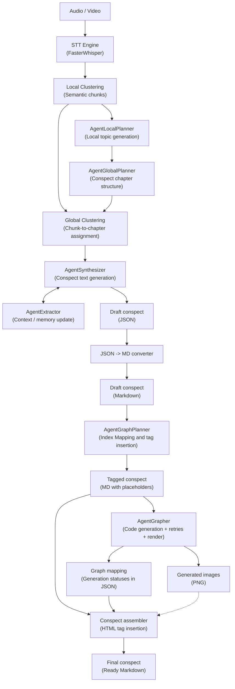

# LongConspectWriter: Structured Note-Taking from 10,000+ Token Lectures Using Local 8B LLMs

README.md in English | [README.ru.md на русском](README.ru.md)

LongConspectWriter is a local multi-agent system for automatically generating structured academic notes from audio and video lectures. The system runs entirely offline on a consumer GPU: it transcribes the recording, builds a semantic structure, synthesizes a note with definitions, theorems, and proofs in Markdown format, and automatically generates visualizations where appropriate.

The project was created as part of a bachelor's thesis and is focused on STEM lectures.

## Table of Contents

- [System Architecture](#system-architecture)
- [Requirements](#requirements)
- [Installation and Run](#installation-and-run)
- [CLI Actions](#cli-actions)
- [Output Artifacts](#output-artifacts)
- [Configuration](#configuration)
- [Evaluation](#evaluation)
- [Cases](#cases)

## System Architecture

LongConspectWriter turns audio or video lectures into a Markdown conspect. The pipeline transcribes the recording with FasterWhisper, builds local semantic clusters, creates a global lecture outline, assigns transcript fragments to chapters, and synthesizes an academic JSON conspect. During synthesis, the internal `AgentExtractor` updates the lecture context so that later chunks do not duplicate entities and topics that have already been extracted.

After synthesis, the JSON is converted to Markdown. A separate `AgentGraphPlanner` analyzes the finished Markdown and inserts `[GRAPH_TYPE: ...]` placeholders where a visualization is useful and can be generated with code. Then `AgentGrapher` finds these placeholders, generates Python scripts for visualizations, renders images with retries on errors, and saves the graph mapping. The final `add_graph_in_conspect` stage replaces placeholders with HTML blocks that point to local images from `assets/`.



### Main Agents and Components

| Component | Responsibility |
| --- | --- |
| `FasterWhisper` | Transcribes audio/video into text in a separate process. |
| `SemanticLocalClusterizer` | Splits the transcript into local semantic clusters. |
| `AgentLocalPlanner` | Builds local topics from clusters. |
| `AgentGlobalPlanner` | Combines local topics into a global chapter outline. |
| `SemanticGlobalClusterizer` | Assigns local clusters to chapters from the global outline. |
| `AgentSynthesizerLlama` | Generates an academic JSON conspect and uses the extractor for context. |
| `AgentExtractor` | Extracts entities from the current synthesis chunk to deduplicate later chunks. |
| `AgentGraphPlanner` | Analyzes the finished Markdown and inserts `[GRAPH_TYPE: ...]` placeholders by matching normalized quotes. |
| `AgentGrapher` | Generates Python visualization code, runs it with `MPLBACKEND=Agg`, retries with higher temperature, and saves the graph mapping. |
| `add_graph_in_conspect` | Copies successful PNG files into the final `assets/` directory and replaces placeholders with HTML image blocks. |

## Requirements

| Component | Minimum | Recommended |
| --- | --- | --- |
| GPU VRAM | 8 GB | 12+ GB |
| RAM | 16 GB | 32 GB |
| Python | 3.12+ | 3.12+ |
| CUDA | 12.1 | 12.1+ |
| Disk space | ~10 GB (models) | ~20 GB |

> The system was tested on NVIDIA GPUs with CUDA 12.1. CPU-only mode is not supported due to inference speed requirements.

## Installation and Run

### Dependencies

- Python `3.12+`
- `uv`
- CUDA-compatible environment for local model execution
- GGUF models for LLM agents

Dependencies are defined in `pyproject.toml`. PyTorch uses the CUDA 12.1 index:

```toml
[[tool.uv.index]]
url = "https://download.pytorch.org/whl/cu121"
```

LLM agents support two ways to load GGUF models:

- `repo_id` + `filename` — the model is downloaded with `llama_cpp.Llama.from_pretrained()` into `.models/`;
- `model_path` — an already downloaded local file is used.

With the current configs, T-lite and Qwen Coder are loaded from HuggingFace into `.models/`. If the `.models/` directory does not exist, it is created automatically.

### Run the Full Pipeline

```bash
uv run python __main__.py --action all --path_to_file "data/example-audio/your_lecture.mp3"
```

`all` runs the full scenario:

```text
STT -> local clustering -> local planner -> global planner -> global clustering -> synthesizer -> JSON to Markdown -> graph planner -> grapher -> final Markdown with images
```

### Run Individual Pipeline Stages

```bash
uv run python __main__.py --action stt --path_to_file "data/example-audio/your_lecture.mp3"
uv run python __main__.py --action local_clustering --path_to_file "data/example-transcrib/your_transcript.json"
uv run python __main__.py --action local_planner --path_to_file "data/example-clusters/example-local-clusters/your_clusters.json"
uv run python __main__.py --action global_planner --path_to_file "data/example-plan/example-local-plan/your_local_plan.json"
uv run python __main__.py --action planner --path_to_file "data/example-clusters/example-local-clusters/your_clusters.json"
uv run python __main__.py --action global_clustering --global_plan_path "data/example-plan/example-global-plan/your_global_plan.json" --local_clusters_path "data/example-clusters/example-local-clusters/your_clusters.json"
uv run python __main__.py --action clustering --path_to_file "data/example-transcrib/your_transcript.json"
uv run python __main__.py --action synthesizer --path_to_file "data/example-clusters/example-global-clusters/your_global_clusters.json"
uv run python __main__.py --action convert_json_to_md --path_to_file "data/runs/YYYY.MM.DD/HH.MM.SS/06_synthesizer/conspect.json"
uv run python __main__.py --action graph_planner --path_to_file "data/runs/YYYY.MM.DD/HH.MM.SS/07_conspect_md/conspect.md"
uv run python __main__.py --action grapher --path_to_file "data/runs/YYYY.MM.DD/HH.MM.SS/08_graph_planner/out_filepath.md"
uv run python __main__.py --action add_graph_in_conspect --path_to_file "data/runs/YYYY.MM.DD/HH.MM.SS/08_graph_planner/out_filepath.md" --graphs_path "data/runs/YYYY.MM.DD/HH.MM.SS/09_grapher/graphs_mapping.json"
```

Each CLI run creates a new session directory under `data/runs/<date>/<time>/`. If you run stages manually, pass paths to artifacts from the intended session explicitly.

## CLI Actions

Each pipeline component can be run separately for testing and debugging.

| Action | Input | Output |
| --- | --- | --- |
| `all` | Audio/video | Final Markdown conspect with images |
| `stt` | Audio/video | `01_stt/out_filepath.json` with raw transcription |
| `local_clustering` | STT transcript | `02_local_clusters/out_filepath.json` |
| `local_planner` | Local clusters | `03_local_planners/out_filepath.json` |
| `global_planner` | Local topics | `04_global_planners/out_filepath.json` |
| `planner` | Local clusters | Global outline via `local_planner -> global_planner` |
| `global_clustering` | Global outline + local clusters | `05_global_clusters/out_filepath.json` |
| `clustering` | STT transcript | Global clusters via `local_clustering -> planner -> global_clustering` |
| `synthesizer` | Global clusters | `06_synthesizer/conspect.json` |
| `convert_json_to_md` | JSON conspect | `07_conspect_md/conspect.md` |
| `graph_planner` | Markdown conspect | `08_graph_planner/out_filepath.md` with added `[GRAPH_TYPE: ...]` and `08_graph_planner/out_filepath.jsonl` |
| `grapher` | Markdown with `[GRAPH_TYPE: ...]` | `09_grapher/graphs_mapping.json`, `09_grapher/scripts/*.py`, `09_grapher/assets/*.png` |
| `add_graph_in_conspect` | Markdown with `[GRAPH_TYPE: ...]` + `graphs_mapping.json` | `10_conspect_with_graph_md/final_conspect.md` |

## Output Artifacts

Intermediate artifacts are created automatically in the current session directory:

```text
data/runs/YYYY.MM.DD/HH.MM.SS/
```

Main stage directories:

- `01_stt/` — raw transcription after FasterWhisper.
- `02_local_clusters/` — local semantic clusters.
- `03_local_planners/` — local topics.
- `04_global_planners/` — global chapter outline.
- `05_global_clusters/` — clusters assigned to global chapters.
- `05.1_extractor/` — JSONL output from the internal extractor during synthesis.
- `06_synthesizer/` — JSON conspect.
- `07_conspect_md/` — Markdown conspect before final graph replacement.
- `08_graph_planner/` — Markdown after `[GRAPH_TYPE: ...]` insertion and graph planner JSONL chunk responses.
- `09_grapher/` — `graphs_mapping.json` and generated graphs.
- `09_grapher/assets/` — PNG graphs created by `AgentGrapher`.
- `09_grapher/scripts/` — Python scripts used to render graphs.
- `10_conspect_with_graph_md/` — final Markdown conspect.
- `10_conspect_with_graph_md/assets/` — local images copied for the final Markdown.

## Configuration

The main pipeline config is located at `src/configs/config_pipeline.yaml`:

| Key | Meaning |
| --- | --- |
| `output_dir` | Base directory for session artifacts. Default: `data/`. |
| `lecture_theme` | Lecture theme used for prompt selection. Currently `math`; if a theme is missing, the agent falls back to `universal`. |

Agent configs are located in `src/configs/config-agents/`, and clustering configs are located in `src/configs/config-clusterizer/`.

Current default configuration:

| Component | Default |
| --- | --- |
| STT | `large-v3-turbo` |
| Local/Global Planner LLM | `t-tech/T-lite-it-2.1-GGUF`, `T-lite-it-2.1-Q5_K_M.gguf` |
| Synthesizer LLM | `t-tech/T-lite-it-2.1-GGUF`, `T-lite-it-2.1-Q5_K_M.gguf` |
| Extractor LLM | Uses the same loaded model as the synthesizer |
| Graph Planner LLM | `t-tech/T-lite-it-2.1-GGUF`, `T-lite-it-2.1-Q5_K_M.gguf` |
| Grapher LLM | `Qwen/Qwen2.5-Coder-7B-Instruct-GGUF`, `qwen2.5-coder-7b-instruct-q6_k.gguf` |
| Local embeddings | `cointegrated/rubert-tiny2` |
| Global embeddings | `intfloat/multilingual-e5-small` |

Main configuration files:

| Component | Config | Prompt / Schema |
| --- | --- | --- |
| STT | `src/configs/config-agents/stt/config_stt.yaml` | `src/configs/config-agents/stt/prompt_stt.yaml` |
| Extractor | `src/configs/config-agents/extractor/config_extractor_planner.yaml` | `prompt_extractor.yaml`, `agent_extractor_scheme_output.json` |
| Local Planner | `src/configs/config-agents/local_planner/config_local_planner.yaml` | `prompt_local_planner.yaml` |
| Global Planner | `src/configs/config-agents/global_planner/config_global_planner.yaml` | `prompt_global_planner.yaml`, `agent_global_planner_scheme_output.json` |
| Synthesizer | `src/configs/config-agents/synthesizer/config_synthesizer.yaml` | `prompt_synthesizer.yaml` |
| Graph Planner | `src/configs/config-agents/graph_planner/config_graph_planner.yaml` | `prompt_graph_planner.yaml`, `agent_grapher_planner_scheme_output.json` |
| Grapher | `src/configs/config-agents/grapher/config_grapher.yaml` | `prompt_grapher.yaml` |
| Local Clusterizer | `src/configs/config-clusterizer/config_local_clusterizer.yaml` | — |
| Global Clusterizer | `src/configs/config-clusterizer/config_global_clusterizer.yaml` | — |

Additional visualizer parameters:

| Component | Config key | Meaning |
| --- | --- | --- |
| `AgentGraphPlanner` | `available_lib` | List of libraries the graph planner accounts for when preparing the graph task. |
| `AgentGrapher` | `available_lib` | List of libraries available to the LLM coder during Python script generation. |
| `AgentGrapher` | `re_try_count` | Number of code generation and execution attempts. Currently `3`. |
| `AgentGrapher` | `step_temperature` | Temperature increase step between retries. Currently `0.1`. |

Additional dataclass configuration descriptions are located in `src/configs/configs.py`.

## Evaluation

Conspect quality was evaluated using an LLM judge across 5 academic note-taking paradigms (see [examples/llm-as-a-judge](examples/llm-as-a-judge) for prompts and verdicts).

The system was compared against a baseline: SOTA LLM (Gemini 3 Pro) with a detailed prompt describing all academic note-taking requirements (see [examples/big_LLMS](examples/big_LLMS)).

Dataset: 10 lectures across 5 subject domains (calculus, machine learning, algorithms, general biology, general chemistry). See [examples/dataset.md](examples/dataset.md) for details.

> Results will be added after testing is complete.

## Cases

Examples of conspects generated with LongConspectWriter are located in the [examples](examples) directory.

Current filled examples are in [examples/v2.0](examples/v2.0):