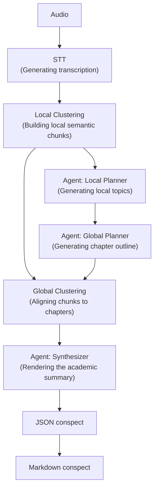

# LongConspectWriter: Local Multi-Agent System For Generating Long Academic Conspect

[README.ru.md in Russian](README.ru.md) | README.md in English

## Table of Contents
- [System Architecture](#system-architecture)
- [LongConspectWriter Deployment](#longconspectwriter-deployment)
- [CLI Actions](#cli-actions)
- [Output Artifacts](#output-artifacts)
- [Configuration](#configuration)
- [Evaluation](#evaluation)
- [Cases](#cases)

## System Architecture



## LongConspectWriter Deployment

### Dependencies

- Python `3.12+`
- `uv`
- CUDA-compatible environment
- local GGUF weights

### Run the full pipeline

```bash
uv run python __main__.py --action all --path_to_file "data/example-audio/your_lecture.mp3"
```

`all` runs the full pipeline.

### Run individual stages pipeline

```bash
uv run python __main__.py --action stt --path_to_file "data/example-audio/your_lecture.mp3"
uv run python __main__.py --action local_clustering --path_to_file "data/example-transcrib/your_transcript.txt"
uv run python __main__.py --action local_planner --path_to_file "data/example-clusters/example-local-clusters/your_clusters.txt"
uv run python __main__.py --action global_planner --path_to_file "data/example-plan/example-local-plan/your_local_plan.txt"
uv run python __main__.py --action planner --path_to_file "data/example-clusters/example-local-clusters/your_clusters.txt"
uv run python __main__.py --action clustering --path_to_file "data/example-transcrib/your_transcript.txt"
uv run python __main__.py --action global_clustering --global_plan_path "data/example-plan/example-global-plan/your_global_plan.json" --local_clusters_path "data/example-clusters/example-local-clusters/your_clusters.txt"
uv run python __main__.py --action synthesizer --path_to_file "data/example-clusters/example-global-clusters/your_global_clusters.json"
```

## CLI Actions

Each pipeline component can be run separately for testing.

Table with all available commands:

| Action | Input | Output |
| --- | --- | --- |
| `all` | Audio | Conspect in `.md` format |
| `stt` | Audio | Raw transcription |
| `drafter` | Raw transcription | High-quality transcription |
| `local_clustering` | High-quality transcription | Local clusters |
| `local_planner` | Local clusters | Local topics |
| `global_planner` | Local topics | Global topics |
| `planner` | Local clusters | Global topics |
| `global_clustering` | Global topics + local clusters | Clusters linked to chapters |
| `synthesizer` | Global clusters | JSON conspect |
| `clustering` | High-quality transcription | Global topics |

## Output Artifacts

LongConspectWriter generates intermediate artifacts automatically as the pipeline runs.  
They are stored in the current session directory and organized by stage:

- `01_stt/` - raw transcription after FasterWhisper
- `02_local_clusters/` - local clusters
- `03_local_planners/` - local topics
- `04_global_planners/` - chapter outline
- `05_global_clusters/` - global clusters
- `06_synthesizer/` - JSON conspect
- `07_conspect_md/` - final Markdown conspect

## Configuration

The main configs are located in `src/configs/config-agents/`:

Current default configuration:

| Component | Default |
| --- | --- |
| STT | `large-v3-turbo` |
| LLM model | `.models/T-lite-it-2.1-Q5_K_M.gguf` |
| Local embeddings | `cointegrated/rubert-tiny2` |
| Global embeddings | `intfloat/multilingual-e5-small` |

Additional dataclass configuration descriptions are located in `src/configs/ai_configs.py`.

**Local GGUF weights must be downloaded separately and saved to the `.models` directory. In the configs under `src/configs/config-agents/`, specify the path to the weights for each agent in the corresponding `config_agentname.yaml` file.**

## Evaluation
...

## Cases

Examples of conspects generated with LongConspectWriter can be found in the [examples](examples) directory.

Current examples are located in: [examples/v1.0](examples/v1.0)
