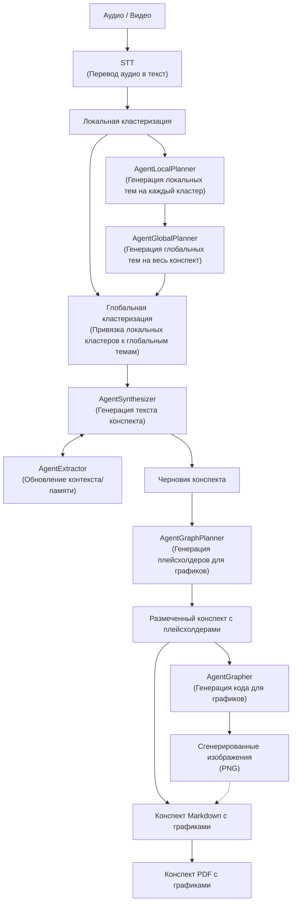

# LongConspectWriter: Structured Conspect from 10,000+ Token Lectures Using Local 8B LLMs

[README.md in english](https://github.com/m4deme1ns4ne/LongConspectWriter#longconspectwriter-structured-note-taking-from-10000-token-lectures-using-local-8b-llms) | README.md на русском

LongConspectWriter — локальная мультиагентная система для автоматического создания структурированных академических конспектов из аудио и видео лекций. Система работает полностью офлайн на потребительском GPU: транскрибирует запись, строит семантическую структуру, синтезирует конспект с определениями, теоремами и доказательствами в формате Markdown, и автоматически генерирует визуализации там, где они уместны.

Проект создан в рамках ВКР и ориентирован на STEM-лекции.

## Оглавление

- [Архитектура системы](#архитектура-системы)
- [Требования](#требования)
- [Установка и запуск](#установка-и-запуск)
- [CLI-действия](#cli-действия)
- [Выходные артефакты](#выходные-артефакты)
- [Конфигурация](#конфигурация)
- [Evaluation](#evaluation)

## Архитектура системы

LongConspectWriter превращает аудио или видео лекции в PDF-конспект. Пайплайн транскрибирует запись через FasterWhisper, строит локальные семантические кластеры, собирает глобальный план лекции, привязывает фрагменты транскрипта к главам и синтезирует академический JSON-конспект. Во время синтеза внутренний `AgentExtractor` обновляет контекст лекции, чтобы следующие чанки не дублировали уже извлечённые сущности и темы.

После синтеза JSON конвертируется в Markdown. Отдельный `AgentGraphPlanner` анализирует готовый Markdown и вставляет `[GRAPH_TYPE: ...]`-плейсхолдеры там, где визуализация полезна и может быть сгенерирована кодом. Затем `AgentGrapher` находит эти плейсхолдеры, генерирует Python-скрипты для визуализаций, рендерит изображения с ретраями при ошибках и сохраняет mapping графиков. Этап `add_graph_in_conspect` заменяет плейсхолдеры HTML-блоками с локальными изображениями из `assets/`. Финальный этап `convert_md_to_pdf` конвертирует Markdown с графиками и LaTeX-формулами в PDF через Playwright + MathJax.



### Основные агенты и компоненты

| Component | Responsibility |
| --- | --- |
| `FasterWhisper` | Транскрибирует аудио/видео в текст в отдельном процессе. |
| `SemanticLocalClusterizer` | Делит транскрипт на локальные семантические кластеры. |
| `AgentLocalPlanner` | Строит локальные темы по кластерам. |
| `AgentGlobalPlanner` | Собирает локальные темы в глобальный план глав. |
| `SemanticGlobalClusterizer` | Привязывает локальные кластеры к главам глобального плана. |
| `AgentSynthesizerLlama` | Генерирует академический JSON-конспект и использует extractor для контекста. |
| `AgentExtractor` | Извлекает сущности из текущего чанка синтеза для дедупликации следующих чанков. |
| `AgentGraphPlanner` | Анализирует готовый Markdown и вставляет `[GRAPH_TYPE: ...]`-плейсхолдеры по цитатам через нормализованный поиск. |
| `AgentGrapher` | Генерирует Python-код визуализации, запускает его через `MPLBACKEND=Agg`, делает ретраи с повышением температуры и сохраняет mapping графиков. |
| `add_graph_in_conspect` | Копирует успешные PNG в финальные `assets/` и заменяет плейсхолдеры HTML-блоками с изображениями. |
| `convert_md_to_pdf` | Конвертирует финальный Markdown в PDF через Playwright: рендерит HTML с MathJax для формул и сохраняет постраничный A4-документ. |

## Установка и запуск

### Зависимости

- Python `3.12+`
- `uv`

> Система тестировалась на GeForce RTX 3050 8gb

```toml
[[tool.uv.index]]
url = "https://download.pytorch.org/whl/cu121"
```

LLM-агенты поддерживают два способа загрузки GGUF:

- `repo_id` + `filename` — модель скачивается через `llama_cpp.Llama.from_pretrained()` в `.models/`;
- `model_path` — используется уже скачанный локальный файл.

Если папки `.models/` нет, она создаётся автоматически.

### Запуск полного пайплайна

```bash
uv run python __main__.py --action all --path_to_file "data/example-audio/your_lecture.mp3"
```

`all` запускает полный сценарий:

```text
STT -> local clustering -> local planner -> global planner -> global clustering -> synthesizer -> JSON to Markdown -> graph planner -> grapher -> final Markdown with images -> PDF
```

### Запуск отдельных стадий

```bash
uv run python __main__.py --action stt --path_to_file "data/example-audio/your_lecture.mp3"
uv run python __main__.py --action local_clustering --path_to_file "data/example-transcrib/your_transcript.json"
uv run python __main__.py --action local_planner --path_to_file "data/example-clusters/example-local-clusters/your_clusters.json"
uv run python __main__.py --action global_planner --path_to_file "data/example-plan/example-local-plan/your_local_plan.json"
uv run python __main__.py --action planner --path_to_file "data/example-clusters/example-local-clusters/your_clusters.json"
uv run python __main__.py --action global_clustering --global_plan_path "data/example-plan/example-global-plan/your_global_plan.json" --local_clusters_path "data/example-clusters/example-local-clusters/your_clusters.json"
uv run python __main__.py --action clustering --path_to_file "data/example-transcrib/your_transcript.json"
uv run python __main__.py --action synthesizer --path_to_file "data/example-clusters/example-global-clusters/your_global_clusters.json"
uv run python __main__.py --action convert_json_to_md --path_to_file "data/runs/YYYY.MM.DD/HH.MM.SS/06_synthesizer/conspect.json"
uv run python __main__.py --action graph_planner --path_to_file "data/runs/YYYY.MM.DD/HH.MM.SS/07_conspect_md/conspect.md"
uv run python __main__.py --action grapher --path_to_file "data/runs/YYYY.MM.DD/HH.MM.SS/08_graph_planner/out_filepath.md"
uv run python __main__.py --action add_graph_in_conspect --path_to_file "data/runs/YYYY.MM.DD/HH.MM.SS/08_graph_planner/out_filepath.md" --graphs_path "data/runs/YYYY.MM.DD/HH.MM.SS/09_grapher/graphs_mapping.json"
uv run python __main__.py --action convert_md_to_pdf --path_to_file "data/runs/YYYY.MM.DD/HH.MM.SS/10_conspect_with_graph_md/final_conspect.md"
```

Необязательный флаг `--lecture_theme` задаёт тему лекции (`math`, `biology`, `chemistry` и т. д.) и влияет на выбор промпта в агентах, поддерживающих тематические шаблоны. Если флаг не передан, агенты используют `universal`-промпт.

Каждый запуск CLI создаёт новую сессионную директорию внутри `data/runs/<date>/<time>/`. Если вы запускаете стадии вручную, передавайте пути к артефактам из нужной сессии явно.

## CLI-действия

Каждый компонент пайплайна можно запускать отдельно для тестирования и отладки.

| Action | Input | Output |
| --- | --- | --- |
| `all` | Аудио/видео | Финальный PDF-конспект с формулами и графиками |
| `stt` | Аудио/видео | `01_stt/out_filepath.json` с сырой транскрибацией |
| `local_clustering` | Транскрипт STT | `02_local_clusters/out_filepath.json` |
| `local_planner` | Локальные кластеры | `03_local_planners/out_filepath.json` |
| `global_planner` | Локальные темы | `04_global_planners/out_filepath.json` |
| `planner` | Локальные кластеры | Глобальный план через `local_planner -> global_planner` |
| `global_clustering` | Глобальный план + локальные кластеры | `05_global_clusters/out_filepath.json` |
| `clustering` | Транскрипт STT | Глобальные кластеры через `local_clustering -> planner -> global_clustering` |
| `synthesizer` | Глобальные кластеры | `06_synthesizer/conspect.json` |
| `convert_json_to_md` | JSON-конспект | `07_conspect_md/conspect.md` |
| `graph_planner` | Markdown-конспект | `08_graph_planner/out_filepath.md` с добавленными `[GRAPH_TYPE: ...]` и `08_graph_planner/out_filepath.jsonl` |
| `grapher` | Markdown с `[GRAPH_TYPE: ...]` | `09_grapher/graphs_mapping.json`, `09_grapher/scripts/*.py`, `09_grapher/assets/*.png` |
| `add_graph_in_conspect` | Markdown с `[GRAPH_TYPE: ...]` + `graphs_mapping.json` | `10_conspect_with_graph_md/final_conspect.md` |
| `convert_md_to_pdf` | Markdown-конспект | `11_conspect_pdf/final_conspect.pdf` |

## Выходные артефакты

Промежуточные артефакты создаются автоматически в папке текущей сессии:

```text
data/runs/YYYY.MM.DD/HH.MM.SS/
```

Основные stage-директории:

- `01_stt/` — сырая транскрибация после FasterWhisper.
- `02_local_clusters/` — локальные семантические кластеры.
- `03_local_planners/` — локальные темы.
- `04_global_planners/` — глобальный план глав.
- `05_global_clusters/` — кластеры, привязанные к глобальным главам.
- `05.1_extractor/` — JSONL-вывод внутреннего extractor во время синтеза.
- `06_synthesizer/` — JSON-конспект.
- `07_conspect_md/` — Markdown-конспект без финальной подстановки графиков.
- `08_graph_planner/` — Markdown после вставки `[GRAPH_TYPE: ...]` и JSONL-ответы graph planner по чанкам.
- `09_grapher/` — `graphs_mapping.json` и сгенерированные графики.
- `09_grapher/assets/` — PNG-графики, созданные `AgentGrapher`.
- `09_grapher/scripts/` — Python-скрипты, которыми рендерились графики.
- `10_conspect_with_graph_md/` — финальный Markdown-конспект.
- `10_conspect_with_graph_md/assets/` — локальные изображения, скопированные для финального Markdown.
- `11_conspect_pdf/` — PDF-версия конспекта с отрендеренными формулами и графиками.

## Конфигурация

Главный конфиг пайплайна находится в `src/configs/config_pipeline.yaml`:

Конфиги агентов расположены в `src/configs/config-agents/`, конфиги кластеризации — в `src/configs/config-clusterizer/`.

Dataclass-описания конфигураций находятся в `src/configs/configs.py`.

## Evaluation

Оценка качества конспектов проводилась методом LLM-as-a-judge по 7 парадигмам (P1–P7). Промпт судьи: [llm-as-a-judge](evaluation\comparison\prompt_llm-as-a-judge.md).
Полная методология и датасет — в папке [evaluation/](evaluation/).

**Baseline** — Gemini 3.1 Pro с [детальным системным промптом](evaluation\comparison\prompt_gemini.md). 
В отличие от LCW, Gemini обрабатывает полный транскрипт целиком (без разбивки на чанки) и работает через оффициальный сайт [Gemini](https://gemini.google.com) с подпиской Google AI Pro.

**Датасет:** 10 лекций из 5 предметных областей: алгоритмы, машинное обучение, мат. анализ, биология, химия.


---

### Сводные оценки

| #  | Тема | Домен | Лекция | LCW | Gemini | LCW % |
|---:|------|-------|:------:|:---:|:------:|:-----:|
| 1  | Введение. Базовые конструкции Python | Алгоритмы | [Ссылка](https://www.youtube.com/watch?v=KdZ4HF1SrFs) | 8.14 | 8.57 | 95% |
| 2  | Алгебра логики. Ветвления | Алгоритмы | [Ссылка](https://www.youtube.com/watch?v=ZgSx3yH7sJI) | 6.00 | 7.86 | 76% |
|    | **Алгоритмы** | | | **7.07** | **8.22** | **86%** |
| 3  | Введение. Основные понятия и обозначения | Машинное обучение | [Ссылка](https://www.youtube.com/watch?v=SZkrxWhI5qM) | 5.43 | 8.43 | 64% |
| 4  | Метрические методы классификации | Машинное обучение | [Ссылка](https://www.youtube.com/watch?v=QIktmPA8nb0) | 6.57 | 8.29 | 79% |
|    | **Машинное обучение** | | | **6.00** | **8.36** | **72%** |
| 5  | Основные определения математического анализа | Мат. анализ | [Ссылка](https://www.youtube.com/watch?v=m4ga7dEMvAE) | 7.71 | 8.86 | 87% |
| 6  | Функция и её график. Мн-ва целых и рациональных чисел | Мат. анализ | [Ссылка](https://www.youtube.com/watch?v=hgsVSHbYsKo) | 6.71 | 8.71 | 77% |
|    | **Мат. анализ** | | | **7.21** | **8.79** | **82%** |
| 7  | Определение жизни. Микро- и макроэлементы | Биология | [Ссылка](https://www.youtube.com/watch?v=dQymynuGFh8) | 7.86 | 10.00 | 79% |
| 8  | Биологические мембраны. Вторичные метаболиты | Биология | [Ссылка](https://www.youtube.com/watch?v=ciA1Jx5Cy0w) | 7.00 | 9.57 | 73% |
|    | **Биология** | | | **7.43** | **9.79** | **76%** |
| 9  | Основные понятия химии | Химия | [Ссылка](https://www.youtube.com/watch?v=8d5r394DKqM) | 8.00 | 9.71 | 82% |
| 10 | Атом водорода и многоэлектронные атомы | Химия | [Ссылка](https://www.youtube.com/watch?v=Rubk3p2rEYA) | 5.29 | 8.43 | 63% |
|    | **Химия** | | | **6.65** | **9.07** | **73%** |
|    | **Среднее** | | | **6.87** | **8.84** | **78%** |

---

## Детализация по парадигмам

_Формат: LCW / Gemini_

| #  | Тема | P1 | P2 | P3 | P4 | P5 | P6 | P7 | Avg |
|---:|------|:--:|:--:|:--:|:--:|:--:|:--:|:--:|----:|
| 1  | Введение. Базовые конструкции Python | 9/9 | 10/10 | 8/9 | 3/4 | 9/10 | 9/9 | 9/9 | 8.14/8.57 |
| 2  | Алгебра логики. Ветвления | 8/9 | 8/10 | 3/8 | 3/3 | 4/10 | 8/8 | 8/7 | 6.00/7.86 |
| 3  | Введение. Основные понятия и обозначения | 6/10 | 9/10 | 5/9 | 2/2 | 4/10 | 7/9 | 5/9 | 5.43/8.43 |
| 4  | Метрические методы классификации | 7/9 | 5/10 | 5/8 | 3/3 | 9/10 | 9/9 | 8/9 | 6.57/8.29 |
| 5  | Основные определения математического анализа | 9/10 | 10/10 | 9/9 | 3/4 | 5/10 | 9/10 | 9/9 | 7.71/8.86 |
| 6  | Функция и её график. Мн-ва целых и рациональных чисел | 7/9 | 9/10 | 4/8 | 1/6 | 9/10 | 9/9 | 8/9 | 6.71/8.71 |
| 7  | Определение жизни. Микро- и макроэлементы | 8/10 | 10/10 | 6/10 | 3/10 | 10/10 | 9/10 | 9/10 | 7.86/10.00 |
| 8  | Биологические мембраны. Вторичные метаболиты | 6/10 | 10/9 | 6/10 | 1/8 | 8/10 | 9/10 | 9/10 | 7.00/9.57 |
| 9  | Основные понятия химии | 9/10 | 9/10 | 7/9 | 3/9 | 9/10 | 10/10 | 9/10 | 8.00/9.71 |
| 10 | Атом водорода и многоэлектронные атомы | 5/10 | 6/10 | 4/6 | 1/5 | 5/10 | 9/9 | 7/9 | 5.29/8.43 |
|    | **Среднее** | **7.4/9.6** | **8.6/9.9** | **5.7/8.6** | **2.3/5.4** | **7.2/10.0** | **8.8/9.3** | **8.1/9.1** | **6.87/8.84** |

**Вывод.** LCW достигает **78% качества облачного SOTA** (6.87 / 10 против 8.84 / 10 у Gemini), работая полностью офлайн на потребительском GPU с 8B-моделью. 

**Сильные стороны.** Покрытие материала (P6: 8.8 / 9.3) и педагогическая глубина (P7: 8.1 / 9.1) — показатели, наиболее близкие к Gemini. Это говорит о том, что связка локальных планировщиков и глобального плана эффективно решает задачу «не упустить тему» даже без сквозного контекста. Структурность конспекта (P2: 8.6 / 9.9) также высока — агент-синтезатор стабильно выдаёт логичную иерархию разделов.

**Ограничения.** Фактическая точность (P5: 7.2 / 10.0) — показатель, наиболее чувствительный к размеру модели: 8B-модель чаще галлюцинирует детали и иногда переформулирует термины. LaTeX-формализм (P3: 5.7 / 8.6) страдает по той же причине: корректная разметка формул требует точного воспроизведения синтаксиса, с чем малые модели справляются хуже. P4 (визуализация) низок у обеих систем (LCW: 2.3, Gemini: 5.4) — автоматический выбор уместного типа графика и его корректная генерация объективно сложны вне зависимости от размера модели.

**По доменам** лучший результат показывают Алгоритмы (86%): контент хорошо структурирован в транскрипте и не требует сложной математической нотации. Наибольший разрыв — в Машинном обучении (72%) и Химии (73%): лекции плотно насыщены формульной нотацией и специализированной терминологией, где дефицит параметров ощущается острее всего.
