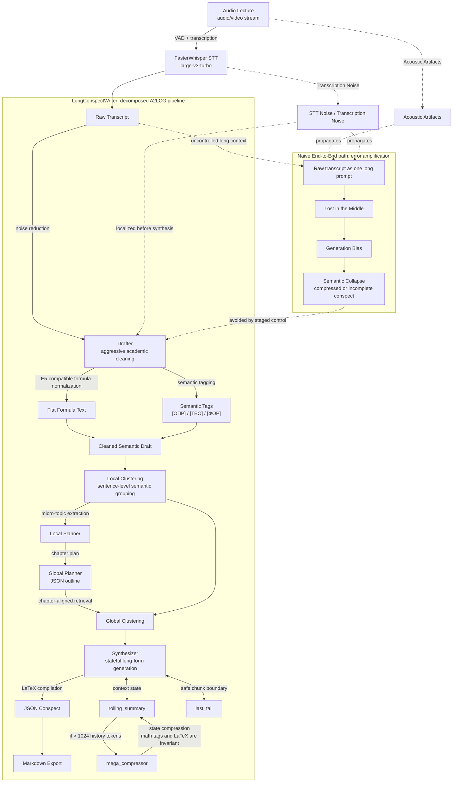

# LongConspectWriter

[README.md in english](README.md) | README.md на русском

## Оглавление
- [System Architecture](#system-architecture)
- [LongConspectWriter Deployment](#longconspectwriter-deployment)
- [CLI Actions](#cli-actions)
- [Output Artifacts](#output-artifacts)
- [Configuration](#configuration)
- [Evaluation](#evaluation)
- [Cases](#cases)

## System Architecture



## LongConspectWriter Deployment

### Dependencies

- Python `3.12+`
- `uv`
- CUDA-совместимая среда
- локальные GGUF-веса

### Run the full pipeline

```bash
uv run python __main__.py --action all --path_to_file "data/example-audio/your_lecture.mp3"
```

`all` запускает полный пайплайн.

### Run individual stages pipeline

```bash
uv run python __main__.py --action stt --path_to_file "data/example-audio/your_lecture.mp3"
uv run python __main__.py --action drafter --path_to_file "data/example-transcrib/your_transcript.txt"
uv run python __main__.py --action local_clustering --path_to_file "data/example-transcrib/your_transcript.txt"
uv run python __main__.py --action local_planner --path_to_file "data/example-clusters/example-local-clusters/your_clusters.txt"
uv run python __main__.py --action global_planner --path_to_file "data/example-plan/example-local-plan/your_local_plan.txt"
uv run python __main__.py --action planner --path_to_file "data/example-clusters/example-local-clusters/your_clusters.txt"
uv run python __main__.py --action clustering --path_to_file "data/example-transcrib/your_transcript.txt"
uv run python __main__.py --action global_clustering --global_plan_path "data/example-plan/example-global-plan/your_global_plan.json" --local_clusters_path "data/example-clusters/example-local-clusters/your_clusters.txt"
uv run python __main__.py --action synthesizer --path_to_file "data/example-clusters/example-global-clusters/your_global_clusters.json"
```

## CLI Actions

Каждый компонент пайплайна можно запускать отдельно для тестирования.

Таблица со всеми доступными командами:

| Action | Input | Output |
| --- | --- | --- |
| `all` | Аудио | Конспект в формате .md |
| `stt` | Аудио | Сырая транскрибация |
| `drafter` | Сырая транскрибация | Качественная транскрибация |
| `local_clustering` | Качественная транскрибация | Локальные кластеры |
| `local_planner` | Локальные кластеры | Локальные темы |
| `global_planner` | Локальные темы | Глобальные темы |
| `planner` | Локальные кластеры | Глобальные темы |
| `global_clustering` | Глобальные темы + локальные кластеры | Кластеры, привязанные к главам |
| `synthesizer` | Глобальные кластеры |  JSON-конспект |
| `clustering` | Качественная транскрибация | Глобальные темы |

## Output Artifacts

LongConspectWriter сохраняет промежуточные состояния на диск. 

| Directory | Artifact |
| --- | --- |
| `data/example-transcrib/` | Сырая транскрибация после FasterWhisper |
| `data/example-mini-conspect/` | Качественная транскрибация|
| `data/example-clusters/example-local-clusters/` | Локальные  кластеры |
| `data/example-plan/example-local-plan/` | Локальные темы |
| `data/example-plan/example-global-plan/` | Глобальные темы |
| `data/example-clusters/example-global-clusters/` | Глобальные кластеры |
| `data/example-conspect/` | Конспект в формате JSON |
| `data/example-final-conspect/` | Конспект в формате .md |

## Configuration

Основные конфиги расположены в `src/configs/config-agents/`:

Текущая конфигурация по умолчанию:

| Component | Default |
| --- | --- |
| STT | `large-v3-turbo` |
| LLM model | `.models/T-lite-it-2.1-Q5_K_M.gguf` |
| Local embeddings | `cointegrated/rubert-tiny2` |
| Global embeddings | `intfloat/multilingual-e5-small` |

Дополнительные dataclass-описания конфигураций находятся в `src/configs/ai_configs.py`.

**Локальные GGUF-веса нужно скачивать отдельно, и сохранять в папку .models и в конфигах по пути src\configs\config-agents\ в файлах config_agentname.yaml указать для какого агента путь до весов.**

## Evaluation
...

## Cases

Примеры конспектов сгенерированных с помощью LongConspectWriter вы можете прочитать в папке [examples](examples).

Актуальные примеры находятся в папке: [examples\v1.0](examples\v1.0)
