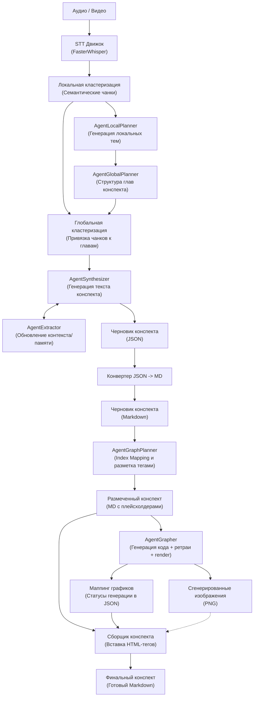

# LongConspectWriter: Пайплайн для суммаризации 10 000+ токенов лекций с помощью локальных 8B LLM

[README.md in english](https://github.com/m4deme1ns4ne/LongConspectWriter/#longconspectwriter-local-multi-agent-system-for-generating-long-academic-conspect) | README.md на русском

## Оглавление

- [Архитектура системы](#архитектура-системы)
- [Установка и запуск](#установка-и-запуск)
- [CLI Actions](#cli-actions)
- [Выходные артефакты](#выходные-артефакты)
- [Конфигурация](#конфигурация)
- [Evaluation](#evaluation)
- [Cases](#cases)

## Архитектура системы

LongConspectWriter превращает аудио или видео лекции в Markdown-конспект. Пайплайн транскрибирует запись через FasterWhisper, строит локальные семантические кластеры, собирает глобальный план лекции, привязывает фрагменты транскрипта к главам и синтезирует академический JSON-конспект. Во время синтеза внутренний `AgentExtractor` обновляет контекст лекции, чтобы следующие чанки не дублировали уже извлеченные сущности и темы.

После синтеза JSON конвертируется в Markdown. Отдельный `AgentGraphPlanner` анализирует готовый Markdown и вставляет `[GRAPH_TYPE: ...]`-плейсхолдеры там, где визуализация полезна и может быть сгенерирована кодом. Затем `AgentGrapher` находит эти плейсхолдеры, генерирует Python-скрипты для визуализаций, рендерит изображения с ретраями при ошибках и сохраняет mapping графиков. Финальный этап `add_graph_in_conspect` заменяет плейсхолдеры HTML-блоками с локальными изображениями из `assets/`.



### Основные агенты и компоненты

| Component | Responsibility |
| --- | --- |
| `FasterWhisper` | Транскрибирует аудио/видео в текст в отдельном процессе. |
| `SemanticLocalClusterizer` | Делит транскрипт на локальные семантические кластеры. |
| `AgentLocalPlanner` | Строит локальные темы по кластерам. |
| `AgentGlobalPlanner` | Собирает локальные темы в глобальный план глав. |
| `SemanticGlobalClusterizer` | Привязывает локальные кластеры к главам глобального плана. |
| `AgentSynthesizerLlama` | Генерирует академический JSON-конспект и использует extractor для контекста. |
| `AgentExtractor` | Извлекает сущности из текущего чанка синтеза для дедупликации следующих чанков. |
| `AgentGraphPlanner` | Анализирует готовый Markdown и вставляет `[GRAPH_TYPE: ...]`-плейсхолдеры по цитатам через нормализованный поиск. |
| `AgentGrapher` | Генерирует Python-код визуализации, запускает его через `MPLBACKEND=Agg`, делает ретраи с повышением температуры и сохраняет mapping графиков. |
| `add_graph_in_conspect` | Копирует успешные PNG в финальные `assets/` и заменяет плейсхолдеры HTML-блоками с изображениями. |

## Установка и запуск

### Dependencies

- Python `3.12+`
- `uv`
- CUDA-совместимая среда для локального запуска моделей
- GGUF-модели для LLM-агентов

Зависимости описаны в `pyproject.toml`. Для PyTorch используется индекс CUDA 12.1:

```toml
[[tool.uv.index]]
url = "https://download.pytorch.org/whl/cu121"
```

LLM-агенты поддерживают два способа загрузки GGUF:

- `repo_id` + `filename` - модель скачивается через `llama_cpp.Llama.from_pretrained()` в `.models/`;
- `model_path` - используется уже скачанный локальный файл.

По текущим конфигам T-lite и Qwen Coder загружаются из HuggingFace в `.models/`. Если папки `.models/` нет, она создается автоматически.

### Run the full pipeline

```bash
uv run python __main__.py --action all --path_to_file "data/example-audio/your_lecture.mp3"
```

`all` запускает полный сценарий:

```text
STT -> local clustering -> local planner -> global planner -> global clustering -> synthesizer -> JSON to Markdown -> graph planner -> grapher -> final Markdown with images
```

### Run individual stages pipeline

```bash
uv run python __main__.py --action stt --path_to_file "data/example-audio/your_lecture.mp3"
uv run python __main__.py --action local_clustering --path_to_file "data/example-transcrib/your_transcript.json"
uv run python __main__.py --action local_planner --path_to_file "data/example-clusters/example-local-clusters/your_clusters.json"
uv run python __main__.py --action global_planner --path_to_file "data/example-plan/example-local-plan/your_local_plan.json"
uv run python __main__.py --action planner --path_to_file "data/example-clusters/example-local-clusters/your_clusters.json"
uv run python __main__.py --action global_clustering --global_plan_path "data/example-plan/example-global-plan/your_global_plan.json" --local_clusters_path "data/example-clusters/example-local-clusters/your_clusters.json"
uv run python __main__.py --action clustering --path_to_file "data/example-transcrib/your_transcript.json"
uv run python __main__.py --action synthesizer --path_to_file "data/example-clusters/example-global-clusters/your_global_clusters.json"
uv run python __main__.py --action convert_json_to_md --path_to_file "data/runs/YYYY.MM.DD/HH.MM.SS/06_synthesizer/conspect.json"
uv run python __main__.py --action graph_planner --path_to_file "data/runs/YYYY.MM.DD/HH.MM.SS/07_conspect_md/conspect.md"
uv run python __main__.py --action grapher --path_to_file "data/runs/YYYY.MM.DD/HH.MM.SS/08_graph_planner/out_filepath.md"
uv run python __main__.py --action add_graph_in_conspect --path_to_file "data/runs/YYYY.MM.DD/HH.MM.SS/08_graph_planner/out_filepath.md" --graphs_path "data/runs/YYYY.MM.DD/HH.MM.SS/09_grapher/graphs_mapping.json"
```

Каждый запуск CLI создает новую сессионную директорию внутри `data/runs/<date>/<time>/`. Если вы запускаете стадии вручную, передавайте пути к артефактам из нужной сессии явно.

## CLI Actions

Каждый компонент пайплайна можно запускать отдельно для тестирования и отладки.

| Action | Input | Output |
| --- | --- | --- |
| `all` | Аудио/видео | Финальный Markdown-конспект с изображениями |
| `stt` | Аудио/видео | `01_stt/out_filepath.json` с сырой транскрибацией |
| `local_clustering` | Транскрипт STT | `02_local_clusters/out_filepath.json` |
| `local_planner` | Локальные кластеры | `03_local_planners/out_filepath.json` |
| `global_planner` | Локальные темы | `04_global_planners/out_filepath.json` |
| `planner` | Локальные кластеры | Глобальный план через `local_planner -> global_planner` |
| `global_clustering` | Глобальный план + локальные кластеры | `05_global_clusters/out_filepath.json` |
| `clustering` | Транскрипт STT | Глобальные кластеры через `local_clustering -> planner -> global_clustering` |
| `synthesizer` | Глобальные кластеры | `06_synthesizer/conspect.json` |
| `convert_json_to_md` | JSON-конспект | `07_conspect_md/conspect.md` |
| `graph_planner` | Markdown-конспект | `08_graph_planner/out_filepath.md` с добавленными `[GRAPH_TYPE: ...]` и `08_graph_planner/out_filepath.jsonl` |
| `grapher` | Markdown с `[GRAPH_TYPE: ...]` | `09_grapher/graphs_mapping.json`, `09_grapher/scripts/*.py`, `09_grapher/assets/*.png` |
| `add_graph_in_conspect` | Markdown с `[GRAPH_TYPE: ...]` + `graphs_mapping.json` | `10_conspect_with_graph_md/final_conspect.md` |

## Выходные артефакты

Промежуточные артефакты создаются автоматически в папке текущей сессии:

```text
data/runs/YYYY.MM.DD/HH.MM.SS/
```

Основные stage-директории:

- `01_stt/` - сырая транскрибация после FasterWhisper.
- `02_local_clusters/` - локальные семантические кластеры.
- `03_local_planners/` - локальные темы.
- `04_global_planners/` - глобальный план глав.
- `05_global_clusters/` - кластеры, привязанные к глобальным главам.
- `05.1_extractor/` - JSONL-вывод внутреннего extractor во время синтеза.
- `06_synthesizer/` - JSON-конспект.
- `07_conspect_md/` - Markdown-конспект без финальной подстановки графиков.
- `08_graph_planner/` - Markdown после вставки `[GRAPH_TYPE: ...]` и JSONL-ответы graph planner по чанкам.
- `09_grapher/` - `graphs_mapping.json` и сгенерированные графики.
- `09_grapher/assets/` - PNG-графики, созданные `AgentGrapher`.
- `09_grapher/scripts/` - Python-скрипты, которыми рендерились графики.
- `10_conspect_with_graph_md/` - финальный Markdown-конспект.
- `10_conspect_with_graph_md/assets/` - локальные изображения, скопированные для финального Markdown.

## Конфигурация

Главный конфиг пайплайна находится в `src/configs/config_pipeline.yaml`:

| Key | Meaning |
| --- | --- |
| `output_dir` | Базовая папка для сессионных артефактов. По умолчанию `data/`. |
| `lecture_theme` | Тема лекции для выбора промпта. Сейчас используется `math`; при отсутствии темы агент берет `universal`. |

Конфиги агентов расположены в `src/configs/config-agents/`, конфиги кластеризации - в `src/configs/config-clusterizer/`.

Текущая конфигурация по умолчанию:

| Component | Default |
| --- | --- |
| STT | `large-v3-turbo` |
| Local/Global Planner LLM | `t-tech/T-lite-it-2.1-GGUF`, `T-lite-it-2.1-Q5_K_M.gguf` |
| Synthesizer LLM | `t-tech/T-lite-it-2.1-GGUF`, `T-lite-it-2.1-Q5_K_M.gguf` |
| Extractor LLM | Использует ту же загруженную модель, что и synthesizer |
| Graph Planner LLM | `t-tech/T-lite-it-2.1-GGUF`, `T-lite-it-2.1-Q5_K_M.gguf` |
| Grapher LLM | `Qwen/Qwen2.5-Coder-7B-Instruct-GGUF`, `qwen2.5-coder-7b-instruct-q6_k.gguf` |
| Local embeddings | `cointegrated/rubert-tiny2` |
| Global embeddings | `intfloat/multilingual-e5-small` |

Основные файлы конфигурации:

| Component | Config | Prompt / Schema |
| --- | --- | --- |
| STT | `src/configs/config-agents/stt/config_stt.yaml` | `src/configs/config-agents/stt/prompt_stt.yaml` |
| Extractor | `src/configs/config-agents/extractor/config_extractor_planner.yaml` | `prompt_extractor.yaml`, `agent_extractor_scheme_output.json` |
| Local Planner | `src/configs/config-agents/local_planner/config_local_planner.yaml` | `prompt_local_planner.yaml` |
| Global Planner | `src/configs/config-agents/global_planner/config_global_planner.yaml` | `prompt_global_planner.yaml`, `agent_global_planner_scheme_output.json` |
| Synthesizer | `src/configs/config-agents/synthesizer/config_synthesizer.yaml` | `prompt_synthesizer.yaml` |
| Graph Planner | `src/configs/config-agents/graph_planner/config_graph_planner.yaml` | `prompt_graph_planner.yaml`, `agent_grapher_planner_scheme_output.json` |
| Grapher | `src/configs/config-agents/grapher/config_grapher.yaml` | `prompt_grapher.yaml` |
| Local Clusterizer | `src/configs/config-clusterizer/config_local_clusterizer.yaml` | - |
| Global Clusterizer | `src/configs/config-clusterizer/config_global_clusterizer.yaml` | - |

Дополнительные параметры визуализатора:

| Component | Config key | Meaning |
| --- | --- | --- |
| `AgentGraphPlanner` | `available_lib` | Список библиотек, которые graph planner учитывает при составлении ТЗ для графика. |
| `AgentGrapher` | `available_lib` | Список библиотек, доступных LLM-кодеру при генерации Python-скрипта. |
| `AgentGrapher` | `re_try_count` | Количество попыток генерации и исполнения кода. Сейчас `3`. |
| `AgentGrapher` | `step_temperature` | Шаг повышения температуры между ретраями. Сейчас `0.1`. |

Дополнительные dataclass-описания конфигураций находятся в `src/configs/configs.py`.

## Evaluation

...

## Cases

Примеры конспектов, сгенерированных с помощью LongConspectWriter, находятся в папке [examples](examples).

Актуальные заполненные примеры находятся в папке [examples/v2.0](examples/v2.0).