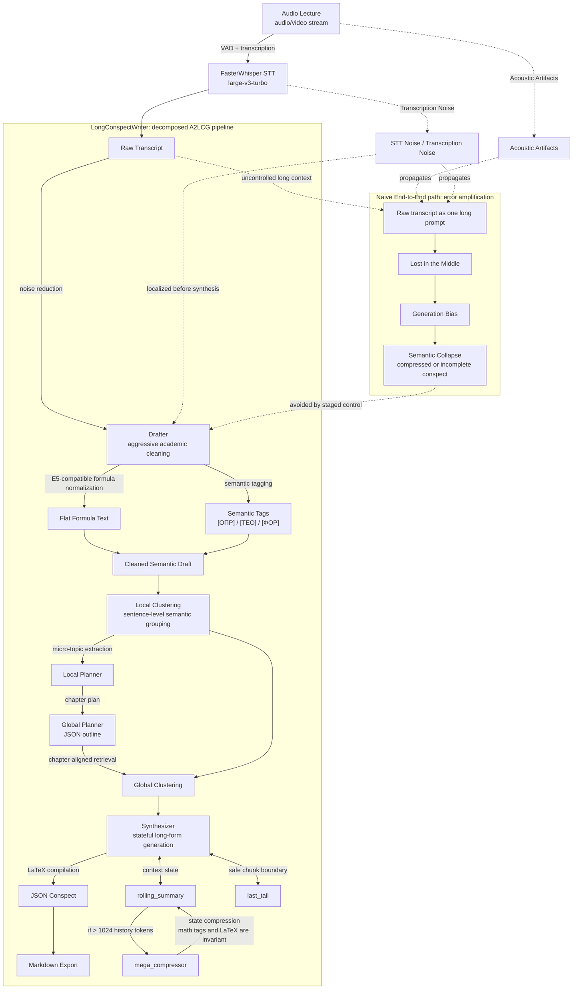

# LongConspectWriter

[README.md on english](README.md) | README.md на русском

LongConspectWriter - исследовательский прототип мультиагентной системы для задачи **Audio-to-LongConspect Generation (A2LCG)**: трансляции неструктурированного аудиопотока лекции в объемный академический конспект в формате Markdown. Проект рассматривает генерацию конспекта не как одиночный вызов языковой модели, а как последовательность наблюдаемых стадий: транскрибация, очистка, семантическая нормализация, иерархическое планирование, тематическая кластеризация, синтез и экспорт.

Центральная гипотеза проекта состоит в том, что длинные STEM-лекции требуют декомпозированной архитектуры с контролем промежуточных состояний. Ошибки распознавания речи, локальные акустические артефакты и шум разговорной речи не должны напрямую попадать в финальный генератор длинного текста: в противном случае они усиливают потерю контекста и приводят к схлопыванию образовательных фактов в краткое резюме.

Реализация ориентирована на локальный запуск. Агенты работают через `llama.cpp`.

## Архитектура системы (System Architecture)



## Описание Агентов LLM

#### Drafter
  -

#### Planners
  -

#### Synthesizer
  -

## Описание методов Кластеризации
  -

## Развертывание

### Зависимости

- Python `3.12+`
- `uv`
- CUDA-совместимая среда
- локальные GGUF-веса

### Установка

```bash
uv sync
```

**Локальные GGUF-веса нужно скачивать отдельно, и сохранять в папку .models и в конфигах src\configs\config-agents\... указать для какого агента путь до весов.**


### Запуск пайплайна

```bash
uv run python __main__.py --action all --path_to_file "data/example-audio/your_lecture.mp3"
```

`all` запускает полный пайплайн.

### Запуск отдельных стадий

```bash
uv run python __main__.py --action stt --path_to_file "data/example-audio/your_lecture.mp3"
uv run python __main__.py --action drafter --path_to_file "data/example-transcrib/your_transcript.txt"
uv run python __main__.py --action local_clustering --path_to_file "data/example-transcrib/your_transcript.txt"
uv run python __main__.py --action local_planner --path_to_file "data/example-clusters/example-local-clusters/your_clusters.txt"
uv run python __main__.py --action global_planner --path_to_file "data/example-plan/example-local-plan/your_local_plan.txt"
uv run python __main__.py --action planner --path_to_file "data/example-clusters/example-local-clusters/your_clusters.txt"
uv run python __main__.py --action clustering --path_to_file "data/example-transcrib/your_transcript.txt"
uv run python __main__.py --action global_clustering --global_plan_path "data/example-plan/example-global-plan/your_global_plan.json" --local_clusters_path "data/example-clusters/example-local-clusters/your_clusters.txt"
uv run python __main__.py --action synthesizer --path_to_file "data/example-clusters/example-global-clusters/your_global_clusters.json"
```

## CLI Actions

Каждый компонент пайплайна можно запускать отдельно для тестирования.

Таблица со всеми доступными командами:

| Action | Input | Output |
| --- | --- | --- |
| `all` | Аудио | Конспект в формате .md |
| `stt` | Аудио | Сырая транскрибация |
| `drafter` | Сырая транскрибация | Качественная транскрибация |
| `local_clustering` | Качественная транскрибация | Локальные кластеры |
| `local_planner` | Локальные кластеры | Локальные темы |
| `global_planner` | Локальные темы | Глобальные темы |
| `planner` | Локальные кластеры | Глобальные темы |
| `global_clustering` | Глобальные темы + локальные кластеры | Кластеры, привязанные к главам |
| `synthesizer` | Глобальные кластеры |  JSON-конспект |
| `clustering` | Качественная транскрибация | Глобальные темы |

## Output Artifacts

LongConspectWriter сохраняет промежуточные состояния на диск. 

| Directory | Artifact |
| --- | --- |
| `data/example-transcrib/` | Сырая транскрибация после FasterWhisper |
| `data/example-mini-conspect/` | Качественная транскрибация|
| `data/example-clusters/example-local-clusters/` | Локальные  кластеры |
| `data/example-plan/example-local-plan/` | Локальные темы |
| `data/example-plan/example-global-plan/` | Глобальные темы |
| `data/example-clusters/example-global-clusters/` | Глобальные кластеры |
| `data/example-conspect/` | Конспект в формате JSON |
| `data/example-final-conspect/` | Конспект в формате .md |

## Configuration

Основные конфиги расположены в `src/configs/config-agents/`:

- `stt/config_stt.yaml` - FasterWhisper, VAD и параметры транскрибации;
- `drafter/config_drafter.yaml` - модель, generation parameters и путь к prompt-файлу Drafter-а;
- `local_planner/config_local_planner.yaml` - параметры локального планировщика;
- `global_planner/config_global_planner.yaml` - параметры глобального планировщика;
- `synthesizer/config_synthesizer.yaml` - параметры Synthesizer-а;
- `*/prompt_*.yaml` - системные промпты и user templates агентов.

Текущая конфигурация по умолчанию:

| Component | Default |
| --- | --- |
| STT | `large-v3-turbo` |
| LLM backend | `llama.cpp` |
| GGUF model | `.models/T-lite-it-2.1-Q5_K_M.gguf` |
| LLM context | `n_ctx: 8192` |
| Local embeddings | `cointegrated/rubert-tiny2` |
| Global embeddings | `intfloat/multilingual-e5-small` |

Дополнительные dataclass-описания конфигураций находятся в `src/configs/ai_configs.py`; список нежелательных генеративных фрагментов - в `src/configs/bad_words.py`.
