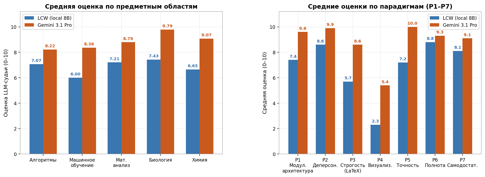

<p align="center">
  
</p>

# **LongConspectWriter: преодоление ограничений контекстного окна при конспектировании аудиолекций с помощью локальных SLM**

<p align="center">
  <a href="README.md">English</a> •
  <b>Русский</b>
</p>

<p align="center">
  <a href=""></a>
  <a href="LICENSE"></a>
</p>

LongConspectWriter превращает аудио/видеозапись лекции в структурированный академический PDF-конспект с формулами и графиками — полностью локально, на 8 ГБ VRAM. Ни один вызов LLM не получает на вход весь транскрипт. Примеры вывода — в [`examples/`](examples/); метод и оценка качества описаны в [статье](docs/article.md).

## Оглавление

- [Архитектура системы](#архитектура-системы)
- [Установка и запуск](#установка-и-запуск)
- [CLI-действия](#cli-действия)
- [Выходные артефакты](#выходные-артефакты)
- [Конфигурация](#конфигурация)
- [Оценка качества](#оценка-качества)

## Архитектура системы

<p align="center">

</p>

### Основные агенты и компоненты

| Компонент | Назначение |
| --- | --- |
| `FasterWhisper` | Транскрибирует аудио/видео в текст. |
| `SemanticLocalClusterizer` | Делит транскрипт на локальные семантические кластеры. |
| `AgentLocalPlanner` | Строит локальные темы по кластерам. |
| `AgentGlobalPlanner` | Собирает локальные темы в глобальный план глав. |
| `SemanticGlobalClusterizer` | Привязывает локальные кластеры к главам глобального плана. |
| `AgentSynthesizerLlama` | Генерирует академический JSON-конспект и использует extractor для контекста. |
| `_AgentExtractor` | Извлекает сущности из текущего чанка синтеза для дедупликации следующих чанков. |
| `convert_json_to_md` | Конвертирует JSON-конспект синтезатора в Markdown для последующих этапов визуализации. |
| `AgentGraphPlanner` | Анализирует готовый Markdown и вставляет `[GRAPH_TYPE: ...]`-плейсхолдеры по цитатам через нормализованный поиск. |
| `AgentGrapher` | Генерирует Python-код визуализации, запускает его через `MPLBACKEND=Agg`, делает ретраи с повышением температуры и сохраняет mapping графиков. |
| `add_graph_in_conspect` | Копирует успешные PNG в финальные `assets/` и заменяет плейсхолдеры HTML-блоками с изображениями. |
| `convert_md_to_pdf` | Конвертирует финальный Markdown в PDF через Playwright: рендерит HTML с MathJax для формул и сохраняет постраничный A4-документ. |

## Установка и запуск

### Зависимости

- Python `3.12+`
- `uv`

> Система тестировалась на GeForce RTX 3050 8gb

### Запуск полного пайплайна

```bash
uv run python __main__.py --action all --path_to_file "data/example-audio/your_lecture.mp3"
```

`all` запускает полный сценарий.

### Запуск отдельных стадий

```bash
uv run python __main__.py --action stt --path_to_file "data/example-audio/your_lecture.mp3"
uv run python __main__.py --action local_clustering --path_to_file "data/example-transcrib/your_transcript.json"
uv run python __main__.py --action local_planner --path_to_file "data/example-clusters/example-local-clusters/your_clusters.json"
uv run python __main__.py --action global_planner --path_to_file "data/example-plan/example-local-plan/your_local_plan.json"
uv run python __main__.py --action planner --path_to_file "data/example-clusters/example-local-clusters/your_clusters.json"
uv run python __main__.py --action global_clustering --global_plan_path "data/example-plan/example-global-plan/your_global_plan.json" --local_clusters_path "data/example-clusters/example-local-clusters/your_clusters.json"
uv run python __main__.py --action clustering --path_to_file "data/example-transcrib/your_transcript.json"
uv run python __main__.py --action synthesizer --path_to_file "data/example-clusters/example-global-clusters/your_global_clusters.json"
uv run python __main__.py --action convert_json_to_md --path_to_file "data/runs/YYYY.MM.DD/HH.MM.SS/06_synthesizer/conspect.json"
uv run python __main__.py --action graph_planner --path_to_file "data/runs/YYYY.MM.DD/HH.MM.SS/07_conspect_md/conspect.md"
uv run python __main__.py --action grapher --path_to_file "data/runs/YYYY.MM.DD/HH.MM.SS/08_graph_planner/out_filepath.md"
uv run python __main__.py --action add_graph_in_conspect --path_to_file "data/runs/YYYY.MM.DD/HH.MM.SS/08_graph_planner/out_filepath.md" --graphs_path "data/runs/YYYY.MM.DD/HH.MM.SS/09_grapher/graphs_mapping.json"
uv run python __main__.py --action convert_md_to_pdf --path_to_file "data/runs/YYYY.MM.DD/HH.MM.SS/10_conspect_with_graph_md/final_conspect.md"
```

Необязательный флаг `--lecture_theme` задаёт тему лекции (`math`, `biology`, `chemistry` и т. д.) и влияет на выбор промпта в агентах, поддерживающих тематические шаблоны. Если флаг не передан, агенты используют `universal`-промпт.

Каждый запуск CLI создаёт новую сессионную директорию внутри `data/runs/<date>/<time>/`. Если вы запускаете стадии вручную, передавайте пути к артефактам из нужной сессии явно.

## CLI-действия

Каждый компонент пайплайна можно запускать отдельно для тестирования и отладки.

| Action | Input | Output |
| --- | --- | --- |
| `all` | Аудио/видео | Финальный PDF-конспект с формулами и графиками |
| `stt` | Аудио/видео | `01_stt/out_filepath.json` с сырой транскрибацией |
| `local_clustering` | Транскрипт STT | `02_local_clusters/out_filepath.json` |
| `local_planner` | Локальные кластеры | `03_local_planners/out_filepath.json` |
| `global_planner` | Локальные темы | `04_global_planners/out_filepath.json` |
| `planner` | Локальные кластеры | Глобальный план через `local_planner -> global_planner` |
| `global_clustering` | Глобальный план + локальные кластеры | `05_global_clusters/out_filepath.json` |
| `clustering` | Транскрипт STT | Глобальные кластеры через `local_clustering -> planner -> global_clustering` |
| `synthesizer` | Глобальные кластеры | `06_synthesizer/conspect.json` |
| `convert_json_to_md` | JSON-конспект | `07_conspect_md/conspect.md` |
| `graph_planner` | Markdown-конспект | `08_graph_planner/out_filepath.md` с добавленными `[GRAPH_TYPE: ...]` и `08_graph_planner/out_filepath.jsonl` |
| `grapher` | Markdown с `[GRAPH_TYPE: ...]` | `09_grapher/graphs_mapping.json`, `09_grapher/scripts/*.py`, `09_grapher/assets/*.png` |
| `add_graph_in_conspect` | Markdown с `[GRAPH_TYPE: ...]` + `graphs_mapping.json` | `10_conspect_with_graph_md/final_conspect.md` |
| `convert_md_to_pdf` | Markdown-конспект | `11_conspect_pdf/final_conspect.pdf` |

## Выходные артефакты

Промежуточные артефакты создаются автоматически в папке текущей сессии:

```text
data/runs/YYYY.MM.DD/HH.MM.SS/
```

Основные stage-директории:

- `01_stt/` — сырая транскрибация после FasterWhisper.
- `02_local_clusters/` — локальные семантические кластеры.
- `03_local_planners/` — локальные темы.
- `04_global_planners/` — глобальный план глав.
- `05_global_clusters/` — кластеры, привязанные к глобальным главам.
- `05.1_extractor/` — JSONL-вывод внутреннего extractor во время синтеза.
- `06_synthesizer/` — JSON-конспект.
- `07_conspect_md/` — Markdown-конспект без финальной подстановки графиков.
- `08_graph_planner/` — Markdown после вставки `[GRAPH_TYPE: ...]` и JSONL-ответы graph planner по чанкам.
- `09_grapher/` — `graphs_mapping.json` и сгенерированные графики.
- `09_grapher/assets/` — PNG-графики, созданные `AgentGrapher`.
- `09_grapher/scripts/` — Python-скрипты, которыми рендерились графики.
- `10_conspect_with_graph_md/` — финальный Markdown-конспект.
- `10_conspect_with_graph_md/assets/` — локальные изображения, скопированные для финального Markdown.
- `11_conspect_pdf/` — PDF-версия конспекта с отрендеренными формулами и графиками.

## Конфигурация

Все конфиги организованы в три группы:

```
src/configs/
├── config_pipeline.yaml          — глобальные параметры пайплайна
├── config-agents/                — по одному конфигу на каждый агент
│   ├── stt/
│   ├── local_planner/
│   ├── global_planner/
│   ├── synthesizer/
│   ├── extractor/
│   ├── graph_planner/
│   └── grapher/
└── config-clusterizer/           — параметры кластеризации
    ├── config_local_clusterizer.yaml
    └── config_global_clusterizer.yaml
```

Dataclass-описания всех полей конфигов — в `src/configs/configs.py`.

### Переменные окружения

Файл `.env` (шаблон — `.env.example`) содержит токен HuggingFace для загрузки моделей:

```
HF_TOKEN=hf_...
```

Модели автоматически загружаются в `.models/` при первом запуске.

## Оценка качества

Качество оценивалось методом LLM-as-a-judge (судья — `Qwen3 Max Preview`) на 10 лекциях из 5 доменов, в сравнении с baseline `Gemini 3.1 Pro` (single-call). По среднему баллу за 7 парадигм LCW набирает **6,87/10 против 8,84/10** у Gemini — ≈78% качества облачного эталона при нулевой стоимости инференса и полностью локально.



Методология, разбор по парадигмам и интерпретация — в [статье](docs/article.md). Промпт судьи, baseline-промпт, описание датасета и полные результаты — в папке [evaluation/](evaluation/) ([промпт судьи](evaluation/comparison/prompt_llm-as-a-judge.md), [датасет](evaluation/dataset.md)).
