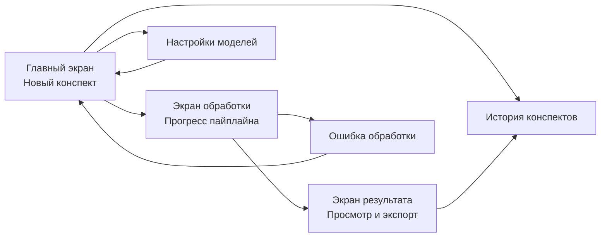
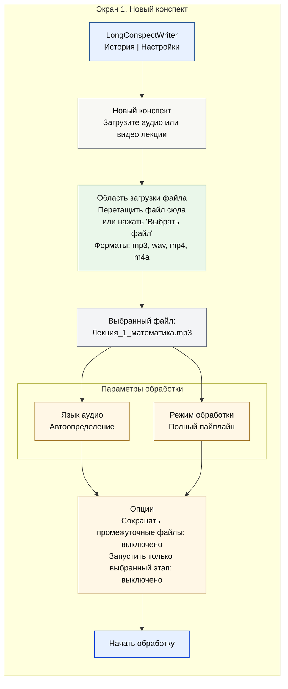
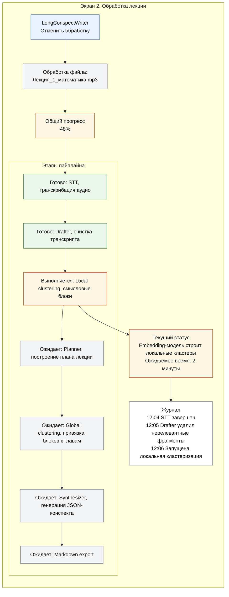
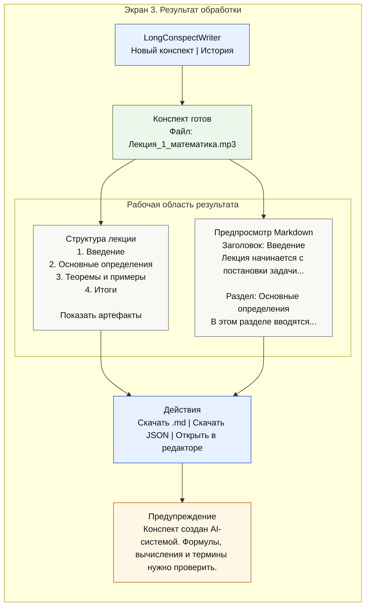
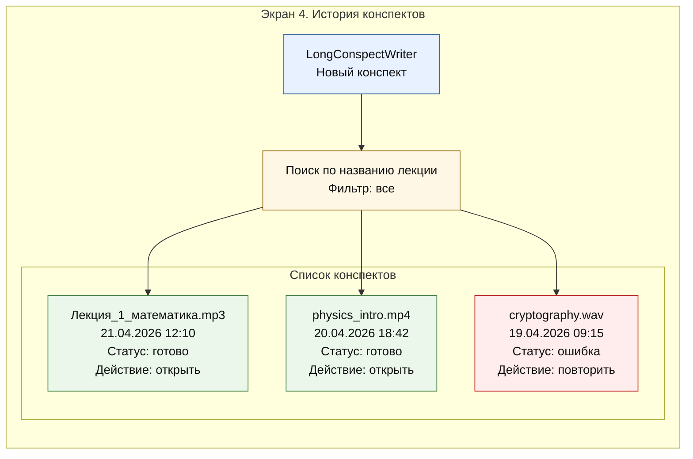
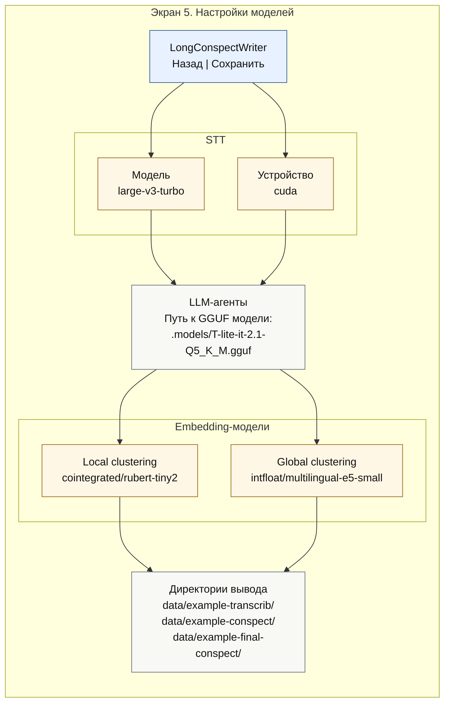
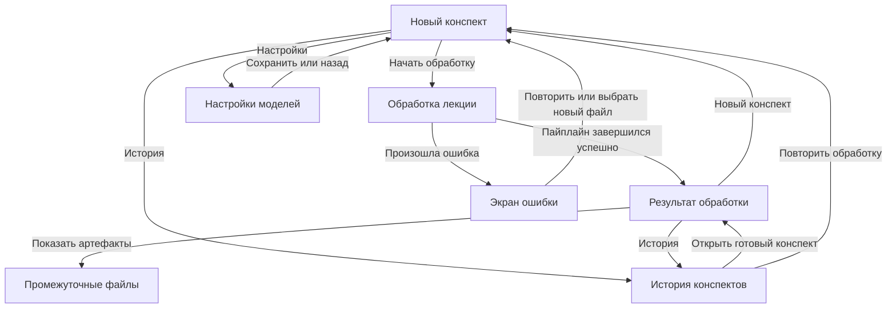

# Прототип интерфейса LongConspectWriter

## Назначение

LongConspectWriter помогает пользователю получить структурированный Markdown-конспект из аудио- или видеозаписи лекции. Интерфейс должен скрывать сложность CLI-пайплайна и показывать пользователю понятный путь: загрузить файл, настроить обработку, дождаться результата, проверить и скачать конспект.

## Основные пользователи

| Пользователь | Цель |
| --- | --- |
| Студент | Быстро получить конспект лекции из аудиозаписи |
| Преподаватель | Подготовить структурированный материал по записи занятия |
| Разработчик/исследователь | Запустить отдельные этапы пайплайна и проверить промежуточные артефакты |

## Карта экранов

## Экран 1. Новый конспект

Экран нужен для загрузки лекции и выбора базовых параметров обработки.

### Комментарии

| Элемент | Назначение |
| --- | --- |
| Область загрузки файла | Основной способ передать системе аудио или видео |
| Язык аудио | Можно оставить автоопределение или выбрать язык вручную |
| Режим обработки | Полный пайплайн или отдельный этап для проверки |
| Сохранять промежуточные файлы | Позволяет потом открыть транскрипт, кластеры, планы и JSON |
| Начать обработку | Переход на экран прогресса |

## Экран 2. Обработка лекции

Экран показывает состояние пайплайна и текущий этап обработки.

### Комментарии

| Элемент | Назначение |
| --- | --- |
| Общий прогресс | Дает пользователю понимание, сколько этапов уже выполнено |
| Список этапов | Показывает, где находится пайплайн и что будет дальше |
| Текущий статус | Объясняет действие системы обычным языком |
| Журнал | Нужен для диагностики и доверия к процессу |
| Отменить обработку | Возвращает пользователя на главный экран без создания результата |

## Экран 3. Результат обработки

Экран нужен для просмотра готового конспекта, проверки структуры и экспорта результата.

### Комментарии

| Элемент | Назначение |
| --- | --- |
| Структура лекции | Быстрая навигация по главам итогового конспекта |
| Предпросмотр Markdown | Позволяет проверить результат до скачивания |
| Скачать .md | Сохраняет итоговый Markdown-файл |
| Скачать JSON | Скачивает структурированный результат для повторной обработки |
| Показать артефакты | Открывает промежуточные файлы: транскрипт, кластеры, планы |
| Предупреждение | Напоминает, что AI-результат требует проверки человеком |

## Экран 4. История конспектов

Экран помогает вернуться к ранее обработанным лекциям.

### Комментарии

| Элемент | Назначение |
| --- | --- |
| Поиск | Быстро находит конспект по названию исходного файла |
| Фильтр | Позволяет показать только готовые, ошибочные или выполняющиеся задачи |
| Открыть | Переход на экран результата |
| Повторить | Возвращает пользователя на экран нового конспекта с тем же файлом |

## Экран 5. Настройки моделей

Экран предназначен для разработчика или продвинутого пользователя.

### Комментарии

| Элемент | Назначение |
| --- | --- |
| STT-настройки | Управляют моделью транскрибации и устройством выполнения |
| Путь к GGUF | Указывает локальные веса LLM-агентов |
| Embedding-модели | Отвечают за локальную и глобальную кластеризацию |
| Директории вывода | Показывают, куда сохраняются промежуточные и итоговые файлы |

## Переходы между экранами

## Минимальный набор для реализации MVP

Для первой версии интерфейса достаточно трех экранов:

1. Новый конспект.
2. Обработка лекции.
3. Результат обработки.

Историю и настройки можно добавить позже, потому что они улучшают удобство, но не являются обязательными для полного пользовательского сценария.
