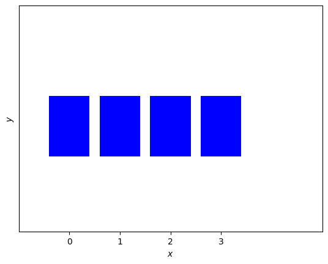

**Этот конспект сгенерирован с помощью AI.**
**Система может допускать ошибки в формулах, вычислениях и специфической терминологии.**
**Пожалуйста, относитесь с понимаем и проверяйте конспект!**

# Концепция логической системы

Алгебра логики — это раздел математики, традиционно включаемый в информатику, хотя формально он относится к логике высказываний. Мы ограничиваемся только составными высказываниями, не углубляясь в атомарные. В основе лежит принцип: каждое высказывание либо истинно (true), либо ложно (false). Это — классическая двузначная логика Аристотеля, в отличие от индийской традиции, допускающей иные значения истинности.

Высказывания обозначаются буквами, например, `A`, могут быть записаны на разных языках. Например, `"2 + 2 = 4"` — истинно, а `"1 + 1 = 1"` — ложно. Важно, что истинность зависит от аксиоматической системы: утверждение `"Бог есть"` может быть истинным в одной системе и ложным — в другой (например, для верующего vs атеиста). Это демонстрирует, что разные логические системы могут быть несовместимы.

Попытки построить единую абсолютную истину (как в начале XX века) были опровергнуты теоремой Гёделя: любая достаточно мощная аксиоматическая система либо неполна (существуют утверждения, которые нельзя ни доказать, ни опровергнуть), либо противоречива. Это стало концом идеи единой истинной концепции мироздания.

В алгебре логики рассматриваются только составные высказывания, построенные из атомарных с помощью логических операций. Первая операция — **отрицание** (`¬A`): истинно тогда и только тогда, когда `A` ложно, и наоборот. Следующая — **логическое И** (`A ∧ B`), объединяющее два высказывания (атомарные или составные). Истинно только если оба операнда истинны.

Для анализа истинности будем использовать таблицу истинности в виде формализованного формата:  
- `A = true` → `¬A = false`  
- `A = false` → `¬A = true`  
- `A ∧ B = true` ⇔ `A = true` и `B = true`, иначе — `false`

Дальнейшее построение составных высказываний будет основано на этих операциях.

# Реализация логических операций

Для логической функции двух переменных область определения состоит из всех возможных комбинаций значений аргументов: (0, 0), (0, 1), (1, 0), (1, 1). Всего таких комбинаций — $2^2 = 4$. Каждая функция отображает каждую из этих пар в значение 0 или 1. Следовательно, количество различных функций двух логических переменных равно $2^{2^2} = 2^4 = 16$. Это следует из того, что для каждой из 4 строк таблицы истинности можно независимо выбрать выходное значение (0 или 1), и общее число таких комбинаций — $2^4 = 16$.

Таблицы истинности позволяют однозначно определить поведение любой логической функции. Например, функция конъюнкции `AND(x, y)` возвращает 1 только при (1, 1), а дизъюнкция `OR(x, y)` — 1 во всех случаях, кроме (0, 0). Операция импликации `A → B` задаётся как:  
$$
A \to B = \begin{cases}
0, & \text{если } A=1 \text{ и } B=0 \\
1, & \text{иначе}
\end{cases}
$$

Эквиваленция `A ≡ B` (или `A ↔ B`) равна 1 тогда и только тогда, когда значения A и B совпадают:  
$$
A \leftrightarrow B = (A \land B) \lor (\lnot A \land \lnot B)
$$

Отрицание (`¬A`, или черта над A) инвертирует значение: если A = 0, то ¬A = 1; если A = 1, то ¬A = 0.

В алгебре логики логические значения удобно представлять как числа: ложь — `0`, истина — `1`. Это позволяет использовать численные методы для анализа функций, хотя важно помнить, что это не эквивалентно арифметическим операциям. Например, возведение в квадрат логического выражения (как в обычной алгебре) приводит к **следствию**, но **не к эквивалентности**:
- из $x = 2$ следует $x^2 = 4$,  
но обратное неверно: $x^2 = 4$ не означает $x = 2$ (может быть $x = -2$).  
В логике аналог — импликация: из истинности A следует B, но не наоборот.

Таким образом, в алгебре логики:
- `¬A` — отрицание,
- `A ∧ B` — конъюнкция (логическое умножение),
- `A ∨ B` — дизъюнкция (логическое сложение),
- `A → B` — импликация,
- `A ↔ B` — эквивалентность.

Все эти операции могут быть выражены через базовые элементы, и их поведение полностью определяется таблицами истинности.

Количество функций одной логической переменной — четыре:  
- `x` (тождественная функция),  
- `¬x` (отрицание, черта над x),  
- константа 0,  
- константа 1.  

Наиболее сложная из них — отрицание `¬x`.  

Для двух переменных количество возможных функций определяется числом строк в таблице истинности: $2^{2^n}$, где $n$ — число переменных. При $n=2$: $2^{2^2} = 16$ различных функций.  
При $n=3$: $2^{2^3} = 256$ функций.  

Табличное задание возможно только при конечной области определения (в данном случае — 4 комбинации значений переменных). При бесконечной области (например, вещественные числа) табличный способ неприменим — требуется интерполяция.  

Операции представлены в формальном виде:  
- `¬A` — отрицание,  
- `A ∧ B` — логическое умножение (конъюнкция),  
- `A ∨ B` — логическое сложение (дизъюнкция).  

Обозначения выбраны для ясности и избежания путаницы с другими символами.

Сколько вариантов комбинаций ноликов и единичек можно написать для двух переменных? — $2^2 = 4$. Для трёх переменных — $2^3 = 8$ строк. Общее количество различных логических функций от $n$ переменных составляет $2^{2^n}$.  
Для двух переменных: $2^{2^2} = 16$ возможных функций. Из них четыре базовые операции уже известны:  
- `¬A` — отрицание,  
- `A ∧ B` — конъюнкция (логическое умножение),  
- `A ∨ B` — дизъюнкция (логическое сложение),  
- `A ⊕ B` — исключающее ИЛИ (XOR, сложение по модулю 2).  

Кроме них, можно добавить две тривиальные функции:  
- тождественная 0 — всегда ложная (противоречие),  
- тождественная 1 — всегда истинная (тавтология).  

Табличный способ задания функций применим только при конечной области значений. При бесконечной области (например, вещественные числа) требуется интерполяция или аналитическое описание.  

Примеры:  
- Конъюнкция `A ∧ B`: истинно только если оба аргумента истинны — $0 \cdot 0 = 0$, $0 \cdot 1 = 0$, $1 \cdot 0 = 0$, $1 \cdot 1 = 1$.  
- Дизъюнкция `A ∨ B`: ложно только при обоих аргументах нулевых.  
- Исключающее ИЛИ (XOR): истинно, когда аргументы различны — $0 + 1 = 1$, $1 + 0 = 1$, $1 + 1 = 0$.  

Импликация `A → B` («если A, то B») определяется как ложная только при истинном посылке и ложном выводе. Остальные комбинации — истинные:  
- истина → истина = истина,  
- истина → ложь = ложь,  
- ложь → истина = истина,  
- ложь → ложь = истина.  

Левая часть импликации называется посылкой (предпосылка), правая — выводом. Истинность всей конструкции зависит от соответствия между ними, а не от фактической содержательной связи.

Получается, что высказывание «1 плюс 1 равно 1» в рамках алгебры логики оказывается истинным. Понятно? Логика здесь проста: поскольку нет чисел больше единицы, нельзя быть «истиннее», чем истина — если утверждение истинно, то выше подняться некуда. Поэтому выражение `1 + 1` «упирается в потолок» системы.  

Однако существует и другой вариант — **исключающее или**, обозначаемое как XOR (или ⊕). Оно отличается от обычного логического «или» только одной строкой таблицы истинности:  
- `0 XOR 0 = 0`  
- `0 XOR 1 = 1`  
- `1 XOR 0 = 1`  
- `1 XOR 1 = 0`  

Это соответствует **сложению по модулю 2**, что корректно в кольцах вычетов по модулю 2. Таким образом, `1 + 1 = 0` в этой алгебраической структуре — математически адекватно. Обозначается как `⊕`.  

Теперь рассмотрим импликацию: `x → y`. Пример: «Если 2+2=4, то 4+4=8» — обе части истинны, значит, импликация истинна.  
- Если посылка (левая часть) ложна, а вывод (правая) истинен — импликация всё равно истинна.  
- Только в случае: `ложь → ложь` — импликация ложна.  

**Концепция:**  
Импликация `x → y` истинна во всех случаях, кроме когда посылка истинна, а вывод — ложен. Это не означает логической связи между x и y, а лишь формальное соответствие в таблице истинности.  

**Алгоритм:**  
Для импликации `x → y`:  
- Если `x = 0`, то результат = 1 (независимо от `y`)  
- Если `x = 1`, то результат = `y`  

**Паттерн:**  
Импликация часто используется в аксиоматических системах: из ложной посылки может следовать как истинное, так и ложное заключение — это важно при проверке согласованности системы.  

Пример: если начать с ложного утверждения (например, «2+2=5»), можно логически прийти к истинному (`4+4=8`) или к ложному (`5=2`). Это демонстрирует, что **из лжи может следовать истина**, но также — и ложь.  

**Вывод:**  
Если в аксиоматической системе присутствует хотя бы одно ложное высказывание, то из него могут быть выведены как истинные, так и ложные утверждения. Это означает: наличие ложных посылок не гарантирует истинность всей системы, даже если большинство выводов кажутся логичными.  

Жизненный пример: сектантские системы (например, саентология) могут строить внешне убедительные выводы на основе ложной основы — человек принимает систему за истинную, хотя исходные посылки ошибочны. Это показывает важность проверки аксиом, а не только результатов рассуждений.

**Концепция:** Дизъюнктивная нормальная форма (ДНФ) позволяет представить любую логическую функцию через сумму произведений — по одной конъюнкции на каждую строку таблицы истинности, где функция принимает значение 1.  
**Алгоритм:** Для функции трёх переменных \( f(x,y,z) \), заданной набором значений: `0, 0, 0, 0, 0, 1, 0, 0, 1, 0, 1, 0, 1, 0, 1, 0, 1, 1, 1, 1`, выбираются строки с единицами (в данном случае — строки 5, 9 и 17). Для каждой такой строки строится конъюнкция переменных:  
- \( f_1 = x \cdot y \cdot z \) — соответствует строке `0, 0, 1` (где \( x=0, y=0, z=1 \))  
- \( f_2 = x \cdot y \cdot z \) — соответствует строке `0, 1, 0` (где \( x=0, y=1, z=0 \))  
- \( f_3 = x \cdot y \cdot z \) — соответствует строке `1, 1, 1` (где \( x=1, y=1, z=1

<div align='center'><br><p>Таблица истинности для ДНФ функции f x y z </p></div>

 \))  

Общая функция в ДНФ:  
$$
f(x,y,z) = f_1 + f_2 + f_3 = (x \cdot y \cdot z) + (x \cdot y \cdot z) + (x \cdot y \cdot z)
$$

**Паттерн:** Использование произведения переменных для активации одной строки и дизъюнкции — универсальный способ построения ДНФ.  
**Концепция:** Конъюнкция \( x \cdot y \cdot z \) истинна только тогда, когда все переменные принимают значение 1; в остальных случаях — ложна. Это свойство используется для точного соответствия конкретной строке таблицы истинности.  
**Алгоритм:** Для строки `0, 0, 1` (индекс 5): \( f_1 = x \cdot y \cdot z \)  
Для строки `0, 1, 0` (индекс 9): \( f_2 = x \cdot y \cdot z \)  
Для строки `1, 1, 1` (индекс 17): \( f_3 = x \cdot y \cdot z \)  

**Концепция:** Дизъюнкция всех таких конъюнкций даёт полную функцию — она равна 1 ровно в тех строках, где хотя бы одна из \( f_i \) истинна.  
**Алгоритм:** Итоговая формула:  
$$
f(x,y,z) = (x \cdot y \cdot z) + (x \cdot y \cdot z) + (x \cdot y \cdot z)
$$

**Концепция:** ДНФ — достаточная система для представления любой булевой функции, поскольку покрывает все возможные комбинации входов.  
**Алгоритм:** Количество строк в таблице истинности \( 2^n \), где \( n \) — число переменных; каждая единица в выходной последовательности требует отдельной конъюнкции по переменным строки.  
**Паттерн:** Если единиц меньше, чем нолей (как в данном случае — 3 из 8), ДНФ проще и компактнее, чем КНФ.

**Концепция:** Реализация логических функций через дизъюнктивную нормальную форму (ДНФ) строится на разложении по единичным строкам таблицы истинности. Каждая единица в выходной последовательности соответствует отдельной конъюнкции переменных, где переменные берутся с отрицанием или без — в зависимости от значения в строке.

**Алгоритм:**  
Для каждой строки, где функция принимает значение `1`, формируется элементарная конъюнкция: переменная включается без отрицания, если её значение в этой строке — `1`, и с отрицанием (`¬x`), если `0`. Все такие конъюнкции объединяются операцией дизъюнкции (`∨`).  
Количество строк в таблице истинности: $ 2^n $, где $ n $ — число переменных. Если единиц меньше половины возможных комбинаций (например, 3 из 8), ДНФ оказывается компактнее, чем КНФ.

**Паттерн:** При реализации конкретной логической функции для одной строки используется выражение вида:  
`¬x ∧ ¬y ∧ ¬z` — если все переменные в строке равны `0`, и аналогично строятся остальные элементы.  
Пример:  
- $ f_1 = \neg x \land \neg y \land \neg z $ — истинно только при $ (0, 0, 0) $  
- $ f_2 = \neg x \land y \land z $ — истинно при $ (0, 1, 1) $  
- $ f_3 = x \land \neg y \land \neg z $ — истинно при $ (1, 0, 0) $  

Общая функция:  
$$ F = f_1 \lor f_2 \lor f_3 $$

**Концепция:** Упрощение выражения возможно с использованием законов алгебры логики. Без применения этих законов выражение остаётся в канонической форме — наборе дизъюнктов по единичным строкам.

**Алгоритм:**  
Упрощение выполняется по следующим законам:  
- **Повторения**: $ a \land a = a $, $ a \lor a = a $  
- **Тождества с отрицанием**: $ a \lor \neg a = 1 $, $ a \land \neg a = 0 $  
- **Поглощение**: $ a \land (a \lor b) = a $, $ a \lor (a \land b) = a $  
- **Дистрибутивность**: $ a \land (b \lor c) = (a \land b) \lor (a \land c) $, $ a \lor (b \land c) = (a \lor b) \land (a \lor c) $ — позволяет выносить общие множители и группировать члены.

**Паттерн:**  
Применение закона поглощения: если в выражении встречается подвыражение вида $ a \land (a \lor b) $, его можно заменить на просто $ a $. Аналогично для дизъюнкции. Это уменьшает количество слагаемых или конъюнктов без изменения логики функции.

**Концепция:** Свойства операций `AND` и `OR` позволяют переставлять скобки при вычислении — **ассоциативность**:  
$ (a \land b) \land c = a \land (b \land c) $,  
$ (a \lor b) \lor c = a \lor (b \lor c) $.  

Это позволяет писать выражения без явных скобок: `a ∧ b ∧ c` — однозначно интерпретируется как ассоциативная цепочка.

**Концепция:** ассоциативность логических операций позволяет опускать скобки в выражениях вида `a ∧ b ∧ c` или `a ∨ b ∨ c`, поскольку результат не зависит от порядка группировки:  
$ (a \land b) \land c = a \land (b \land c) $,  
$ (a \lor b) \lor c = a \lor (b \lor c) $.  

**Концепция:** коммутативность логических операций означает, что порядок операндов не влияет на результат:  
$ a \land b = b \land a $,  
$ a \lor b = b \lor a $.  

**Концепция:** дистрибутивность конъюнкции относительно дизъюнкции позволяет раскрывать скобки в выражениях вида `a ∧ (b ∨ c)` как `a ∧ b ∨ a ∧ c`:  
$ a \land (b \lor c) = (a \land b) \lor (a \land c) $.  

**Концепция:** дистрибутивность дизъюнкции относительно конъюнкции позволяет "собрать" выражение в скобки:  
$ a \lor (b \land c) = (a \lor b) \land (a \lor c) $.  

**Концепция:** закон поглощения — ключевой инструмент упрощения выражений. Два основных случая:  
- $ a \land (a \lor b) = a $,  
- $ a \lor (a \land b) = a $.  

**Алгоритм:** упрощение выражения `a ∨ (b ∧ c)` с использованием дистрибутивности и закона поглощения:  
1. Раскрываем скобки по дистрибутивности: `a ∨ (b ∧ c) = (a ∨ b) ∧ (a ∨ c)`.  
2. Если далее возникает структура вида `(a ∨ b) ∧ a`, то по закону поглощения упрощается до `a`.  

**Паттерн:** использование формализма с "галочками" (графических обозначений операций) помогает избежать когнитивных ошибок при интерпретации дистрибутивности — в отличие от привычных математических аналогий `+` и `×`, где интуиция может вводить в заблуждение.

**Концепция:** дистрибутивность в алгебре логики работает в обе стороны — как `A ∧ (B ∨ C) = (A ∧ B) ∨ (A ∧ C)` и `(A ∨ B) ∧ (A ∨ C) = A ∨ (B ∧ C)`.  
**Алгоритм:** при раскрытии скобок по дистрибутивности в выражении `(A ∨ B) ∧ (A ∨ C)` получается `A ∨ (B ∧ C)`, что эквивалентно исходному — это доказывается через закон поглощения: члены `B ∧ A` и `C ∧ A` исчезают, оставляя только `A`.  
**Паттерн:** использование графических обозначений операций (`∧` — "и", `∨` — "или") вместо математических аналогий (`+`, `×`) устраняет когнитивные искажения при интерпретации дистрибутивности.  

$$
(A \lor B) \land (A \lor C) = A \lor (B \land C)
$$  
$$
\text{Раскрытие: } (A \lor B) \land (A \lor C) = A \lor (B \land C)
$$  
```python
def distribute_or_over_and(A, B, C):
    return A or (B and C)
```

**Концепция:** законы Де Моргана описывают отрицание конъюнкции и дизъюнкции:  
- $\overline{A \lor B} = \overline{A} \land \overline{B}$  
- $\overline{A \land B} = \overline{A} \lor \overline{B}$  

**Алгоритм:** отрицание "или" превращается в "и" с отрицанием каждого операнда, а отрицание "и" — в "или" с отрицанием.  
```python
def de_morgan_or(A, B):
    return not A and not B

def de_morgan_and(A, B):
    return not A or not B
```

**Концепция:** закон двойного отрицания утверждает, что $\overline{\overline{A}} = A$.  

**Алгоритм:** отрицание отрицания возвращает исходное значение.  
```python
def double_negation(A):
    return not (not A)
```

**Концепция:** импликация $A \Rightarrow B$ эквивалентна $\overline{A} \lor B$.  
**Паттерн:** это позволяет заменить логическую операцию следования на дизъюнкцию и отрицание — стандартная замена в схемотехнике.  

**Концепция:** эквивалентность $A \Leftrightarrow B$ равна $(\overline{A} \land \overline{B}) \lor (A \land B)$.  
**Алгоритм:** выражение истинно, когда оба операнда одинаковы — либо оба истинны, либо оба ложны.  

**Концепция:** алгебра логики используется при построении логических схем в компьютерах (`AND`, `OR`, `NOT`, `XOR`).  
**Паттерн:** любая булева функция может быть реализована как комбинация базовых логических элементов.

# Применение в программировании

В языке Python логические значения представлены типом `bool` и имеют две константы: `True` (с большой буквы) и `False`. Переменная типа `bool` может быть создана напрямую, например:  
```python
flag = False
```
Логические операции в Python — это `and`, `or`, `not`. Они работают с булевыми значениями и возвращают результат соответствующего типа. Оператор сравнения `==` (равно) возвращает `True` или `False` в зависимости от равенства двух значений.  

Пример использования логических операций для проверки наличия числа, делящегося на 10:  
```python
n = int(input())
flag = False
for i in range(n):
    x = int(input())
    flag = flag or (x % 10 == 0)
```
Здесь `or` используется для накопления результата — если хотя бы одно число делится на 10, флаг становится `True`.  

Для проверки, что **все** числа делятся на 10, применяется операция `and`:  
```python
flag = True
for i in range(n):
    x = int(input())
    flag = flag and (x % 10 == 0)
```
Изначально `flag` установлен в `True`, и только при встрече первого числа, не делящегося на 10, он становится `False`.  

**Алгоритм:**  
- Для проверки "хотя бы один" — использовать `or`.  
- Для проверки "все" — использовать `and`.  
- Начальное значение для `and` — `True`, для `or` — `False`.  

Конструкции `if` могут быть заменены на логические выражения, особенно в простых случаях:  
```python
print("Делится") if x % 10 == 0 else print("Не делится")
```
Однако вложенные и последовательные `if` остаются предпочтительными при сложной логике ветвления.  

Логические операторы позволяют компактно выражать условия без явного использования `if`, но читаемость кода может страдать при отсутствии комментариев или сложных выражениях.

Если первое число — реальное число, которое не делится на 10, флаг должен быть сброшен. Реализация: `n = int(input())`, затем цикл `for i in range(n)`: считываем `x`, устанавливаем `flag = flag and (x % 10 == 0)`. Начальное значение `flag` — `True`. Если хотя бы одно число не делится на 10, результат будет `False`. После цикла выводим `print(flag)`.

Конструкция с логическим `or` может заменить последовательные `if`:  
```python
x = int(input())
if x % 2 == 0 or x % 3 == 0:
    print("да")
```

Если условия не исключают друг друга (например, `x == 1` и `x == 2`), нельзя использовать отдельные `if`, так как изменение значения внутри первого блока может повлиять на второе. Правильный подход — объединить в одно условие:  
```python
if x == 1 or x == 2:
    print("one")
```

В Python логические операторы (`and`, `or`) имеют более низкий приоритет, чем операции сравнения. При сомнениях — использовать скобки:  
```python
if (x % 2 == 0) and (x % 3 == 0):
    print("на 6")
```

Вложенные `if` допустимы, но их использование костыляно и усложняет логику. Эквивалентность конструкций сохраняется до тех пор, пока не используется `else`.  
```python
if x % 2 == 0:
    if x % 3 == 0:
        print("на 6")
```
эквивалентно  
```python
if (x % 2 == 0) and (x % 3 == 0):
    print("на 6")
```

Однако, если добавить `else` во вложенный блок — логика меняется:  
```python
if x % 2 == 0:
    if x % 3 == 0:
        print("на 6")
    else:
        print("не на 6")
```
— здесь `else` относится только к внутреннему условию, и при `x % 2 != 0`, но `x % 3 == 0`, выполнение не попадёт внутрь внешнего блока.  
В отличие от этого:  
```python
if (x % 2 == 0) and (x % 3 == 0):
    print("на 6")
else:
    print("не на 6")
```
— `else` будет срабатывать при **любом** отсутствии делимости на 2 или 3.  
Это частая ловушка в задачах ЕГЭ по информатике — неправильное использование вложенных условий без учёта приоритетов и области действия `else`.

В Python чётко разделены логические операции (`and`, `or`) и битовые операции (`&`, `|`). Логические операторы имеют более низкий приоритет по сравнению с операциями сравнения чисел, поэтому при неоднозначности всегда следует явно расставлять скобки. Конструкция `else` внутри вложенного условия будет срабатывать **при любом** ложном условии — будь то отсутствие делимости на 2 или на 3. Это частая ловушка в задачах ЕГЭ: если вы используете `else` после внутреннего `if`, то он выполнится, когда **любое из условий ложно**, и интерпретируется как «не делится ни на 2, ни на 3».  

Если же `else` находится **вне** вложенного блока — например, после внешнего `if`, — то он сработает только тогда, когда **весь внешний блок не выполнен**, независимо от внутреннего. Это позволяет корректно обрабатывать случаи вроде:  
- число делится на 2, но не на 3 → ничего не печатаем;  
- число не проходит фильтр (не делится ни на 2, ни на 3) → выполняем `else`.  

Такие конструкции эквивалентны записи через два независимых `if`, соединённых логическим `and`:  
```python
if x % 2 == 0 and x % 3 == 0:
    print("на 6")
# иначе — ничего не делаем, если только одно условие не выполнено
```

Однако каскадные условные конструкции с глубоким вложением (`else if`) в Python реализуются через `elif`, что предотвращает «убегание» кода вправо и делает структуру читаемой.  

**Концепция:** каскадная условная конструкция  
Для классификации значений используется последовательное исключение: сначала проверяется наиболее специфичное условие (например, `x < 0`), затем — следующее по диапазону (`0 <= x < 5`, `5 <= x < 10`). Каждое последующее условие логически зависит от предыдущего: если предыдущее ложно, то текущее становится актуальным.  

**Алгоритм:**  
```python
if x < 0:
    print("А")
elif x < 5:  # автоматически подразумевается x >= 0
    print("Б")
elif x < 10:  # автоматически x >= 5
    print("С")
else:         # автоматически x >= 10
    print("Д")
```  

**Паттерн:**  
При проектировании каскадных условий важно учитывать **полноту покрытия**. Даже если кажется, что все случаи учтены, рекомендуется явно проверить граничные или неожиданные значения — например, добавить `raise ValueError("невозможно")` в `else`, чтобы выявить ошибки на этапе разработки. Это повышает надёжность программы и помогает при отладке.

Если `x < 0`, то `print('а')`. Иначе, если `x >= 5`, но при этом `x < 10`, выполняется `print('c')`. В противном случае — `else` без дополнительных условий: `print('d')`. При этом автоматически известно, что `x >= 10`, поскольку предыдущие условия исключили все остальные варианты.  

Для определения четверти по координатам `(x, y)` при условии, что точка не лежит на осях (ни `x ≠ 0`, ни `y ≠ 0`), используется каскадная конструкция:  
- если `y > 0`:  
  - если `x > 0` → `print('первая')`  
  - иначе → `print('вторая')`  
- иначе (при `y < 0`):  
  - если `x < 0` → `print('третья')`  
  - иначе → `print('четвёртая')`  

**Паттерн:** При проектировании каскадных условий важно учитывать **полноту покрытия**. Даже если кажется, что все случаи учтены, рекомендуется явно проверить граничные или неожиданные значения — например, добавить `raise ValueError("невозможно")` в `else`, чтобы выявить ошибки на этапе разработки. Это повышает надёжность программы и помогает при отладке.  

В Python для избежания избыточного отступа используется конструкция `elif` (сокращение от `else if`), объединяющая `else` и `if`. Это позволяет избежать "погружения" кода вправо и делает структуру читаемой.  

**Концепция:** Расстановка специальных проверок (`assert`, `raise`) в unreachable-областях — приём проектирования по контракту, повышающий надёжность системы. Такие "ловушки" помогают выявить логические ошибки на этапе выполнения, даже если теоретически путь туда невозможен.
