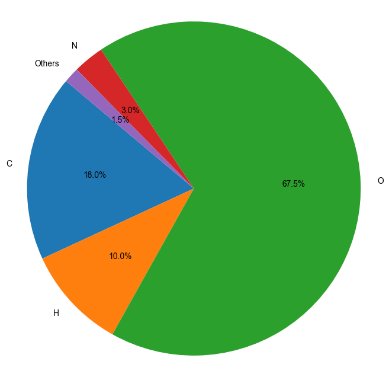
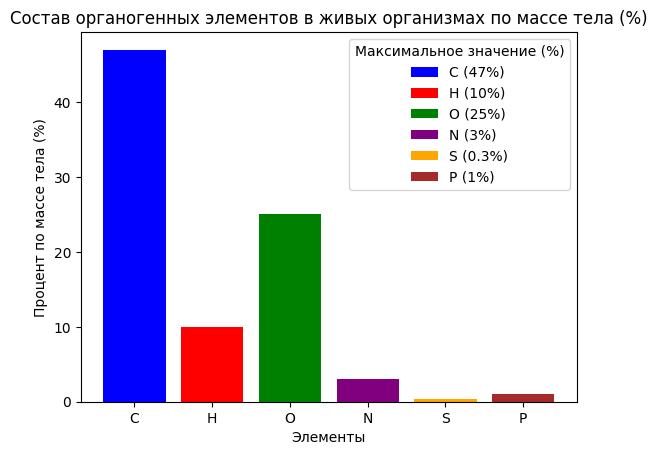
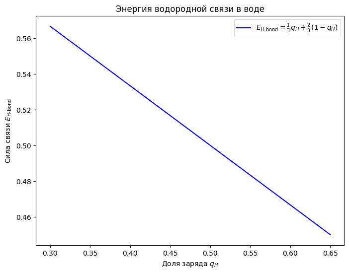
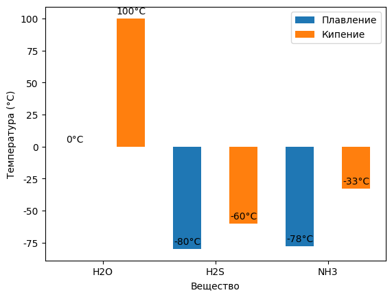

**Этот конспект сгенерирован с помощью AI.**
**Система может допускать ошибки в формулах, вычислениях и специфической терминологии.**
**Пожалуйста, относитесь с понимаем и проверяйте конспект!**

# Макроуровень как основа биологического познания

Само понятие общей биологии не является однозначным. Развитие большинства наук шло от макроскопических проявлений к микроскопическим механизмам — например, в физике человек сталкивался с падением тел под действием силы тяжести или поведением электрических цепей ещё до того, как были открыты атомы и законы их взаимодействия. Аналогично в биологии: первые наблюдения касались высших животных и растений — объектов, с которыми человек ежедневно взаимодействует. По мере развития науки границы исследования расширялись, но в отличие от физики, где макроскопические описания (механика) дали мощный стимул для дальнейшего прогресса, в биологии такой «макроосновы» не сложилось.

Причина в том, что биология изначально формировалась как наука о многообразии — о происхождении, сохранении и функционировании форм жизни. Однако при систематизации знаний приоритет отдавался уже известным, близким человеку объектам: домашним животным, сельскохозяйственным растениям. Это привело к тому, что на первый план вышли зоология позвоночных и ботаника высших растений, тогда как другие группы организмов оказались в тени. В результате биологический цикл обучения строится «с головы» — школьник начинает с ботаники и зоологии, не имея базовых знаний по химии и физике, которые необходимы для понимания механизмов жизнедеятельности.

Такой подход сохраняется и на уровне высшего образования: на первом курсе традиционно изучаются ботаника и зоология, тогда как фундаментальные дисциплины — физика, химия — осваиваются позже. Лишь после этого студенты приступают к биохимии, молекулярной биологии, генетике и физиологии, что делает эти предметы по сути недоступными без предварительного изучения естественных наук. В итоге учебники и программы строятся так, что переход от макроскопических описаний к микроскопическим механизмам становится почти невозможным для студента — он не возвращается «назад», даже если понимает суть процессов.

В отличие от этого, предлагаемая структура курса направлена на последовательное изучение: начиная с компонентов живого, объясняя, почему их совокупность порождает новые свойства, и прослеживая, как эти системы функционируют, развиваются и эволюционируют. Такой подход позволяет избежать разрыва между макроскопическим восприятием жизни и её молекулярной основой.

Однако из-за ограниченности времени курс не предполагает полной детализации. Основное внимание будет уделено ключевым, с практической или концептуальной точки зрения важным аспектам, а углублённые объяснения оставлены за рамками лекции. Это обусловлено также тем, что среди слушателей регулярно встречаются студенты, интересующиеся вопросами физиологии, спорта и применения анаболических стероидов — что указывает на потребность в прикладной, но строго научной интерпретации биологических процессов.

# Границы жизни: вирусы как вызов определению

Вирусы не обладают признаками жизни вне клетки хозяина: в покоящейся форме, передающейся между организмами, они представляют собой инертные частицы, состоящие из белка и одной молекулы РНК (или ДНК), которые могут быть полностью разложены на составные молекулы — белки и нуклеиновую кислоту — при изменении условий среды. При pH 9,5–10 вирус табачной мозаики распадается на отдельные белки и одну длинную молекулу РНК; при добавлении слабой уксусной кислоты (без резкого изменения pH) РНК переходит в кислотную форму и выпадает в осадок, что демонстрирует её химическую природу как неорганического соединения.  

Вирусы проявляют свойства живого только внутри клетки хозяина: они используют клеточный аппарат биосинтеза белков для репликации своих генетических материалов и сборки новых вирусных частиц, перестраивая функции клетки на свой счёт. При этом собственные системы синтеза белка у вирусов отсутствуют — все необходимые белки производятся за счёт переориентации клеточных механизмов.  

Вирусы являются облигатными паразитами: вне клетки они не способны к размножению, не проявляют метаболической активности и не отвечают на внешние стимулы как живые организмы. Их жизнеспособность реализуется исключительно в условиях инфицирования клетки, где они нарушают нормальные функции хозяина, что приводит к развитию заболевания — не столько из-за репликации вируса, сколько из-за подавления клеточных процессов.  

Таким образом, граница между живым и неживым у вирусов проходит по наличию или отсутствию автономной метаболической активности: вне клетки — это химическое вещество; внутри клетки — функциональный элемент, использующий живую систему как среду для самовоспроизведения.

В условиях слабой концентрации уксусной кислоты РНК, находящаяся в растворе, переходит в кислотную форму и выпадает в осадок. Вирусный белок остаётся в растворе. После высушивания полученных фракций образуется стабильный препарат, пригодный для длительного хранения. При последующем растворении в воде при условиях, близких к клеточным, и смешивании компонентов происходит самособирание вирусной частицы. Процесс сборки аналогичен кристаллизации солей — например, хлористого натрия или медного купороса — за счёт специфичных межмолекулярных взаимодействий. Только определённые белки способны встраиваться в структуру: другие белки не участвуют; сборка осуществляется строго одним видом белка и с участием одного белка-инициатора.

# Энергетика и саморегуляция: основа жизнедеятельности

Живые организмы характеризуются способностью поддерживать постоянство своего состава и состояния, отличного от окружающей среды, за счёт целенаправленной реакции на внешние воздействия. Это свойство — поддержание гомеостаза — является более устойчивым и универсальным по сравнению с другими признаками жизни: оно присутствует у всех клеток и организмов в состоянии жизнедеятельности и исчезает при нарушении регуляции внутреннего равновесия. Способность к размножению рассматривается как потенциальное, а не обязательное свойство живого: многие особи (включая человека) остаются живыми за пределами репродуктивного периода, что свидетельствует о необходимости оговорок при формулировке критериев жизни.

Определение живого может основываться на наборе свойств или на природе материального носителя. Первый подход предполагает наличие комплекса признаков: воспроизведение себе подобных, реакция на внешние стимулы и поддержание гомеостаза. Второй подход опирается на химическую специфику — живые организмы продуцируют или содержат определённые вещества, ранее классифицируемые как органические. Современная органическая химия охватывает широкий круг соединений углерода, не ограниченных природными образцами и даже потенциально токсичных для живых систем.

Важным отличием является то, что большинство синтетических органических веществ действуют как ингибиторы биологических процессов — например, блокируя рецепторы (как бета-адренорецепторы) или подавляя синтез природных регуляторов. В то же время стимуляторы, усиливающие функции клеток, встречаются значительно реже. Это указывает на асимметрию в возможности управления биологическими системами: легче «выключить», чем «включить».

Особое значение имеет тот факт, что независимо от типа организма, в его составе доминирует один класс соединений — белки. Эта универсальность белковой структуры легла в основу представления о жизни как о проявлении белкового метаболизма, сформировавшееся уже к середине XIX века.

В живых организмах всегда присутствуют вещества, действующие как ингибиторы — например, блокаторы бета-адренорецепторов, которые не являются биологически родственными адреналину, но связываются с тем же рецептором и подавляют его активность. Существуют также вещества, препятствующие синтезу естественных регуляторов: они действуют на других участках метаболизма, но в итоге приводят к снижению уровня таких молекул, как адреналин, за счёт нарушения их продукции. Эти соединения чаще всего являются ингибиторами — их легко синтезировать для подавления определённых процессов. Напротив, стимуляторы, способные «включать» функции, особенно те, которые плохо работают, известны крайне мало.

Органическая химия в целом изучает не только соединения живых организмов, но и продукты их метаболизма; исследования именно природных соединений составляют предмет биоорганической химии — междисциплинарной области на стыке химии и биологии. Критерием включения вещества в эту область является его биологическое происхождение.

Независимо от типа организма — будь то *Homo sapiens* или *E. coli* — в его составе доминирует один класс соединений: белки. Эта универсальность белковой структуры легла в основу представления о жизни как о проявлении белкового метаболизма, сформировавшегося уже к середине XIX века.

Фридрих Энгельс в работе «Диалектика природы» дал определение жизни как способа существования белковых тел, при котором ключевым моментом является постоянный обмен веществ с окружающей средой. При этом структура белков сохраняется благодаря этому обмену; его нарушение ведёт к прекращению жизненных процессов. Данное определение остаётся верным более чем за полтора столетия и не было опровергнуто экспериментально.

Однако данное философское определение не имеет практической значимости для биологии: оно не позволяет делать предсказания, формулировать гипотезы или направлять исследования. Тем не менее, оно отражает наблюдаемый факт — во всех живых системах функционируют белки.

Жизнь также часто определяют как существование саморегулирующихся систем. Однако саморегуляция может быть присуща и неживым системам (например, техническим устройствам), поэтому это свойство недостаточно для выделения жизни. Все попытки формализовать понятие жизни сталкиваются с проблемой: они опираются на известные факты прошлого, но не способны предсказывать новые явления — аналогично тому, как военные академии учат по опыту прошлых войн.

Поэтому в биологии принято ограничиваться описанием наблюдаемых общих свойств живых систем, а не строить универсальные определения. Эти свойства основаны на общности состава и строения: у всех организмов — от *Homo sapiens* до бактерий — присутствует генетический материал в виде ДНК, каталитические белки, осуществляющие обмен веществ, и сходные по функции и структуре ферменты.

Несмотря на различия в размерах, организации и типах обмена (например, аэробный или анаэробный), у всех живых организмов на Земле реализованы одни и те же базовые биохимические принципы. Это позволяет рассматривать жизнь как совокупность систем, построенных из белков и нуклеиновых кислот — полимеров, обладающих нерегулярной, но функционально определённой структурой.

Начало изучения общих свойств жизни требует анализа того, из чего построены организмы: они используют вещества из окружающей среды, но не все компоненты доступны напрямую. Например, азот в атмосфере (в виде $\text{N}_2$) недоступен большинству организмов; его могут фиксировать только ограниченные группы бактерий, превращая в доступные формы. Остальные организмы получают азот уже в составе органических соединений.

Организмы используют из окружающей среды только те формы веществ, которые могут быть усвоены. Например, азот в атмосфере ($\text{N}_2$) недоступен большинству живых организмов — его способны фиксировать лишь ограниченные группы бактерий, превращая в доступные соединения. Остальные организмы получают азот уже в составе органических молекул.  

Несмотря на то что в атмосфере Земли содержится около 70% азота, это не означает его избыток для жизни: он представлен в форме, недоступной для большинства организмов. Аналогично обстоит дело и с другими элементами — одни соединения из окружающей среды могут быть неусваиваемыми, другие же, казалось бы, непригодные, активно используются после преобразования.  

Яркий пример — кремний. Хотя его соединения (песок, стекло) нерастворимы в воде, живые организмы способны растворять их, переводить в ионную форму и использовать для построения структур. У хвощей кремниевые кристаллы строго определённой формы и размера откладываются в стеблях, придавая им жёсткость. Эти кристаллы использовались в ювелирной промышленности как полировочный материал до середины XX века.  

Кремний также входит в состав хрящевой ткани — примерно 1% сухого веса хряща приходится на кремний. Он переводится в анионы кремниевой кислоты, которые образуют эфирные связи с полисахаридами и участвуют в создании четырёхвалентного соединения, соединяющего четыре полимерные цепи в одной точке.  

Углерод является основным элементом живых организмов благодаря своей уникальной электронной структуре: он четырёхвалентен, образует устойчивые неполярные и слабо смещённые по электронной плотности связи. В отличие от кремния, у которого связи поляризованы из-за большего размера ядра и слабого удержания электронов, у углерода электронные пары более прочно удерживаются, но при этом недостаточно сильно притягиваются к ядру. Это позволяет углероду образовывать разнообразные типы связей — с электроотрицательными атомами (азот, кислород) возникают смещённые связи, а с водородом или другим углеродом — неполярные.  

Четыре валентности углерода обеспечивают возможность образования длинных цепочек, разветвлённых структур и циклов, что лежит в основе огромного разнообразия органических соединений. Эти особенности обусловлены именно электронной структурой атома, а не просто его химическими свойствами.  

Лёгкость атомов углерода и построенных на их основе молекул напрямую влияет на скорость диффузии — чем легче молекула, тем выше её подвижность в среде. Это критически важно для процессов поглощения веществ, транспорта и перераспределения внутри клетки и организма. Углерод не имеет эквивалентов среди других элементов по этим характеристикам.  

Другие элементы, такие как азот, могут образовывать несколько связей (например, трёхвалентный азот в молекуле аммиака), но их свойства ограничены электронной структурой: хотя они способны к образованию неполярных молекул, их химические и физические характеристики не обеспечивают такой степени разнообразия и функциональной гибкости, как у углерода.

Углерод обладает четырьмя валентными электронами, что позволяет ему образовывать до четырёх ковалентных связей. Благодаря этому он способен создавать разнообразные структуры — линейные, разветвлённые и циклические цепи, а также сложные изомерные соединения. Такие свойства обусловлены электронной конфигурацией внешнего энергетического уровня углерода: четыре валентных электрона обеспечивают стабильность при образовании σ-связей без необходимости в дополнительных внешних парах электронов. В отличие от кремния, углерод имеет меньшую атомную массу, что способствует высокой скорости диффузии образующихся на его основе молекул — важный фактор для эффективного транспорта веществ в живых системах.

Связи между атомами углерода и водорода (C–H) или между двумя атомами углерода (C–C) являются неполярными, поскольку разница в электроотрицательности этих элементов незначительна. В таких связях электроны распределены симметрично, что приводит к отсутствию поляризации и заряда на атомах. Это свойство делает углерод-углеродные соединения малополярными или неполярными, однако в водной среде такие молекулы оказываются энергетически невыгодными для взаимодействия с полярным растворителем — водой.

Для обеспечения электростатических взаимодействий в биологических молекулах в углеродную основу включаются кислород и азот. Кислород, обладающий высокой электроотрицательностью (2,5 по шкале Полинга), смещает электроны к себе при образовании ковалентных связей с углеродом (C–O). Это приводит к частичному отрицательному заряду на атоме кислорода и положительному — на углероде. Подобное смещение создаёт полярные группы, способные участвовать в водородных связях и диполь-дипольных взаимодействиях.

Азот также образует полярные связи с углеродом (C–N), но его электронная структура отличается: у атома азота пять валентных электронов — три участвуют в ковалентных связях, один остаётся неспаренным, а ещё одна пара электронов находится на внутренней орбитале. Эта внутренняя электронная пара делает атом азота способным к акцептации протона (H⁺), что проявляется, например, при взаимодействии аммиака с водой: NH₃ + H₂O → NH₄⁺ + OH⁻. В результате образуется ион аммония и гидроксид-ионы, что определяет щелочную реакцию среды.

Таким образом, азот и кислород вносят в органические молекулы полярные и заряженные группы — аминогруппы (–NH₂) и карбоксильные группы (–COOH), которые могут участвовать в электростатических взаимодействиях. Аминогруппы при присоединении протона становятся положительно заряженными (+NH₃⁺), а карбоксильные группы — отрицательно заряженными (–COO⁻). Эти заряды обеспечивают специфическое взаимодействие между молекулами, например, связывание белков с анионами или катионами.

В условиях водной среды неполярные участки углеродных цепей (например, в липидах или углеводородных фрагментах) не могут эффективно взаимодействовать с полярными молекулами воды. Энергетически невыгодно растворение неполярных соединений в воде, поэтому такие группы стремятся минимизировать контакт с водой и объединяться между собой. Это приводит к образованию гидрофобных взаимодействий — слабого, но устойчивого типа взаимодействия, основанного на максимизации удалённости от полярной среды.

В результате таких процессов в биологических молекулах формируются сложные пространственные структуры: неполярные участки собираются внутрь (например, в мембранах), а полярные и заряженные группы ориентируются наружу, обеспечивая взаимодействие с водной средой. Ключевую роль в стабилизации этих структур играют ван-дер-ваальсовы силы — слабые межмолекулярные взаимодействия между неполярными участками, возникающие за счёт временных дипольных моментов и индукционных эффектов.

Таким образом, углерод обеспечивает основу для огромного разнообразия органических соединений благодаря своей валентности и стабильности связей. Кислород и азот дополняют эту структуру полярными и заряженными группами, необходимыми для электростатических взаимодействий в водной среде. Неполярные участки углерода-углерода и углерода-водорода, несмотря на отсутствие поляризации, участвуют в формировании сложных биомолекулярных структур через гидрофобные и ван-дер-ваальсовы взаимодействия.

Кислород и азот способны образовывать ковалентные связи с углеродом, при этом оба атома обладают высокой электроотрицательностью — они смещают общую электронную пару в свою сторону, создавая частичные отрицательные заряды на себе. В случае кислорода это приводит к формированию полярных связей, где на кислороде локализуется отрицательный заряд, а на присоединённых атомах водорода — положительный. Подобное распределение зарядов характерно для молекул воды: $\text{H}_2\text{O}$, в которой два атома водорода несут частичные положительные заряды, а один атом кислорода — два частичных отрицательных заряда из-за наличия двух неподелённых электронных пар. Такие дипольные структуры обеспечивают электростатическое взаимодействие между полярными группами молекул.

Углеродные участки молекул, связанные неполярными ковалентными связями (C–H), в водной среде не взаимодействуют с водой энергетически выгодно. Это приводит к тому, что такие неполярные группы стремятся минимизировать контакт с водой и объединяются между собой. На больших молекулах это проявляется как суммарное неспецифическое взаимодействие — ван-дер-ваальсовы силы, действующие на поверхности соприкосновения. Эти взаимодействия, хотя и слабые по отдельности, становятся устойчивыми при увеличении площади контакта и обеспечивают формирование гидрофобных комплексов.

Гидрофобные взаимодействия — это не ковалентные связи и не специфические межатомные соединения, а совокупность слабых электростатических взаимодействий между атомами на поверхности соприкосновения двух молекул в водной среде. Они устойчивы именно в присутствии воды: при удалении из водной среды (например, при добавлении гидрофобного растворителя) такие комплексы легко разрушаются. Таким образом, гидрофобные взаимодействия — это следствие выталкивания неполярных участков из водной фазы и их самособирания.

В составе органических соединений живых организмов ключевую роль играют четыре элемента: углерод (C), водород (H), кислород (O) и азот (N). Углерод образует основу всех органических молекул, обеспечивая разнообразие структур за счёт валентности. Водород, в зависимости от окружения, участвует либо в неполярных связях (C–H), способных к ван-дер-ваальсовым взаимодействиям, либо в полярных — с O или N, где он приобретает частичный положительный заряд. Кислород и азот создают полярные группы, способные к электростатическим взаимодействиям: ионным (при полной ионизации) или диполь-дипольным (при частичном смещении заряда). Эти взаимодействия лежат в основе формирования сложных биомолекулярных структур.

В совокупности углерод, водород, кислород и азот составляют около 96% массы живых организмов. Такое высокое содержание обусловлено доминирующей ролью воды — $\text{H}_2\text{O}$, где на долю кислорода и водорода приходится подавляющая часть массы. Углерод представлен в основном за счёт органических соединений, которые определяют структуру белков, липидов, углеводов и нуклеиновых кислот. Все описанные типы взаимодействий — электростатические (ионные, дипольные), ван-дер-ваальсовы и гидрофобные — являются основой для самособирания молекул в водной среде и формирования функциональных биомолекулярных комплексов без необходимости ковалентного связывания между ними.

Азот составляет около 3% от общей массы живых организмов, тогда как кислород — более 65%, водород — около 10%, углерод — примерно 18%

 
Массовый состав основных элементов в живых организмах

. При равных молярных соотношениях масса водорода в 16 раз превышает массу кислорода из-за разницы в атомных массах (1 и 16 соответственно), однако по числу атомов водорода в воде их вдвое больше, чем кислорода. Соответственно, по массе кислород преобладает над водородом в 8 раз. Остальные элементы — сера, фосфор, железо, калий, кальций, магний, натрий, хлор и другие — присутствуют в меньших количествах, но обязательны для жизнедеятельности всех живых организмов.

Сера входит в состав органических соединений как обязательный элемент. Она расположена под кислородом в периодической системе, однако из-за большего числа электронных оболочек слабее притягивает электроны, образуя менее полярные связи по сравнению с кислородом. В биохимии серы характерны две стабильные формы: полностью окисленная — сульфат (SO₄²⁻), который входит в состав сульфополисахаридов соединительной ткани и некоторых липидов мембран хлоропластов; и восстановленная — сероводородная форма, образующая две ключевые аминокислоты. Цистеин содержит группу –SH, функционально аналогичную сероводороду, и участвует в формировании дисульфидных мостиков между остатками цистеина в белках. Метионин включает сульфурированную углеродную цепь и проявляет свойства неполярной группы, схожие с метильными фрагментами. Обе аминокислоты необходимы для жизни: метионин — стартовая аминокислота при синтезе белков, цистеин — компонент активных центров большинства ферментов.

Фосфор представлен в живых организмах исключительно в форме ортофосфата (H₃PO₄), который не имеет альтернативных стабильных форм. Ортофосфат способен образовывать эфирные связи с молекулами, что используется для активации соединений и изменения их заряда и структуры. Фосфатные группы — сильные отрицательно заряженные участки, способные дестабилизировать соседние молекулы и участвовать в переносе энергии. При образовании фосфоангидридных связей (макроэргических) высвобождается значительное количество энергии. Примером служит АТФ, содержащий две такие связи. Подобные структуры характерны также для нуклеотидов и нуклеиновых кислот. Фосфор уникален как элемент, способный сохранять три кислотные группы в одной молекуле: при присоединении двух протонов остаются свободные группы, способные диссоциировать, обеспечивая высокий отрицательный заряд и высокую реакционную способность. Это делает фосфатную группу эффективным носителем энергии.

Арсенат (AsO₄³⁻), хотя и структурно похож на ортофосфат, не обладает свойствами трёхосновной кислоты: его кислотные группы менее устойчивы, склонны к потере воды с образованием арсенита (AsO₂⁻), который теряет способность к образованию макроэргических связей. В результате арсенат не может выполнять функции фосфата в биохимических реакциях и ингибирует процессы, зависящие от фосфорилирования. Это объясняет его токсичность — он конкурирует за места связывания с АТФ и другими фосфатсодержащими соединениями, нарушая энергетический обмен без участия в реакциях.

Таким образом, шесть элементов — углерод, водород, кислород, азот, сера, фосфор — являются органогенными, то есть входят в состав всех органических соединений живых организмов. Они составляют основу биомолекулярной структуры и функциональной активности клеток. Остальные элементы (железо, калий, кальций, магний, натрий, хлор и др.) присутствуют в меньших количествах, но играют важную роль в регуляции метаболизма, поддержании ионного баланса и структурной организации биологических систем.

Эти шесть элементов — углерод, водород, кислород, азот, сера и фосфор — входят в состав органических веществ и называются органогенными. Их наличие необходимо для формирования полного комплекса органических соединений, из которых построены живые объекты. Остальные элементы (железо, калий, кальций, магний, натрий, хлор и др.) присутствуют в меньших количествах, но играют важную роль в регуляции метаболизма, поддержании ионного баланса и структурной организации биологических систем.

Фосфат обладает тремя кислотными группами, две из которых могут участвовать в реакциях с образованием новых связей, сохраняя при этом высокую электроотрицательность. Третья кислотная группа диссоциирует, обеспечивая полный отрицательный заряд, что делает фосфатные соединения высокоэнергетичными и способными к активации биохимических реакций.

Арсенат не обладает свойствами сильной трёхосновной кислоты: его трёхкислотная форма менее устойчива, склонен терять воду с образованием арсенита — соединения без трёхкислотных группировок. В результате арсенат не может участвовать в реакциях, аналогичных фосфатным, и используется биологическими системами невозможно.

Токсичность арсената обусловлена его способностью связываться на месте фосфатных групп в биомолекулах (например, в АТФ), что приводит к ингибированию ключевых метаболических процессов. Таким образом, он не участвует в реакциях, но нарушает их протекание — именно это лежит в основе его ядовитого действия.

Количество органогенных элементов в живых организмах составляет десятки процентов массы тела: углерод — до 47%, водород — около 6–10%, кислород — 10–25%, азот — 1–3%, сера — примерно 0,3%, фосфор — около 1% (у *Homo sapiens* за счёт костной ткани; у растений содержание ниже из-за отсутствия минеральных структур

 
Состав органогенных элементов в живых организмах по массе тела

). Остальные элементы присутствуют в количествах от долей до десятков процентов: натрий и калий — в заметных концентрациях, хотя их соотношение в биосфере отличается от геохимического фона — в верхних слоях Земли натрия значительно больше, чем калия.

Эти шесть элементов — углерод, водород, кислород, азот, сера и фосфор — входят в состав органических веществ и называются органогенными. Термин «органогенные» является биологическим и не связан напрямую с химией; он отражает необходимость этих элементов для построения полного комплекса органических соединений, из которых состоят живые объекты. Помимо них, в заметных количествах (от долей до десятков процентов массы организма) присутствуют также натрий, калий, кальций и магний. У *Homo sapiens* содержание фосфора достигает около 1% за счёт костной ткани; у растений его концентрация ниже — из-за отсутствия минеральных структур, таких как кости, а также отсутствия фосфатных компонентов в клеточных стенках. Сера составляет примерно 0,3%. Остальные элементы (натрий, калий и др.) присутствуют в количествах менее десятой или сотой процента.

В биосфере соотношение натрия и калия отличается от их распределения в верхних слоях Земли: натрия значительно больше, чем калия. В живых организмах наблюдается обратная картина — калия содержится намного больше, чем натрия, причём разница достигает двух порядков. Это обеспечивается за счёт активного ионного транспорта: все живые организмы (включая *Homo sapiens*) выкачивают натрий из клеток и закачивают калий внутрь. Процесс осуществляется с помощью единого фермента — натрий-калиевого транспортерного белка (натрий-калиевая атефаза), который работает несимметрично: связывает три иона натрия изнутри клетки, выталкивает их наружу, а снаружи захватывает два иона калия и переносит внутрь. Поскольку калий имеет большую гидратную оболочку, он труднее проходит через мембрану, что делает его транспорт энергетически выгодным.

В результате на внешней стороне мембраны накапливается положительный заряд (3 Na⁺), а внутри — отрицательный (2 K⁺). Мембрана клеток приобретает электрический потенциал, при котором внутренняя сторона становится отрицательно заряженной относительно внешней. Такая структура позволяет клетке функционировать как конденсатор, и запасённая в этом потенциале энергия может использоваться для других транспортных процессов.

Причина накопления калия и удаления натрия связана с растворимостью солей нуклеиновых кислот: натриевые соли РНК и ДНК плохо растворимы, тогда как калиевые — хорошо. При высокой концентрации натрия (например, 1–2 моля) РНК выпадает в осадок, что делает невозможным её функционирование. Поэтому клетки активно удаляют натрий и накапливают калий, обеспечивая стабильность нуклеиновых кислот. В качестве противоионов к нуклеиновым кислотам также могут выступать магниевые ионы.

Кальций и магний — двухвалентные металлы, их соли часто нерастворимы (особенно фосфатные). Поэтому в клетке концентрация кальция поддерживается на низком уровне за счёт его постоянного выкачивания. Однако при необходимости — например, для мышечного сокращения — кальций быстро высвобождается из внутриклеточных депо (сортоплазматического ретикулума) и концентрация возрастает более чем на 5 порядков за доли секунды. После завершения процесса сокращение кальций возвращается в депо с использованием энергии АТФ специальным белком.

Кальций в цитоплазме клеток поддерживается на низком уровне за счёт постоянного его выкачивания из внутриклеточных депо — сортоплазматического ретикулума. При необходимости, например для мышечного сокращения, концентрация ионов кальция повышается более чем на пять порядков за доли секунды вследствие высвобождения из этих структур. После завершения сократительного процесса кальций возвращается в депо с использованием энергии АТФ и специальным белковым механизмом, что восстанавливает исходную концентрацию и обеспечивает стабильность внутриклеточной среды.

В цитоплазме преобладает магний над кальцием: концентрация кальция — миллимолярная, магния — миллимолярная, тогда как калия — десятки и сотни миллимолей. Магний является критически важным элементом для жизнедеятельности клетки: в виде магниевых солей он стабилизирует структуру рибосом и необходим для биосинтеза белка. Без ионов Mg²⁺ многие клеточные процессы невозможны.

Магний также играет ключевую роль в фотосинтезе — он обязателен для синтеза хлорофилла. В пресноводных экосистемах дефицит магния часто становится лимитирующим фактором продуктивности: в водоёмах с высоким содержанием магниевых глин (например, глинистых пород) наблюдается бурное развитие водорослей и зоопланктона, тогда как в аналогичных по другим параметрам (свет, питание, температура) водоёмах с низким содержанием магния — низкая биомасса и отсутствие цветения воды.

Противоионы к ионам кальция и магния в клетке преимущественно представлены хлорид-ионами Cl⁻. Хлор в большинстве случаев выполняет функцию инертного противоиона и не участвует напрямую в биохимических реакциях, за исключением двух конкретных случаев, где он выступает как кофермент. Концентрация хлора в клетках составляет десятые и сотые доли процента.

Все перечисленные элементы — кальций, магний, хлор, калий — относятся к макроэлементам, поскольку их содержание в клетке велико и легко определяется методами анализа. Однако при изучении урожайности сельскохозяйственных культур было обнаружено, что даже при достаточном уровне макроэлементов растения могут страдать от дефицита других веществ. Это привело к выявлению группы микроэлементов — элементов, необходимых в крайне малых количествах, но без которых жизнедеятельность организма невозможна.

К микроэлементам относятся железо, медь и другие металлы с переменной валентностью. В живых системах они участвуют в окислительно-восстановительных реакциях как переносчики электронов: например, железо переходит из трёхвалентного состояния (Fe³⁺) в двухвалентное (Fe²⁺), захватывая электрон, а затем передаёт его другому соединению, окисляя его и возвращаясь в исходное состояние. Такие процессы лежат в основе работы ключевых клеточных структур.

Железосодержащие белки делятся на две основные группы. Первая — гемсодержащие белки: цитохромы, участвующие в дыхательной цепи митохондрий и синтезе АТФ, а также цитохром P450 в печени, отвечающий за детоксикацию ароматических соединений. Вторая группа — белки с железосульфидными кластерами (Fe-S-кластеры), где железо связано с серой цистеиновых остатков. Такие кластеры обеспечивают передачу электронов по цепочке: один атом железа окисляет одно соединение, передаёт электрон соседним атомам и окисляет другое. Fe-S-белки широко представлены в митохондриях и хлоропластах и участвуют как в энергетическом обмене, так и в регуляции метаболизма.

В отличие от макроэлементов, микроэлементы характеризуются групповой специфичностью: одни необходимы всем организмам (например, железо и медь), другие — только определённым таксонам. Железо и медь обладают переменной валентностью и участвуют в окислительно-восстановительных реакциях как переносчики электронов. В живых системах железо может переходить из трёхвалентного состояния в двухвалентное и обратно, принимая или отдавая электроны.  

Две основные группы железосодержащих белков — гемсодержащие (цитохромы) и белки с Fe-S-кластерами. Цитохромы содержат железо в геме и участвуют в передаче электронов в митохондриях при синтезе АТФ, а также выполняют защитную функцию в печени через цитохром P450, окисляя токсичные соединения, включая ароматические.  

Fe-S-белки характеризуются тем, что железо связано с серой цистеиновых остатков и образует кластер — цепочку атомов железа и серы. Один атом железа может последовательно окислять одно соединение, передавать электрон соседним атомам железа и окислять другое. Такие белки широко представлены в митохондриях и хлоропластах и участвуют как в энергетическом обмене, так и в регуляции метаболизма.  

Медь также способна менять валентность и участвует в переносе электронов, являясь ключевым компонентом последнего этапа окислительного фосфорилирования в митохондриях. В этом процессе молекула кислорода $\text{O}_2$ координируется с ионом меди и гемом, образуя структурный узел, способный замещаться на ион цианида $\text{CN}^-$. Цианид прочно фиксируется в этом центре, блокируя дальнейшую передачу электронов и останавливая окисление. При поступлении более 40 мг цианида происходит летальный исход.  

Медные белки, как и железо-содержащие, могут не только участвовать в окислительно-восстановительных реакциях, но и координационно связывать кислород. У некоторых организмов (например, моллюсков) вместо гемоглобина функционирует гемоцианин — белок с медью, обеспечивающий транспорт кислорода.  

Молибден входит в состав ферментов, катализирующих процессы превращения азота: окисление аммония до нитратов или их восстановление. Эти реакции особенно важны для растений, тогда как у животных участие молибдена в азотном обмене выявлено позже.  

Бор является жизненно важным элементом для растений, участвующим в формировании фотосинтетического аппарата; у животных он не требуется, но безвреден и может использоваться в сельском хозяйстве как микроудобрение (борная кислота).  

Фтор необходим животным для синтеза зубной эмали — кристаллической формы гидроксиапатита $\text{Ca}_{10}(\text{PO}_4)_6(\text{OH})_2$. В отличие от костной ткани, где кальций связан с фосфатом и гидроксилом по основной цепи, в эмали фтор замещает гидроксил, образуя более плотные и устойчивые кристаллы $\text{Ca}_{10}(\text{PO}_4)_6\text{F}_2$, что повышает прочность. Растениям и животным без зубов с эмалью фтор не требуется.  

Йод необходим для синтеза тиреоидных гормонов в щитовидной железе *Homo sapiens*; у организмов, не имеющих этой железы (рыбы, лягушки, растения), йод не играет биологической роли.  

Таким образом, микроэлементы демонстрируют как универсальные функции (перенос электронов), так и строгую специфичность для определённых групп организмов.  

Переход к следующим соединениям: вода является определяющим компонентом всех живых систем. Ниже приведена структурная формула воды — $\text{H}_2\text{O}$.

Вода является определяющим компонентом всех живых систем. Структурная формула воды — $\text{H}_2\text{O}$. Молекула воды представляет собой кислород, к которому присоединены два атома водорода под углом связи 105°. Электроны смещаются в сторону атома кислорода, что обусловливает частичный положительный заряд на атомах водорода и частичный отрицательный — на атоме кислорода. Две свободные электронные пары атома кислорода ориентированы под аналогичными углами, но в противоположном направлении относительно связи H–O.  

В результате формируется полярная молекула с дипольным моментом: один конец молекулы заряжен положительно (область атомов водорода), другой — отрицательно (область атома кислорода). Это позволяет воде участвовать в двух типах межмолекулярных взаимодействий. Первый — образование водородной связи между положительно заряженными атомами водорода одной молекулы и отрицательно заряженным атомом кислорода другой молекулы воды. Сила этой связи составляет около трети заряда единичного электрона, что делает её слабой по сравнению с ковалентными связями, но достаточной для формирования устойчивых сетей в жидкой фазе.  

Второй тип взаимодействия — ориентация дипольных молекул относительно внешних электрических полей или ионов. При попадании в раствор ион окружается плотной оболочкой ориентированных молекул воды, называемой гидратной оболочкой. Степень ориентации зависит от величины заряда и размера иона: чем больше заряд, тем прочнее и плотнее гидратная оболочка. Это свойство определяет растворимость ионных соединений и их поведение в биологических системах.  

Таким образом, полярность молекулы воды обусловливает её ключевую роль как универсального растворителя, посредника в переносе веществ и источника энергии для многих биохимических процессов за счёт формирования водородных связей и диполь-дипольных взаимодействий.

Вода как основа биологических свойств: структурная формула H₂O отражает ковалентную связь между одним атомом кислорода и двумя атомами водорода, при этом угол связи составляет 105°. Электронная пара смещается к атому кислорода, формируя частичные заряды: на каждом атоме водорода — положительный заряд δ⁺, на атоме кислорода — отрицательный заряд δ⁻. Две неподелённые электронные пары кислорода ориентированы под углом ~105° в противоположном направлении, что определяет полярность молекулы и возможность двух типов межмолекулярных взаимодействий.

Первый тип — водородная связь между положительно заряженным атомом водорода одной молекулы воды и отрицательно заряжённым атомом кислорода другой. Сила этой связи составляет примерно треть элементарного заряда на водороде и две трети — на кислороде

 
Энергия водородной связи в воде

, что делает её слабее ковалентной, но достаточной для формирования устойчивых сетей в жидкой фазе.

Второй тип — диполь-дипольное взаимодействие: полярная молекула воды с противоположными полюсами (δ⁺ у водорода, δ⁻ у кислорода) ориентируется под действием внешнего электрического поля или заряда. При контакте с ионами в растворе молекулы воды образуют плотную гидратную оболочку, где положительные концы молекул направлены к отрицательным ионам и наоборот.

Чем выше заряд иона, тем больше молекул воды включается в гидратацию — формируется многоуровневая оболочка. На периферии этой оболочки заряды чередуются: после отрицательного слоя (при положительном ионе) следует положительный, который притягивает следующий слой молекул воды. Это приводит к ослаблению электростатических взаимодействий между ионами за счёт экранирования.

Диэлектрическая проницаемость воды составляет 81 — в 81 раз выше, чем у вакуума, что означает резкое снижение силы кулоновского притяжения между ионами даже на малых расстояниях. Это обусловливает электролитическую диссоциацию веществ: соединения с ионными связями (соли), а также функциональные группы органических молекул — карбоксильные (–COOH → –COO⁻ + H⁺) и фосфатные (–PO₄³⁻) — в водной среде практически полностью диссоциируют, приобретая заряды.

В белках и нуклеиновых кислотах наличие заряженных групп определяет их электрические свойства, участие в специфичных взаимодействиях и узнавания. Исключение составляют случаи координации двухвалентных катионов (Mg²⁺, Ca²⁺) с двумя отрицательно заряженными центрами, например, в АТФ: при связывании с одним из кислородов фосфатной группы образуется прочная координационная связь, устойчивая против гидратационной оболочки. В остальных случаях заряженные функциональные группы остаются диссоциированными благодаря экранированию водой.

Водородные связи возможны не только между молекулами воды, но и между водой и другими полярными или частично заряженными группами в биомолекулах — это обеспечивает стабильность конформаций белков, нуклеиновых кислот и участие воды в каталитических центрах ферментов.

В водной среде все заряженные функциональные группы органических молекул диссоциированы, за исключением случаев, когда двухвалентные катионы — магний и кальций — координационно связываются с двумя отрицательно заряженными атомами (например, кислородом в АТФ), образуя прочное взаимодействие. В таких случаях гидратная оболочка оказывается недостаточной для вытеснения иона, поскольку координационная связь стабилизирует его положение.  

Водородные связи могут формироваться не только между молекулами воды, но и между водой и полярными группами других соединений — например, гидроксильными или амидными, несущими частичный заряд (отрицательный на атомах кислорода и азота). Вокруг таких групп формируется гидратная оболочка, препятствующая их ассоциации и способствующая растворимости.  

Каждая молекула воды способна образовывать до четырёх водородных связей: два — за счёт донорных водородов, два — за счёт акцепторного атома кислорода. Энергия водородной связи составляет примерно 1/10 от энергии ковалентной связи и легко разрывается при тепловом движении. При физиологических температурах (комнатная температура) энергия теплового движения достаточна для постоянного разрыва и восстановления водородных связей, обеспечивая динамичность структуры воды.  

При низких температурах тепловое движение недостаточно для разрыва всех связей — молекулы воды фиксируются в устойчивой пространственной структуре, образуя кристаллическую решётку льда. Каждая молекула в льду связана тремя или четырьмя водородными связями и лишена возможности вращаться или перемещаться. При нагревании увеличивается частота разрыва связей: при наличии двух оставшихся связей молекула приобретает вращательную свободу; смещение приводит к изменению расстояний до соседей, затрудняя восстановление связи. Это соответствует переходу воды из твёрдого состояния в жидкое — структура становится частично подвижной, но сохраняет локальную упорядоченность.  

Структура воды динамична: время жизни каждой водородной связи составляет порядка 10⁻⁴–10⁻⁵ секунд. Поэтому говорить о «памяти» или «передаче информации» через структуру воды невозможно — такие представления не имеют научного обоснования. Тем не менее, именно благодаря этой динамической структуре вода обладает уникальными свойствами, обусловленными наличием водородных связей.  

Одним из ключевых свойств является высокая температура кипения — 100 °C при атмосферном давлении, при которой почти все водородные связи разрушаются и вода переходит в газообразное состояние. Это аномально по сравнению с другими соединениями аналогичного размера: например, сероводород (H₂S) становится жидким только при температуре около –80 °C, аммиак (NH₃) — при –44 °C.  

Аномальная стабильность жидкой фазы воды делает возможным существование жизни в водных средах на Земле и объясняет, почему метановые океаны не могут поддерживать биохимические процессы: энергия теплового движения молекул слишком мала для реализации направленных энергетических превращений, необходимых для клеточной жизнедеятельности.  

Большинство внутриклеточных процессов используют энергию теплового движения, но направляют её за счёт специфических структур — например, белков или мембранных систем. Это позволяет реализовать «биологический демон Максвелла»: энергия расходуется только в одном направлении (например, при мышечном сокращении), а обратный процесс требует затрат АТФ. Аналогично устроены транспортные системы и другие метаболические механизмы.  

Структура воды характеризуется наличием локальных плоскостей упорядоченности, обусловленных ориентацией водородных связей между молекулами. Эти плоскости не являются устойчивыми на длительное время, но обеспечивают уникальные физико-химические свойства, необходимые для поддержания гомеостаза и функционирования биологических систем.

Вода обладает уникальными физико-химическими свойствами, обусловленными её пространственной структурой и наличием локальных плоскостей упорядоченности, формируемых водородными связями между молекулами. Эти связи неустойчивы во времени — при столкновении молекул связь быстро разрушается из-за высокой скорости теплового движения, что характерно для состояния вблизи температуры кипения (100 °C при атмосферном давлении).  

Аномальность свойств воды проявляется в сравнении с аналогичными соединениями:  
- *H₂S* (сероводород) переходит в жидкое состояние только при температуре около –80 °C;  
- *NH₃* (аммиак) — при –44 °C

 
Сравнение температур фазовых переходов для H₂O  H₂S и NH₃

.  

Такие низкие температуры делают невозможным существование жидкой среды на основе этих веществ, необходимой для клеточных процессов. Жизнь возможна лишь в среде с подходящей энергией теплового движения молекул, которая у воды находится в оптимальном диапазоне: достаточно высока для осуществления биохимических реакций, но не настолько велика, чтобы разрушать структуры без контроля.  

Переход воды из жидкого состояния в твёрдое (замерзание) происходит при 0 °C — значительно выше, чем у *H₂S* (–170 °C) или *NH₃* (–78 °C). Это обеспечивает широкий интервал существования жидкой фазы, что критически важно для метаболической активности.  

При замерзании вода расширяется: плотность максимальна при +4 °C, а при 0 °C образуется лёд с меньшей плотностью. Образование слоистой структуры льда связано с наличием устойчивых плоскостей упорядоченности и менее плотных межслоевых областей. Это приводит к тому, что лёд плавает на поверхности водоёмов, а не оседает на дно.  

В процессе охлаждения поверхностные слои воды охлаждаются до 0 °C, становятся тяжелее (плотнее) и опускаются вниз, обеспечивая конвективное перемешивание. При достижении +4 °C дальнейшее охлаждение приводит к уменьшению плотности — охлаждённая вода остаётся сверху. Таким образом, лёд формируется только на поверхности, защищая подlying слой воды от промерзания до дна.  

Это свойство обеспечивает сохранение жизнеспособности организмов в водоёмах даже при зимних заморозках и используется некоторыми видами (например, лягушками) для выживания в условиях сезонного похолодания.
