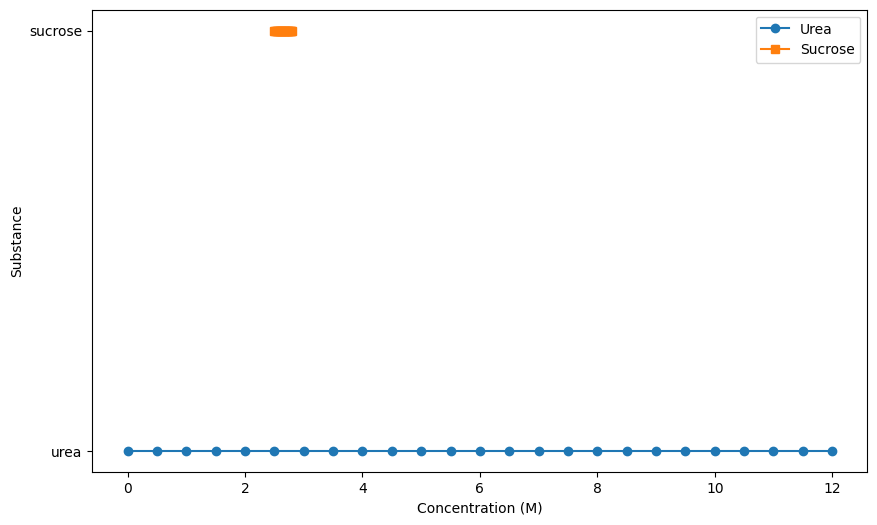
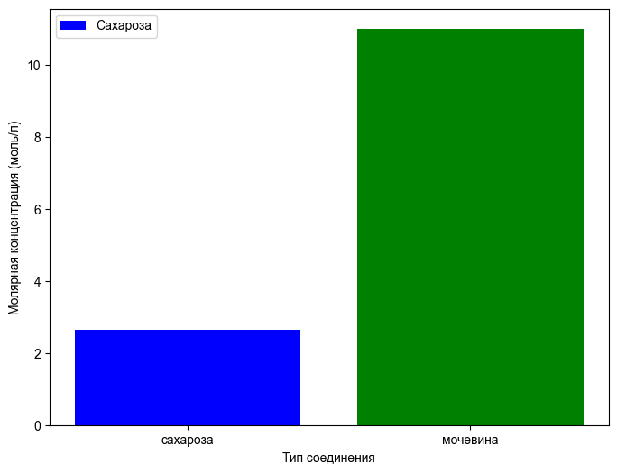
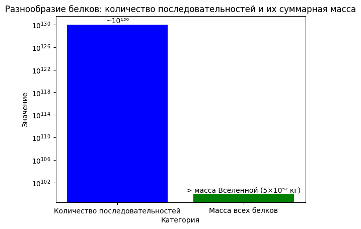
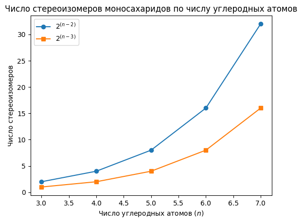

**Этот конспект сгенерирован с помощью AI.**
**Система может допускать ошибки в формулах, вычислениях и специфической терминологии.**
**Пожалуйста, относитесь с понимаем и проверяйте конспект!**

# Структура и взаимодействие с водой

Вещества, не способные образовывать водородные связи с водой из-за отсутствия полярных групп или неполярной природы связей между атомами углерода и водорода, называются гидрофобными. Такие соединения, например углеводороды, при попадании в водную среду нарушают уже существующие водородные связи между молекулами воды, что энергетически невыгодно для системы. В результате вода стремится минимизировать этот дисбаланс — за счёт теплового движения молекулы вещества постепенно перемещаются к поверхности раствора или выходят в отдельную фазу, как наблюдается при смешивании бензина с водой. Это явление обусловлено стремлением системы к энергетическому минимуму через максимизацию числа водородных связей.

Вещества, содержащие полярные группы — кислород, азот, серу — способны образовывать водородные связи с молекулами воды либо взаимодействовать по ионному механизму (Кулоновскому притяжению). К таким веществам относятся гидрофильные соединения: сахара, аминокислоты, мочевина. Например, сахароза благодаря множеству гидроксильных групп легко растворяется в воде, образуя насыщенные растворы до концентрации около 2,5 моль/л (примерно 2 кг на литр воды). Мочевина (*urea*), имеющая четыре атома водорода, способных участвовать в водородных связях — по два от кислорода и по одному от каждого из двух атомов азота — образует значительно большее число связей с водой. Это позволяет достигать концентраций до 10–12 моль/л без кристаллизации, что делает её одним из наиболее гидрофильных органических соединений.

Образование гидратной оболочки вокруг ионов также является энергетически выгодным процессом по сравнению с разрушением водородных связей в чистой воде. Поэтому ионизируемые соединения, особенно с малыми размерами ионов (например, Na⁺, Cl⁻), хорошо растворяются в воде и стабильно существуют в виде гидратированных форм.

Таким образом, способность вещества взаимодействовать с водой определяется наличием полярных или заряженных групп, способных участвовать в водородных связях или ионном взаимодействии. Гидрофильные соединения эффективно интегрируются в водную среду, тогда как гидрофобные вытесняются из неё, стремясь к минимизации нарушения структуры водородной сети воды.

В воде из-за геометрии водородных связей — углов между связями около 104,5° — формируется слоистая, а не непрерывная сеть, что ограничивает её структурную целостность. Сахар (сахароза) улучшает эту структуру за счёт своей полярной гидроксильной группы, способной участвовать в водородных связях с водой. Более эффективно это свойство проявляется у мочевины (*urea*), молекулы которой содержит два атома азота и один кислород: каждый атом азота может служить донором одной водородной связи перпендикулярно плоскости молекулы, а кислород — акцептором двух связей, аналогично воде. В результате на одну молекулу мочевины образуется до четырёх водородных связей, что обеспечивает значительный энергетический выигрыш при растворении.  

Мочевина хорошо растворима в воде: её можно получить растворы с концентрацией до 12 моль/л (иногда выше — до насыщения), тогда как сахароза при насыщении даёт раствор около 2,5–2,8 моль/л

 
Сравнение растворимости мочевины и сахарозы по молярной концентрации

. Таким образом, количество мочевины в растворе может превышать массу воды более чем вдвое по молярному содержанию

 
Сравнение растворимости гидрофильных соединений  сахароза vs мочевина

. Высококонцентрированные растворы мочевины (до 6 моль/л и выше) ранее широко применялись в исследованиях нуклеиновых кислот: они вызывают полную денатурацию ДНК за счёт разрушения водородных связей между комплементарными цепями, позволяя анализировать последствия мутаций или последовательности нуклеотидов.  

Вещества, взаимодействующие с водой, делятся на две группы. Первая — те, чьи взаимодействия с водой энергетически выгодны и не нарушают устойчивость водной структуры: они растворяются без нарушения термодинамического равновесия системы. К ним относятся полярные молекулы, способные к образованию водородных связей или ионного взаимодействия (например, мочевина). Вторая группа включает вещества, где между молекулами существуют прочные межмолекулярные связи — например, большие органические молекулы с внутримолекулярными водородными связями или дисперсионными взаимодействиями. В таких случаях растворение затруднено даже при наличии полярных групп, поскольку энергия разрыва внутренних связей не компенсируется энергией взаимодействия с водой.  

К диполям, способным к взаимодействию с водой через электростатические и диполь-дипольные силы, относятся соединения с выраженной полярностью, такие как этиловый спирт (*ethanol*). Он может образовывать водородные связи за счёт гидроксильной группы — как донор (через атом водорода) и акцептор (через кислород), аналогично воде. Однако при наличии устойчивых внутримолекулярных взаимодействий растворимость снижается, несмотря на наличие полярных фрагментов.

# Механизм формирования мембран и осмотического равновесия

Гидрофильные группы молекул, взаимодействуя с водой за счёт ионных и водородных связей, стремятся к водной фазе, тогда как гидрофобные участки — углеводородные цепи — избегают контакта с водой. В результате теплового движения молекулы ориентируются перпендикулярно поверхности раздела фаз: полярная часть (карбоксильная группа) обращена в воду, а неполярный хвост — в воздушную или маслянистую среду. При достаточном количестве таких молекул они агрегируют, образуя сферические структуры — мицеллы, в которых гидрофобные участки направлены внутрь, а гидрофильные — наружу, к водной среде.  

Мицеллы устойчивы благодаря минимизации свободной энергии системы: гидрофобные фрагменты изолированы от воды, что снижает её структурное нарушение (гидрофобный эффект), а полярные группы стабилизируют мицеллу за счёт взаимодействия с молекулами воды. Такие агрегаты характерны для поверхностно-активных веществ в биологических мембранах и обеспечивают формирование липидного бислоя — основы клеточных мембран *Homo sapiens* и других эукариотических клеток.  

В условиях осмотического равновесия концентрация растворённых веществ внутри и вне клетки определяет направление движения воды через полупроницаемую мембрану. Если концентрация ионов и малых молекул выше внутри клетки, вода поступает внутрь за счёт осмоса; при обратном градиенте — выводится. Мембрана, построенная из мицеллоподобных липидных структур, регулирует этот поток, обеспечивая гомеостаз. Осмотическое равновесие достигается тогда, когда давление воды снаружи и внутри клетки уравновешивает осмотические градиенты, что критически важно для сохранения формы и функций клеток *E. coli* и других микроорганизмов.

Мембранные структуры формируются за счёт самособирания липидных молекул, в которых гидрофобные хвосты (жирнокислотные остатки) ориентируются внутрь, а гидрофильные головки — наружу. В условиях водной среды такие молекулы образуют плотные ассоциаты: при неравномерном распределении хвостов между ними возникают вандервальсовые взаимодействия по всей длине, способствующие компактности структуры. Оптимальная толщина водного слоя между двумя липидными слоями соответствует минимальному объёму свободной воды — избыток стекает вниз и отрывается, как при образовании мыльного пузыря; недостаточная толщина или чрезмерное натяжение приводят к разрушению мембраны из-за потери поверхностной устойчивости.

Мицеллы формируются в толще водной фазы за счёт агрегации гидрофобных хвостов липидов, которые слипаются между собой, образуя радиально ориентированную структуру. Гидрофильные головки остаются на периферии, обращены к воде. Пространство внутри мицеллы — не заполненное атомами, а лишь межатомными промежутками — остаётся частично незанятым, что позволяет встраиваться в него гидрофобным загрязнениям из окружающей среды: липидам с кожи, жирам с тканей или белкам из засохшей крови. Это обеспечивает механизм извлечения и концентрирования неполярных веществ, после чего оставшиеся полярные компоненты (белки) растворяются в воде.

Моцеллы обладают высокой плотностью и устойчивостью благодаря компактной упаковке хвостов за счёт межмолекулярных сил, однако их структура не полностью заполняет объём — это создаёт возможность для адсорбции дополнительных гидрофобных молекул. На этом принципе основаны моющие свойства мыла: оно эффективно удаляет липидные загрязнения, но менее эффективно по сравнению с синтетическими средствами.

Синтетические поверхностно-активные вещества, такие как додецилсульфат натрия, обладают более выраженной моющей активностью благодаря укороченному хвосту (12 атомов углерода) и сильной гидрофильной голове — сульфатной группе. Такие структуры образуют мицеллы с увеличенным числом промежутков, что усиливает способность к адсорбции загрязнений. Однако их использование приводит к сильному обезжириванию поверхности, включая кожу, что требует последующей компенсации жировым барьером (например, кремами).

Особый класс соединений формирует не мицеллы, а двойные липидные слои: при равной ширине гидрофобных хвостов и головок молекулы выстраиваются в параллельные ряды, образуя плоские мембраны. Для предотвращения контакта гидрофильных головок с водой вторая такая же структура присоединяется к первой — формируется бимолекулярный слой, характерный для биологических мембран *E. coli* и других микроорганизмов. Такая организация обеспечивает барьерную функцию и контроль осмотического равновесия за счёт селективной проницаемости.

В случае амфифильных соединений, у которых ширина гидрофобного хвоста сопоставима с шириной гидрофильной головки, формируется двойной бимолекулярный слой. Молекулы выстраиваются в параллельные ряды: головками — внутрь слоя, хвостами — наружу, причём каждая молекула не связана жестко и способна к относительному перемещению, обеспечивая динамичность структуры. Такой тип организации характерен для фосфолипидов и лежит в основе построения биологических мембран *E. coli* и других микроорганизмов.  

Мембраны выполняют барьерную функцию, предотвращая свободную диффузию веществ между живым содержимым клетки и внешней средой. Гидрофобный центр мембраны блокирует прохождение гидрофильных молекул и ионов, что создаёт условия для селективного транспорта через специализированные системы переноса. Это позволяет поддерживать внутреннюю среду клетки как отдельную от неживой среды.  

Особенность липидных мембран — их подвижность: молекулы в бимолекулярном слое не зафиксированы, а способны перемещаться относительно друг друга. Это обеспечивает возможность сборки функциональных комплексов на поверхности мембраны, например, при активации рецепторов гормонов, когда после связывания сигнала формируется канал для ионов натрия, изменяющий ионную силу и запускающий перестройку метаболизма в клетке.  

Для формирования таких структур клетки синтезируют амфифильные соединения — вещества с гидрофильной головкой и гидрофобным хвостом, способные самособираться в упорядоченные слои. Процесс их образования лежит в основе создания мембранных систем.  

Осмос — частный случай диффузии, возникающий при наличии полупроницаемой мембраны, которая пропускает молекулы растворителя (например, $\text{H}_2\text{O}$), но не пропускает растворённые вещества. При неравномерном распределении растворённого вещества по разные стороны мембраны возникает осмотическое давление, направленное на выравнивание концентраций за счёт движения воды. Этот процесс лежит в основе поддержания осмотического равновесия и играет ключевую роль в регуляции объёма клетки и её взаимодействия с окружающей средой.

Осмос — это частный случай диффузии, при котором происходит движение растворителя (например, $\text{H}_2\text{O}$) через полупроницаемую мембрану в сторону более высокой концентрации растворённого вещества. Мембрана пропускает молекулы растворителя, но не пропускает сами растворённые соединения. При неравномерном распределении растворённого вещества по разные стороны мембраны возникает осмотическое давление — движущая сила, направленная на выравнивание концентраций за счёт переноса воды. Этот процесс лежит в основе поддержания осмотического равновесия и играет ключевую роль в регуляции объёма клетки.

Когда концентрация растворённого вещества выше с одной стороны мембраны, а ниже — с другой, вода начинает перемещаться туда, где его меньше, что приводит к повышению уровня жидкости на стороне низкой концентрации. Равновесие устанавливается тогда, когда осмотическое давление, создаваемое столбиком жидкости (разницей высот), уравновешивает диффузионный поток воды. Высота этого столба и определяет величину осмотического давления: одномолярный раствор создаёт давление в несколько сотен атмосфер.

В клетках с высокой концентрацией внутриклеточных веществ (например, у амёбы — около четверти моля) внутреннее осмотическое давление значительно превышает внешнее. При помещении такой клетки в среду с низкой концентрацией растворённых веществ (например, чистую воду), вода активно поступает внутрь, увеличивая объём клетки. У одноклеточных организмов, таких как амёба, этот избыток воды компенсируется сократительными вакуолями — специальными структурами, откачивающими воду из цитоплазмы. Аналогичные механизмы существуют у инфузории туфельки и эвглены.

У эукариотических клеток животных клеточная стенка отсутствует, что делает их уязвимыми к осмотическому лизису. При помещении эритроцитов в дистиллированную воду они раздуваются и лопаются — это пример осмотического разрушения беззащитной мембраны. В отличие от них, бактерии, грибы и растения обладают прочными клеточными стенками, построенными из гидрофильных полимеров (например, целлюлозы или муреина), что позволяет им сохранять форму даже при высоких осмотических нагрузках.

Формирование клеточной стенки у прокариот стало ключевым эволюционным шагом — так называемая «прокариотическая революция», позволившая бактериям колонизировать разнообразные среды обитания. Аналогичные адаптации возникли и у грибов, и у растений. Животные же не развили клеточную стенку из-за особенностей питания: они являются гетеротрофами, потребляющими крупные пищевые частицы, которые невозможно транспортировать через жёсткую оболочку. Это делает их зависимыми от активного выведения воды, что требует значительных энергетических затрат.

Другой эволюционный путь — адаптация к среде с высоким осмотическим давлением, например, морской воде. Костистые рыбы, обитающие в солёной воде, не накапливают воду, а активно выводят избыток соли через жабры и почки, поскольку соль постоянно поступает извне. Таким образом, животные компенсируют отсутствие клеточной стенки либо активной регуляцией объёма (через сократительные вакуоли), либо адаптацией к определённой среде с заданным осмотическим режимом.

Бактерии, грибы и растения, обладая клеточной стенкой, смогли освоить разнообразные среды обитания благодаря устойчивости к осмотическому давлению. Животные, в отличие от них, не имеют клеточной стенки, что делает их уязвимыми к изменениям осмотического режима окружающей среды. Отсутствие клеточной стенки обусловлено типом питания: бактерии, грибы и растения являются осмотрофами — поглощают низкомолекулярные водорастворимые вещества напрямую из среды, тогда как животные питаются крупными частицами пищи, которые невозможно проносить через жёсткую мембрану. Это вынуждает животных жертвовать частью энергии на поддержание осмотического равновесия за счёт активного выведения воды и ионов.

Костистые рыбы, обитающие в морской воде с высоким осмотическим давлением, не накапливают воду, а активно выводят избыток соли через жабры и почки. Соль постоянно поступает извне, а вода выходит из организма, поскольку внешнее давление выше. Таким образом, животные компенсируют отсутствие клеточной стенки либо активной регуляцией объёма (через сократительные вакуоли), либо адаптацией к среде с заданным осмотическим режимом.

Для построения сложных живых систем необходимы молекулы-«переключатели», способные реагировать на внешние воздействия и изменять структуру. Такие функции выполняют преимущественно большие молекулы — полимеры, построенные из повторяющихся мономерных звеньев. Полимеры отличаются от высокомолекулярных веществ регулярностью структуры: они состоят из определённых блоков, соединённых в строго определённой последовательности — как регулярно (чередование одного или двух типов звеньев), так и нерегулярно.

По признаку состава различают гомополимеры (из одного типа мономеров) и гетерополимеры (из нескольких типов). Примером гомополимера является целлюлоза — полимер, построенный из остатков β-D-глюкозы, соединённых β-1,4-гликозидными связями. Свойства таких полимеров слабо зависят от длины цепи: добавление одного звена к цепочке из 100 единиц не меняет их физико-химические характеристики существенно, тогда как увеличение до 10 000 звеньев приводит к заметным изменениям свойств.

# Значение полимеров и вторичных метаболитов

Гомополимеры и регулярные гетерополимеры, такие как целлюлоза (*Cellulose*) или хитин (*Chitin*), в основном выполняют структурные функции либо служат запасными формами энергии, легко расщепляющимися до мономеров для дальнейшего использования в метаболизме. Их свойства зависят от длины цепи: при увеличении числа мономерных единиц (например, до сотен тысяч, как в гликогене) вещество становится нерастворимым и оседает в водной среде, образуя коллоидные системы с рассеиванием света.

Для реализации сложных биологических функций необходимы молекулы с высокой функциональной вариабельностью. Такие свойства обеспечивают нерегулярные гетерополимеры — белки и нуклеиновые кислоты. Белки строятся из 20 стандартных аминокислотных мономеров; при посттрансляционных модификациях дополнительно могут образовываться производные, встречающиеся в строго определённых позициях ограниченного числа. Нуклеиновые кислоты состоят из четырёх типов нуклеотидов.

Количество возможных комбинаций в полимере длиной *n* мономеров с *m* типами мономеров составляет *mⁿ*. При *n = 100* (типичная длина белка) и *m = 20* (число аминокислот), число уникальных последовательностей равно примерно *10¹³⁰*. Масса одной такой молекулы — около 12 000 дальтон; при умножении на *10¹³⁰* и делении на число Авогадро (~6,02 × 10²³) получается масса порядка *10¹⁰⁰* граммов, что превышает массу Вселенной более чем на 30 порядков

 
Разнообразие белков  количество последовательностей и их суммарная масса

. Это демонстрирует принципиальную невозможность реализации всех возможных вариантов в живой природе.

Однако именно разнообразие последовательностей определяет уникальность свойств каждого полимера: чередование заряженных мономеров (например, положительно и отрицательно) создаёт локальные области с преобладающим зарядом. Такие участки способны вступать в специфичные ионные или диполь-дипольные взаимодействия с другими молекулами. Чем больше участков вовлекается в взаимодействие, тем прочнее формируется комплекс — взаимодействие носит кооперативный характер: увеличение числа связей не аддитивно, а экспоненциально усиливает стабильность.

Изменение структуры полимера возможно без разрыва ковалентных связей за счёт перестройки слабых взаимодействий: водородных, гидрофобных, ионных и диполь-дипольных. Эти перестройки лежат в основе регуляции функций — например, при связывании молекулы или иона происходит локальное нарушение одних взаимодействий и формирование новых, что приводит к конформационным изменениям. Такие процессы обеспечивают транспорт веществ (перемещение молекул через мембрану), регуляцию активности ферментов и передачу сигнала.

Живые системы функционируют как динамические сети сложных гетерополимеров, способных к структурным переходам за счёт слабых нековалентных взаимодействий, что обеспечивает их адаптивность и функциональную специфичность.

Полимеры, образующие основу живых систем, обладают способностью к структурным переходам за счёт слабых нековалентных взаимодействий — ионных, водородных, диполь-дипольных и гидрофобных. Эти взаимодействия обеспечивают конформационные изменения молекул, приводящие к перестройке их структуры без нарушения ковалентных связей. Такие перестройки лежат в основе транспорта веществ через мембраны, регуляции активности ферментов и передачи сигнальных сигналов. Прочность комплексов возрастает не аддитивно, а кооперативно: увеличение числа вовлечённых взаимодействий может повышать стабильность связи на порядок. В результате формируются «выключатели» — структурные перестройки молекул при связывании ионов или других молекул, что позволяет реализовывать функции транспорта, формирования каналов в мембранах и даже механической работы. На уровне систем из таких молекул возникают сложные структуры, включая мышцы.

Живые организмы содержат не только полимеры, но и значительные количества мономеров — строительных блоков для их синтеза. К ним относятся моносахариды (например, глюкоза), аминокислоты, нуклеотиды и предшественники липидов. Моносахариды особенно важны: помимо участия в построении полимеров, они служат основным источником энергии и предшественниками всех остальных органических соединений. В условиях фотосинтеза, как у растений, а также при хемосинтетической активности у биоцинозов, первичные продукты — моносахариды (в частности, глюкоза или фруктоза). Аминокислоты и нуклеотиды присутствуют в меньших количествах, липиды не накапливаются в водной среде, но могут храниться в виде готовых крупных молекул.

Доступность этих компонентов для клеток зависит от среды. Растения синтезируют все необходимые мономеры самостоятельно за счёт фотосинтеза или хемосинтеза. Животные и гетеротрофы вынуждены получать их извне — либо в готовом виде (например, глюкоза в пище), либо в составе полимеров, которые затем расщепляются. Аминокислоты, однако, часто не полностью представлены в рационе: набор аминокислот у растений и животных различается, что делает невозможным синтез всех необходимых белков без дополнительного источника. Поэтому животные зависят от других организмов — как прямых (растения), так и косвенных (животные, потребляющие растения). Это определяет необходимость получения мономеров извне и формирует основу метаболической зависимости в экосистемах.

Липиды не накапливаются в клетках, поскольку нерастворимы в водной среде, однако в некоторых случаях могут образовываться запасы уже в виде готовых крупных молекул. Клеткам необходимы определённые фракции веществ — как для синтеза полимеров (целлюлоза, хитин, муреин), так и для получения энергии (*E. coli* использует глюкозы для синтеза АТФ). Эти компоненты не всегда доступны извне: растения синтезируют все необходимые мономеры самостоятельно за счёт фотосинтеза — из глюкозы образуются аминокислоты, нуклеотиды, жиры и другие соединения. Организмы, способные к такому синтезу, обладают метаболической автономией. Остальные виды зависят от внешних источников и вынуждены приспосабливаться: если необходимое вещество отсутствует у соседа, его приходится получать из других организмов — растений или животных, потребляющих растения.

Аминокислоты представляют собой наиболее выраженный пример зависимости: набор аминокислот у растений и животных различается. У растений преобладают одни аминокислоты (например, лизин в пшеничном зерне содержится в недостаточном количестве), тогда как другие — в избытке (до 20% от общего состава). Это делает невозможным синтез всех необходимых белков без дополнительного источника. Поэтому животные зависят от других организмов — как прямых (растения), так и косвенных (животные, потребляющие растения). Это определяет необходимость получения мономеров извне и формирует основу метаболической зависимости в экосистемах.

Для преобразования одних соединений в другие требуется серия биохимических реакций: например, синтез аминокислоты из глюкозы включает окисление промежуточных продуктов, изменение конфигурации атомов углерода и присоединение аминогруппы. Некоторые аминокислоты образуются не напрямую из глюкозы, а из других аминокислот — за счёт 8–10 последовательных стадий. Каждый этап реакции сопровождается образованием промежуточного соединения, которое служит продуктом одной стадии и субстратом следующей. Эти соединения не являются конечными метаболитами, но необходимы для поддержания скорости обмена: их концентрация должна быть выше нуля, иначе реакция замедляется или останавливается.

Количество таких промежуточных соединений значительно превышает число мономеров — если последних около сотни, то промежуточных продуктов насчитывается несколько тысяч. Однако их концентрация в клетке крайне низка: обычно измеряется десятыми долями микромоля или менее. Они быстро превращаются, но постоянно присутствуют в активном метаболическом цикле.

Кроме того, существуют вторичные метаболиты — соединения, не участвующие напрямую в синтезе полимеров или получении энергии, но играющие важную биологическую роль. Примеры: гормоны, синтезируемые из аминокислот — адреналин из тирозина, ауксины растений из триптофана, серотонин также образуется из триптофана. Эти молекулы отличаются от исходных субстратов по структуре и функции, но генетически связаны с ними.

Некоторые вторичные метаболиты накапливаются в больших количествах — например, терпиноиды в цветках растений. Их функция — привлечение опылителей за счёт запаха. Каждый вид растения вырабатывает уникальный «пахучий коктейль», сигнализирующий насекомым о наличии нектара и пригодности растения как источника пищи. Одновременно такие соединения выполняют сигнальную роль: насекомые, не способные воспринять запах, избегают растения.

Другой класс вторичных метаболитов — фенольные соединения, содержащие две или более ароматические группы, соединённые циклическими и неароматическими фрагментами. У растений они изначально выполняли защитные функции (против патогенов) и сигнальную роль. На определённом этапе эволюции из этих соединений в клеточных стенках начал синтезироваться полимер — например, лигнин у сосудистых растений.

Вторичные метаболиты, такие как адреналин и ауксины, синтезируются из специфических предшественников: адреналин — из аминокислоты тирозина, а ауксин — из стриптофана. Из стриптофана дополнительно образуется серотонин. Эти соединения отличаются от первичных по структуре и функции, хотя могут быть родственными по происхождению; их количество в организме обычно невелико, однако некоторые вторичные метаболиты накапливаются в значительных количествах. К таким относятся терпиноиды, синтезируемые в цветках растений, которые выполняют сигнальную функцию — привлекают насекомых-опылителей за счёт характерного запаха. Концентрация и состав терпеноидов варьируют у разных видов растений, формируя уникальный «пахучий коктейль», сигнализирующий опылителям о наличии нектара и пригодности растения для использования. Одновременно такие соединения могут выполнять защитную роль — отпугивать или ограничивать доступ насекомых с менее развитыми органами чувств.

Фенольные соединения содержат две или более ароматические группы, соединённые циклическими и неароматическими фрагментами; у растений они изначально выполняли защитные и сигнальные функции. В ходе эволюции из этой группы соединений в клеточных стенках растений начал синтезироваться полимер — лигнин, образующийся путём радикальной полимеризации фенольных остатков. Появление лигнина обеспечило механическую прочность стеблей сосудистых растений, что стало основой для развития древесной растительности и формирования лесов. Это привело к накоплению огромных объёмов неразлагаемой древесины в каменноугольный период, поскольку до появления грибов способных разлагать лигнин, его распад отсутствовал. Современные грибы эффективно используют лигнин как субстрат, поэтому отложения каменного угля не сохраняются на будущие геологические эпохи.

К числу вторичных метаболитов относятся также смолистые выделения и каучук — специфические соединения, характерные лишь для определённых групп организмов. Их роль ограничена функциональной специализацией, поэтому в общем контексте дальнейшего изучения они не рассматриваются. Помимо органических соединений, в живых организмах присутствуют минеральные компоненты, преимущественно в виде минеральных солей и оксида кремния. Эти вещества выполняют структурную функцию, образуя нерастворимые комплексы.

# Эволюция структурной организации и скелета

Скелетная организация в эволюции живых организмов прошла путь от использования дефицитных минеральных соединений к более доступным и распространённым. Фосфат кальция, составляющий основу скелета позвоночных, появился поздно — только у хрящевых форм (хрящевые рыбы, бесчелюстные), тогда как большинство животных, не имеющих костного скелета, компенсируют дефицит фосфата за счёт его накопления в виде нерастворимых солей или полимеров. У позвоночных эволюция пошла по «расточительному» пути — использование фосфата для построения структурных элементов, хотя при недостатке этого элемента он может частично переходить в обменный фонд.

Более распространённым и эволюционно ранним типом скелета является карбонат кальция, формирование которого не требует дефицитных ресурсов: кальций активно выводится клетками, а углекислый газ — продукт дыхания. Такой скелет встречается у простейших (раковинные амёбы), моллюсков, ракообразных (в панцирях) и членистоногих, где он усиливает жёсткость хитинового наружного скелета. У некоторых групп, например радиолярий, используются кремниевые соединения — кремний и кремниевая кислота формируют геометрически правильные скелеты из нерастворимых кристаллов. В растениях (например, хвощах) окись кремния откладывается внутри полых стеблей для повышения механической прочности. Кремний также входит в состав хрящевой ткани позвоночных как структурный компонент, обеспечивающий сшивки между углеводными цепями.

Минеральные компоненты живых организмов включают ионы натрия, калия, кальция, магния, находящиеся в растворённом виде в виде солей — это важные структурные и регуляторные элементы. Переход к рассмотрению органических соединений начинается с углеводов, название которых отражает их элементарный состав: углерод (C), водород (H) и кислород (O). Соотношение H:O = 2:1, а количество атомов углерода либо равно, либо больше количества кислорода (n ≥ m). Низкомолекулярные представители этой группы обладают сладким вкусом и называются сахарами.

Химически углеводы — это соединения с общей формулой Cₙ(H₂O)ₘ. При n = 1 такая формула не реализуется в виде стабильной молекулы, поскольку все валентности углерода заняты (например, муравьиный альдегид). При увеличении n возникает проблема: водородные связи исчерпываются. Решение — использование кислорода для образования гидроксильных групп (-OH), при этом одна из валентностей остаётся свободной и может присоединять следующий углерод. В результате формируется длинная углеродная цепь с гидроксильными группами на каждом атоме, а концевой атом образует либо альдегидную (C=O), либо кетонную группу.

Таким образом, моносахариды — это полиоксиальдегиды или полиоксикетоны в зависимости от положения карбонильной группы. Примеры: глюкоза (полиоксиальдегид) и фруктоза (полиоксикетон). Структура позволяет присоединять до N углеродных звеньев, образуя длинные цепи при образовании полисахаридов.

Моносахариды — это простые углеводы, в которых каждый атом углерода (кроме концевого) связан с гидроксильной группой (–OH), а концевой атом либо образует альдегидную группу (C=O), либо кетонную. В зависимости от положения карбонильной группы моносахариды классифицируются как полиоксиальдегиды (альдозы) или полиоксикетоны (кетозы). Примеры: глюкоза — альдоза, фруктоза — кетоза. Длина углеродной цепи обозначается числом атомов углерода в названии: триозы (3), тетрозы (4), пентозы (5), гексозы (6), гептозы (7). Химически моносахариды систематически называются с суффиксом «-оза» (*glucose*, *fructose*). Альдозы содержат альдегидную группу, кетозы — кетонную.  

Оптическое разнообразие моносахаридов определяется стереоизомерией: при наличии у атома углерода четырёх различных заместителей (включая –OH) возможны два пространственных изомера — D- и L-формы, вращающие плоскость поляризации света в противоположные стороны. Число возможных стереоизомеров для альдоз с *n* углеродными атомами составляет $2^{(n-2)}$, а для кетоз — $2^{(n-3)}$. Например, у гексоз (6 атомов C) число стереоизомеров: 16 для альдоз и 8 для кетоз. Однако в живой природе реализуются лишь ограниченные подмножества этих структур

 
Число стереоизомеров моносахаридов по числу углеродных атомов

. Большинство моносахаридов не существуют свободно — они входят в состав более сложных соединений или находятся в связанном состоянии.

В случае тетроз (четырёхуглеродных моносахаридов) число асимметрических атомов углерода составляет $n-2$, где $n$ — общее количество углеродных атомов, а для альдоз — $n-1$. При этом у гексоз (6 атомов C), которые являются основной группой моносахаридов в живой природе, число асимметрических центров: 4 для альдоз и 3 для кетоз. Соответственно, теоретически возможно $2^{(n-2)} = 8$ изомеров для тетроз и $2^{(n-1)} = 16$ — для пентоз; у гексоз это $2^4 = 16$ для альдоз и $2^3 = 8$ для кетоз. Однако в живой природе реализуются лишь ограниченные подмножества этих структур: большинство моносахаридов не существуют в свободном виде, а входят в состав полимеров или активированных промежуточных соединений.

Триозы представлены двумя формами — глицеральдегидом и диоксиацетоном. Обе находятся преимущественно в фосфорилированном состоянии и участвуют как в гликолизе, так и в фотосинтезе. Тетроза представлена только одной формой, которая встречается в обмене веществ у некоторых организмов, но не является универсальной.

Пентозы представлены несколькими формами: рибоза — входит в состав нуклеотидов и РНК; её восстановленная форма — дезоксирибоза — является компонентом ДНК. Важно отметить, что в ранних формах жизни (предположительно) отсутствовала ДНК: первые живые системы использовали только РНК на основе рибозы. Нуклеотиды для синтеза ДНК образуются путём восстановления рибозы до дезоксирибозы непосредственно перед включением в цепь; свободные дезоксинуклеотиды в клетке не накапливаются. Рибоза, таким образом, широко распространена и играет ключевую роль в энергетическом обмене (в составе АТФ и других нуклеозидов), тогда как ДНК — лишь в ограниченных количествах.

Кроме того, среди пентоз встречаются ксилоза и арабиноза. Ксилоза — компонент клеточных стенок растений (полимер ксилан) и углеводных остатков, присоединяемых к белкам у эукариот; её содержание у животных незначительно, но у растений велико. Арабиноза также широко представлена в полисахаридных структурах растительных клеточных стенок.

Из гексоз наиболее распространены: глюкоза — как запасное вещество и источник энергии; галактоза — компонент лактозы и многих полисахаридов (у растений и животных); маноза — входит в состав гликопротеидов, мембранных и клеточных поверхностных структур, участвует в межклеточном узнавании (включая иммунные взаимодействия). Маноза присутствует у всех организмов, но в больших количествах — в клеточных стенках дрожжей.

Фруктоза встречается как свободный углевод в растениях (в соках ягод, в составе сахарозы), а также полимеризуется у некоторых растений (цикорий, топинамбур, диоргин) в виде полимера фруктозы — запасного вещества. У животных фруктоза не образует полисахаридов.

Монозы (семиуглеродные сахара) представлены маннозой и сидерозой; первая входит в гликопротеиды и клеточные поверхности, вторая — менее изучена, но также участвует в углеводных модификациях белков.

При полимеризации моносахаридов ключевую роль играет альдегидная группа: она участвует в образовании циклических форм (например, у глюкозы — шестичленный пиранозный цикл за счёт внутримолекулярной реакции между альдегидом и гидроксильной группой на C5), что создаёт условия для конденсации с образованием олиго- и полисахаридов. Реакция конденсации сопровождается выделением $\text{H}_2\text{O}$ и образованием гликозидной связи.

Моноза входит в состав клеточных стенок дрожжей и всех организмов, а также является ключевым компонентом гликопротеидов — соединений, образованных связыванием углеводов с белками или липидами. Гликопротеины локализуются на мембранах и клеточных поверхностях и выполняют важную функцию межклеточного узнавания: обеспечивают распознавание клеток внутри одной ткани или взаимодействие между клетками иммунной системы и активирующими их клетками.

Фруктоза, как тетосахарид, присутствует в составе сахарозы — основного транспортного вещества растений, а также в запасных полисахаридах некоторых растений (например, цикория, топинамбура, диоргина), где она полимеризуется. У животных фруктоза не образует полимеры.

Полимеризация моносахаридов осуществляется за счёт реакции конденсации с выделением $\text{H}_2\text{O}$ и образованием гликозидной связи. Ключевую роль в этом процессе играет альдегидная группа: она участвует в образовании циклической формы (например, у глюкозы — шестичленного пиранозного цикла за счёт внутримолекулярной реакции между альдегидом и гидроксильной группой на C5), после чего свободный гидроксил становится активным и способен присоединять другую молекулу моносахарида. При этом отщепляется водород с одной стороны и гидроксил — с другой, что приводит к образованию гликозидной связи.

Образование дисахаридов возможно не только между углеводами (например, сахароза — соединение молекулы глюкозы и фруктозы), но и с неуглеводными компонентами, образуя соединения, называемые гликозидами. Гликозиды широко распространены в растениях: многие алкалоиды и медицинские препараты представлены именно в этой форме. Присоединение углевода к гидрофильной группе (например, стероиду) увеличивает растворимость соединения — так из нерастворимого стероидного ядра наперстянки образуется водорастворимый гликозид, обладающий фармакологической активностью.

Дисахариды в живых организмах представляют собой отдельный класс соединений, выполняющих различные функции. У растений сахароза служит основным транспортным веществом: после фотосинтеза (образование глюкозы и фруктозы) они соединяются и по ситовидным трубкам флайма распределяются по всему растению. Это позволяет использовать сахарозу как универсальное питательное вещество — при наличии только сахарозы и минеральных солей клетки растений (в частности, почек) способны к росту и размножению *in vitro*. На основе таких культур клеток можно получать готовые растения путём воздействия регуляторов роста: одни гормоны стимулируют образование корней, другие — стеблей. Более 50% цветочных растений, продающихся в магазинах, размножаются именно таким способом. Ранее технология была недоступна — например, орхидеи и кактусы размножались только делением или отводками, что было трудоёмко; сейчас это массовое производство.

Сахароза накапливается временно: в плодах свёклы она служит осмотическим регулятором при зимнем хранении (благодаря толстой клеточной стенке клетки выдерживают высокое осмотическое давление), а в сахарном тростнике — как запас перед цветением, требующий быстрого сбора урожая. В сельскохозяйственных регионах это создаёт период интенсивной работы по уборке и переработке сырья.

Сахароза накапливается временно: в плодах свёклы она служит осмотическим регулятором при зимнем хранении (благодаря толстой клеточной стенке клетки выдерживают высокое осмотическое давление), а в сахарном тростнике — как запас перед цветением, требующий быстрого сбора урожая. В сельскохозяйственных регионах это создаёт период интенсивной работы по уборке и переработке сырья.

Сахароза соединяется между собой и далее по сетевидным трубкам флайма распределяется по разным частям растений. Это оказалось удобным для технологических целей: если взять клетки растений и обеспечить их питанием только сахарозой и минеральными солями, они способны расти и размножаться — в частности, клетки почек, сохраняющие такую способность. На их основе можно выращивать культуру клеток растений неограниченно долго в виде бесформенной массы в колбочках при температуре термостатирования без света. Клетки можно резать на кусочки, пересаживать и размножать. При воздействии регуляторных веществ — растительных гормонов (одни из которых стимулируют образование корней, другие — стеблей) — из них получают готовые растения. Около 50% цветочных растений, продаваемых в магазинах в горшках, размножаются именно таким способом. Семенное размножение у многих видов (включая орхидеи и картофель) либо дорого, либо невозможно.

Раньше технология отсутствовала: орхидеи не продавались массово, их отводки распределялись по знакомству, на них стояли очереди. Сейчас это стандартная практика, доступная даже в домашних условиях — например, один студент наладил её на кухне.

Сахароза запасается преимущественно временно или в местах, где осмотическое давление не критично: в свёкле она необходима для выживания клеток зимой благодаря толстой клеточной стенке; в сахарном тростнике — как краткосрочный резерв перед цветением. В странах производства сахара существует жёсткий аграрный график уборки: задержка на день приводит к началу формирования соцветий и потере сахара, сбор раньше срока — к недостаточной концентрации дисахарида. Таким образом, требуется очень узкий временной интервал для эффективной рубки.

Вторым важным дисахаридом является лактоза (молочный сахар), образующаяся только в млечных железах млекопитающих для выкармливания детёнышей. Она состоит из остатков глюкозы и галактозы. Поскольку лактоза — дисахарид, она крупнее моносахаридов и плохо проникает через клеточные мембраны. Для её переваривания необходим фермент лактаза в кишечнике. При его отсутствии ребёнок не может усваивать молочный сахар, что ранее приводило к смерти. Современные методы диагностики и искусственные смеси позволяют решить эту проблему, однако ген, отвечающий за отсутствие фермента, рецессивен и сохраняется в популяции.

У взрослых млекопитающих лактаза обычно не вырабатывается, поскольку молоко отсутствует в рационе (у коровы — нет, у телёнка — есть). Исключение составляют люди: у большинства из нас фермент синтезируется во взрослом состоянии. Это связано с отбором европейского населения, происходившего от кочевых скотоводов Центральной Азии, где молоко было основным продуктом питания. Те, кто не мог его переваривать, не выжили в условиях миграции и не достигли Европы. Поэтому у европейцев неспособность к перевариванию лактозы — редкое отклонение (мутация), тогда как у народов без такого отбора (например, чурчии) это обычное явление: более 80% не переваривают молочный сахар; оставшиеся 20% вероятно являются гибридами с русскими.
