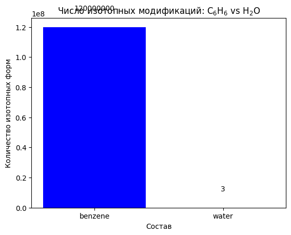
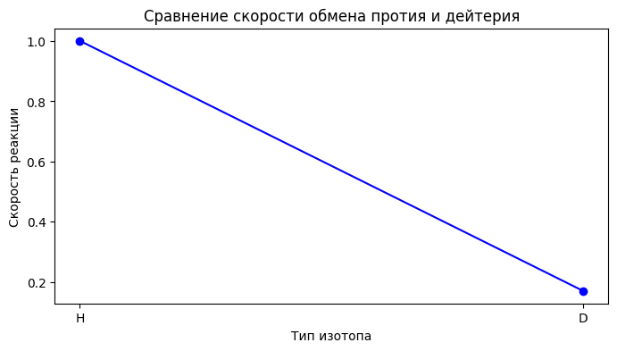
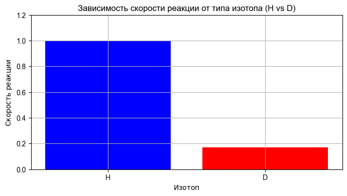
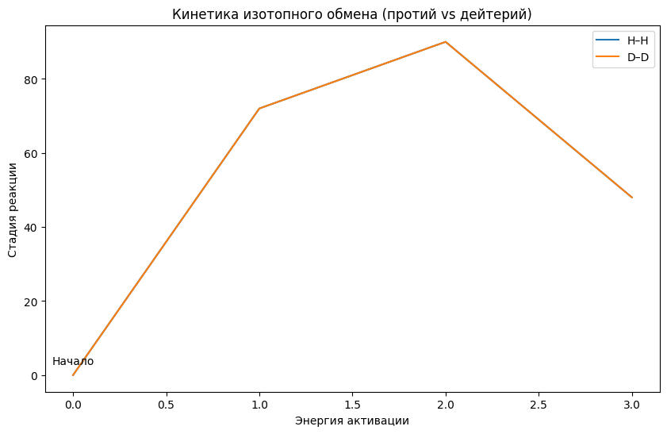
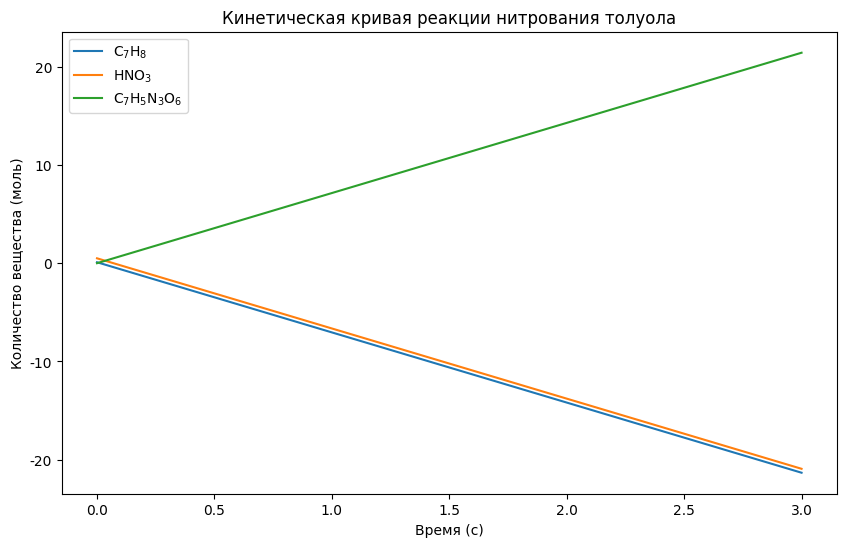
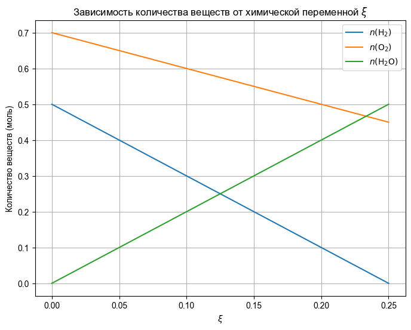

**Этот конспект сгенерирован с помощью AI.**
**Система может допускать ошибки в формулах, вычислениях и специфической терминологии.**
**Пожалуйста, относитесь с понимаем и проверяйте конспект!**

# Фундаментальные принципы химии как науки

Наука — способ познания материального мира, основанный на построении проверяемых моделей. Ключевые компоненты этого определения: материальность объекта познания и возможность проверки построенных моделей. Наука относится к рациональным способам познания в области материального мира; иррациональные способы познания материальных явлений не признаются научным методом.

В классификации способов познания выделяют четыре сферы:  
- материальный мир — наука, искусство;  
- нематериальный (духовный) мир — философия, религия.  

Способы познания делятся на рациональные (логические) и иррациональные (неиспользующие логику). Наука соответствует сочетанию «материальный мир + рациональный способ». Философия — «нематериальный мир + рациональный способ», искусство — «материальный мир + иррациональный способ», религия — «нематериальный мир + иррациональный способ».

Наука и религия занимают разные полюса классификации: наука оперирует проверяемыми моделями материального мира, религия — нематериальными, иррациональными представлениями. Взаимодействие между ними, по мнению лектора, отсутствует. Наука не нуждается в религиозных объяснениях для познания природы, но признаёт право существования религии как формы духовного опыта.

В рамках естествознания выделяют три основные дисциплины: физика, химия и биология — каждая из которых использует метод построения проверяемых моделей для изучения соответствующего уровня организации материи.

# Ограничения и масштабы химической науки

Химия как наука изучает вещества и их превращения, ограниченные фундаментальными физическими законами. Её предмет — не сводимый к физике или биологии, поскольку имеет собственный объект исследования: материальные системы на уровне атомов и молекул. В основе всех химических явлений лежат физические законы, однако в химии действуют специфические масштабы энергии, времени и пространственных размеров.

Масштаб энергии химических процессов составляет около 10 эВ (от 10⁻³ до 10¹ эВ), что соответствует четырём порядкам величины по сравнению с физическими масштабами. Время химических реакций начинается от нижней границы — 10⁻¹⁴ с (реакция H + H → H₂), а верхняя граница — порядка 10¹³ с, соответствующая самым медленным процессам (например, геохимическим преобразованиям за миллионы лет). Быстрее 10⁻¹⁴ с происходят уже не химические, а электронно-колебательные процессы (фемтосекунды, 10⁻¹⁵–10⁻¹⁸ с), которые выходят за рамки химии.

Пространственные масштабы в химии ограничены размерами атомов и молекул: минимальный характерный размер — ковалентный радиус атома водорода, равный 37 пм (10⁻¹⁰ м); максимальный — размеры реакторов или агрегатов, достигающие десятков метров. Таким образом, химия охватывает диапазон от 10⁻¹⁰ до 10¹ м, что составляет всего 11 порядков по длине.

Все законы химии имеют физическую природу и определяются тремя основными параметрами: энергией, временем и расстоянием. В отличие от физики, где масштабы простираются от планковской длины (10⁻³⁵ м) до размеров Вселенной, химия ограничена строго определёнными границами, поскольку не затрагивает изменения в ядрах атомов.

Первым и наиболее значимым законом химии является **Закон периодичности Менделеева** — систематическое расположение элементов по возрастанию атомной массы с повторяющимся характером свойств. Это открытие считается главным достижением российской науки в области химии и остаётся основой современной периодической системы.

# Химические реакции: сущность, механизм и закономерности

Главный закон, определяющий сущность химических реакций — **закон сохранения массы**: масса веществ до и после реакции остаётся постоянной. При этом важно подчеркнуть, что сохраняется именно масса, а не энергия, поскольку в ядерных процессах масса может изменяться; однако ядерные превращения выходят за рамки химии по определению.  

**Химическая реакция** — это превращение одних веществ (реагентов) в другие, отличающиеся от исходных. Отличие заключается не только в составе, но и в строении вещества: при изменении структуры — независимо от состава — процесс считается химической реакцией.  

Примером служит испарение воды ($\text{H}_2\text{O}$): состав не меняется, однако структура изменяется кардинально — в твёрдом льду молекулы неподвижны и упорядочены, в жидкой фазе — подвижны, с нарушенными водородными связями. Это изменение структуры делает процесс химическим явлением, хотя формально по составу реакция отсутствует.  

С этой точки зрения испарение твёрдого углекислого газа ($\text{CO}_2$) также является химической реакцией: при переходе из твёрдого состояния (сухой лёд) в газообразное структура молекулы сохраняется, но характер взаимодействия и степень свободы частиц кардинально меняются — это изменение строения вещества.  

**Определение**: химическая реакция — любое превращение, сопровождающееся образованием или разрывом химических связей. Это строгое определение, используемое профессиональными химиками.  

При всех превращениях **ядра атомов не изменяются**, их количество остаётся постоянным; меняется лишь распределение между частицами.  

Второй фундаментальный закон — **закон периодичности Д.И. Менделеева**: при увеличении заряда ядра периодически повторяются свойства элементов и их соединений. Это следствие квантовой механики, но в применении к химии он формулируется как периодический закон.  

Других универсальных законов химии, строго говоря, нет. Однако существуют важные принципы:  
- **принцип электронейтральности** — все вещества в нормальных условиях электронейтральны; это не закон, а следствие химической термодинамики и устойчивости равновесия.  
- **закон действующих масс (кинетический)** — скорость химической реакции пропорциональна произведению концентраций реагентов в степенях, равных стехиометрическим коэффициентам:  
  $$v = k[\text{A}]^m[\text{B}]^n$$  
  Это закон химии, вытекающий из молекулярно-кинетической теории.  

Также существует **закон действующих масс (термодинамический)** — при достижении химического равновесия величина, определяемая как произведение концентраций продуктов в степенях стехиометрических коэффициентов, делённое на произведение концентраций реагентов с теми же коэффициентами, остаётся постоянной:  
  $$K = \frac{[\text{C}]^c [\text{D}]^d}{[\text{A}]^a [\text{B}]^b}$$  

**Теория химии**: основной теоретической основой является **атомно-молекулярная теория**, утверждающая, что все вещества состоят из атомов и молекул; химические явления объясняются через строение веществ и процессы разрыва/образования связей.  

Однако современная химия опирается на более глубокую теорию — **квантовую механику**, которая определяет электронное строение атомов и молекул, а значит — их химические свойства и способность к превращениям.  

Четвёртый фундаментальный раздел — **химическая термодинамика**, наука о химических равновесиях. Она изучает условия, при которых реакции идут в прямом или обратном направлении, и критерии устойчивости систем.  

В основе химической термодинамики лежат три закона термодинамики:  
- Первый закон — сохранение энергии;  
- Второй закон — возрастание энтропии изолированной системы;  
- Третий закон — стремление энтропии к нулю при абсолютном нуле температуры.  

Эти законы имеют специфические приложения в химии, определяющие возможность протекания реакций и положение равновесия.

Константа равновесия — величина, составленная из концентраций реагентов и продуктов в степенях, равных стехиометрическим коэффициентам, и остающаяся постоянной при достижении химического равновесия независимо от начального состава системы. Это термодинамическое следствие закона действующих масс, применимое к обратимым реакциям.

Кинетический закон действующих масс утверждает, что скорость химической реакции пропорциональна произведению концентраций реагентов в степенях, равных их стехиометрическим коэффициентам. Для мономолекулярной реакции скорость прямо пропорциональна концентрации одного вещества. Этот закон является следствием молекулярно-кинетической теории и лежит в основе кинетики химических процессов.

В химии существует ограниченное число фундаментальных законов: закон сохранения массы, первый и второй законы термодинамики, третий закон термодинамики, принцип электронейтральности и закон действующих масс (в его термодинамической и кинетической формах). Остальные «правила» — следствие этих основ или элементарные математические соотношения.

Химическая стиохиометрия представляет собой совокупность количественных пропорций между реагентами и продуктами реакций. Это не отдельный закон, а система уравнений, описывающих соотношения масс и количеств веществ в реакциях.

Основная теория химии — квантовая механика, поскольку именно она определяет строение атомов и молекул, а через него — все химические и физические свойства веществ, их способность к превращениям и реакционной способности. Атомно-молекулярная теория рассматривается как базовое представление о строении вещества, но не является самостоятельной теорией в современном понимании.

Химическая термодинамика — раздел химии, изучающий равновесные состояния систем, условия протекания реакций и положение равновесия. Она опирается на три закона термодинамики: первый (сохранение энергии), второй (возрастание энтропии изолированной системы) и третий (стремление энтропии к нулю при абсолютном нуле). В химии эти законы конкретизируются через новые переменные — такие как химический потенциал, стандартные состояния и константы равновесия.

Химическая кинетика — наука о скоростях химических реакций и механизмах их протекания во времени. Она дополняет термодинамику, позволяя предсказать не только возможность реакции, но и её скорость при заданных условиях.

Структурная теория органических соединений (ранее ошибочно именуемая теорией Бутлерова) включает принципы, объясняющие влияние пространственного строения молекул на их химические свойства, включая стереохимию. Это направление объединяет теорию строения с учётом геометрии и конформации молекул.

Вещество — объект химии, характеризующийся определённым составом, строением и свойствами. На сегодняшний день в базах данных зарегистрировано около 127 миллионов веществ, из которых более 100 миллионов — химически и физически охарактеризованные соединения. Рост числа новых веществ обусловлен возможностью образования изотопных и изотопно замещённых форм даже для простых молекул.

Например, у водорода — 7 изотопов (H, D, T), из них 2 устойчивых; у кислорода — 3 природных изотопа (¹⁶O, ¹⁷O, ¹⁸O). Число возможных молекул воды с разными изотопными составами составляет 9:  
- H₂¹⁶O, H₂¹⁷O, H₂¹⁸O, D₂¹⁶O, D₂¹⁷O, D₂¹⁸O, T₂¹⁶O, T₂¹⁷O, T₂¹⁸O.  
Кроме того, возможны смешанные формы: HOD (D–H–¹⁶O), HD₁₇O и т.д.

Аналогично, для молекул O₂ из трёх изотопов кислорода возможно 6 комбинаций (16–16, 16–17, 16–18, 17–17, 17–18, 18–18), а для H₂ — 3 (H–H, D–D, T–T). Общее число различных молекул O₂ и H₂ — 18. При учёте симметрии молекулы O₂ некоторые формы могут быть эквивалентны, но в общем случае число уникальных изотопных вариантов остаётся значительным.

Для бензола (C₆H₆), имеющего два устойчивых изотопа углерода (¹²C и ¹³C) и один водород (H или D), число возможных изотопных форм растёт экспоненциально: для каждого положения атома углерода возможны замены, что приводит к множеству структур. В совокупности с другими элементами это объясняет огромное разнообразие соединений в базах данных.

Изотопные замещения приводят к существенным различиям в свойствах веществ. Например, тяжёлая вода (D₂O) имеет плотность на 10% выше обычной H₂O и более высокую температуру кипения. Однако её токсичность обусловлена не химическим составом, а кинетическими факторами: тяжёлые атомы водорода (дейтерий) замедляют обменные реакции в биологических системах. При длительном употреблении D₂O нарушается метаболизм, что может привести к летальному исходу из-за нарушения ферментативных процессов и обмена веществ.

Изотопный состав элементов определяет разнообразие молекул воды и других соединений. У водорода известно семь изотопов, из них два — стабильные: протий (¹H) и дейтерий (²H); у кислорода — три природных изотопа: ¹⁶O, ¹⁷O и ¹⁸O. Комбинируя стабильные изотопы водорода и кислорода, можно образовать до девяти различных молекул воды

 
Изотопное разнообразие молекул H₂O и O₂

:  
- H₁₂O₁₆, H₁₂O₁₇, H₁₂O₁₈ (наиболее распространённая — обычная вода),  
- H₁D₁₆O, H₁D₁₇O, H₁D₁₈O,  
- D₂₁₆O, D₂₁₇O, D₂₁₈O.  

Кроме того, существуют смешанные формы: HOD (где один атом водорода заменён на дейтерий), каждая из которых возможна для всех трёх изотопов кислорода — итого ещё три варианта. Таким образом, общее число устойчивых молекул воды составляет 9.  

Для перекиси водорода (H₂O₂) возможны независимые замены как у атомов водорода (3 изотопа: H, D), так и у кислорода (3 изотопа: ¹⁶O, ¹⁷O, ¹⁸O). Число комбинаций — 3 × 3 = 9 молекул.  

Для молекулярного кислорода (O₂) возможны пары: ¹⁶O–¹⁶O, ¹⁶O–¹⁷O, ¹⁶O–¹⁸O, ¹⁷O–¹⁷O, ¹⁷O–¹⁸O, ¹⁸O–¹⁸O — итого 6 различных изотопных форм.  

Для молекулы водорода (H₂) возможны: H–H, D–H, D–D — 3 варианта.  

При независимом изменении состава атомов в молекуле общее число возможных изотопных модификаций определяется произведением числа вариантов для каждого элемента. Например, для бензола (C₆H₆), имеющего два стабильных изотопа углерода (¹²C и ¹³C) и один — водорода (H или D), количество различных изотопных форм достигает более 120 миллионов

 
Число изотопных модификаций  C₆H₆ vs H₂O

 за счёт всех возможных комбинаций в кольце.  

Свойства таких изотопно замещённых молекул различаются: например, тяжёлая вода (D₂O) имеет плотность на 10% выше обычной H₂O и более высокую температуру кипения. Однако её токсичность обусловлена не химическим составом, а кинетическими факторами — тяжёлые атомы водорода замедляют обменные реакции в биологических системах. При длительном употреблении D₂O нарушается метаболизм из-за нарушения ферментативных процессов и обмена веществ, что может привести к летальному исходу.  

Типы химических реакций остаются одинаковыми для всех изотопных форм, но скорость их протекания существенно различается: обмен дейтерия с другими атомами происходит в среднем в 6 раз медленнее

 
Сравнение скорости обмена протия и дейтерия

 
Энергетический барьер изотопного обмена  протий vs дейтерий 

 
Кинетика изотопного обмена  протий vs дейтерий 

, чем протия. Это нарушает баланс биохимических процессов в организме при полном переходе на тяжёлую воду.  

Таким образом, даже небольшое изменение изотопного состава может кардинально повлиять на кинетику реакций и функциональность биологических систем. Эти эффекты учитываются при построении баз данных по химическим соединениям.

# Структура и свойства веществ: от формулы до применения

Состав вещества описывается химической формулой, которая бывает трёх типов: молекулярной, эмпирической (простейшей) и структурной. Молекулярная формула применима только к веществам молекулярного строения — их более 95 % среди известных соединений, включая почти всю органику. Примером может служить вещество с формулой $\text{C}_2\text{H}_6\text{O}$ — его простейшая формула совпадает с молекулярной, поскольку числа атомов (2, 6, 1) взаимно просты и не могут быть сокращены. Структурная формула для этого вещества в сокращённых обозначениях органической химии записывается как $\text{C}_2\text{H}_5\text{OH}$: функциональные группы указываются явно, атомы водорода, связанные с углеродом, по умолчанию не отображаются. Такая запись компактна и широко используется.

Структурные формулы могут содержать информацию о стереохимии — пространственной конфигурации молекул. Например, для 2-бутанола ($\text{C}_4\text{H}_{10}\text{O}$) при наличии четырёх различных заместителей у одного атома углерода (например, $\text{CH}_3$, $\text{CH}_2\text{CH}_3$, $\text{OH}$ и $\text{H}$) возможны два стереоизомера. Их изображают с помощью сплошной линии (заместитель «смотрит» на наблюдателя) и штриховой («смотрит» от наблюдателя). Эти изомеры — оптические, их свойства близки, но они принципиально различны: при повороте одной молекулы на 180° невозможно совместить её с зеркальным отражением другой. Такие структуры называют структурными формулами со стереохимией; они отражают реальную трёхмерную форму молекул, которая не является фиксированной из-за свободного вращения вокруг одинарных связей и вращательного движения самой молекулы в пространстве.

Для веществ без чёткой стереохимии (например, метанол $\text{CH}_3\text{OH}$ или этан $\text{C}_2\text{H}_6$) изображение пространственной конфигурации бессмысленно — все конфигурации эквивалентны из-за вращения. В отличие от этого, у молекул с асимметрическим атомом углерода (четыре разных заместителя) возникают оптические изомеры, число которых может быть велико: у глюкозы ($\text{C}_6\text{H}_{12}\text{O}_6$) — 16 оптических изомеров.

Простейшая формула показывает минимальное целое соотношение атомов в молекуле. Например, для $\text{C}_6\text{H}_{12}\text{O}_6$ простейшая формула — $\text{CH}_2\text{O}$: отношение числа атомов углерода к водороду равно 1:2, кислорода — 1:1. Это соотношение не зависит от истинной молекулярной массы и позволяет определить только эмпирическую формулу, но не молекулярную.

Кроме формул, состав вещества описывается массовыми долями элементов — отношением массы элемента в молекуле к общей массе молекулы (или моля). Например, массовая доля углерода в $\text{C}_6\text{H}_{12}\text{O}_6$ равна $6 \times 12 / 180 = 0.4$, или 40 %. Эта величина одинакова для всех веществ с одинаковой простейшей формулой ($\text{CH}_2\text{O}$), но различается между веществами с разными молекулярными формулами. Следовательно, по массовой доле можно определить только простейшую формулу, но не молекулярную.

Также используется мольная доля (или атомная доля) элемента — отношение числа молей данного элемента в соединении к общему числу молей всех элементов в формуле. Обозначается буквой $x$ или $\chi$. По определению, сумма мольных долей всех элементов в веществе равна 1.

Простейшая формула показывает элементарное несократимое соотношение атомов элементов в соединении: для глюкозы $\text{C}_6\text{H}_{12}\text{O}_6$ простейшая формула — $\text{CH}_2\text{O}$, что соответствует соотношению $1:2:1$. Она не отражает реальное число атомов в молекуле, в отличие от структурной формулы, где, например, при повороте молекулы на 180° одна группа становится $\text{C}_2\text{H}_5$, а другая — $\text{C}_3$, что указывает на оптические изомеры и различие пространственного строения.  

Массовая доля элемента в веществе определяется как отношение массы атомов данного элемента к общей массе молекулы: для углерода в глюкозе — $6 \cdot M(\text{C}) / M(\text{C}_6\text{H}_{12}\text{O}_6)$. При переходе к молярным величинам используется мольная доля (или атомная доля), обозначаемая $\chi$, — отношение числа молей элемента к общему числу молей всех элементов в формуле. По определению, сумма мольных долей всех элементов равна 1; для глюкозы мольная доля углерода составляет $1/4$.  

По массовой доле можно определить только простейшую формулу, но не молекулярную. Пример: углеводород с 25% атомов углерода и остальным водородом имеет простейшую формулу $\text{C}_3\text{H}_8$, однако реального вещества с такой формулой нет — вместо этого рассматривается условная формула $\text{C}_{2,6}\text{H}_{8}$, полученная делением индексов на наибольший общий делитель.  

Состав вещества описывается также количественными характеристиками: массовыми и мольными долями элементов. Эти величины позволяют различать индивидуальные соединения и смеси.  

Вещества делятся на индивидуальные (состоящие из частиц одного сорта) и смеси (любая комбинация атомов, молекул или ионов). Воздух — пример индивидуального вещества с определённым химическим составом; у смесей существует понятие средней молярной массы. Например, для смеси 50% $\text{CH}_4$ и 50% $\text{C}_2\text{H}_6$ средняя молярная масса равна $16 \cdot 0{,}5 + 30 \cdot 0{,}5 = 23~\text{г/моль}$. Молярная масса воздуха составляет $29~\text{г/моль}$ — это усреднённая величина по составу основных компонентов (азот, кислород, аргон).  

Для любого вещества молярная масса определяется как отношение массы к количеству вещества: для индивидуального соединения — $M = m/n$, где $n$ — число молей данного вещества; для смеси — средняя молярная масса рассчитывается по весу и мольным долям компонентов.  

Абсолютно чистых веществ не существует: даже кремний 99% чистоты может быть недостаточен для электроники, но достаточен для химических реакций. Чистота определяется контекстом применения.  

Химическая формула может применяться как к индивидуальным веществам, так и к смесям — в последнем случае она носит условный характер и отражает усреднённый состав.

# Распространённость элементов и их роль в природе и жизни

Самый распространённый элемент во Вселенной — водород, его мольная доля составляет 93%, массовая доля — около 75%. На втором месте по распространённости — гелий (мольная доля 6,9%), а массовая доля водорода в смеси H₂ и He при отсутствии других элементов оценивается примерно как 75% с точностью до 5%.  

Самая распространённая молекула во Вселенной — H₂. Молекулы He₂ не существуют даже в возбуждённом состоянии: они распадаются быстрее, чем за 10⁻⁸ секунды. На втором месте по распространённости среди молекул — CO (угарный газ), поскольку после завершения термоядерных реакций с участием водорода в звёздах образуется гелий, а дальнейшие реакции (He + He → Be; Be + He → ¹²C; ¹²C + He → ¹⁶O) приводят к образованию углерода и кислорода, которые входят в состав CO.  

Распространённость элементов во Вселенной характеризуется мольными и массовыми долями: водород — 93% (мольная), ~75% (массовая); гелий — 6,9% (мольная). Массовые доли существенно отличаются от мольных из-за малой атомной массы водорода.  

В земной коре наиболее распространённые элементы по массе: кислород (~47%), кремний (~28%), алюминий (~8%), железо (~5%), кальций (~4%), натрий (~3%), калий (~2,5%), магний (~2,5%). По мольной доле — те же элементы, но с иной относительной значимостью из-за различий в атомных массах.  

В организме человека преобладают кислород (65% массы), углерод (18%), водород (10%), азот (3%), кальций (1,5%), фосфор (1,0%), калий (0,3%), сера (0,25%).  

Средняя молярная масса воздуха составляет примерно 29 г/моль:  
$$
(0{,}78 \times 28) + (0{,}21 \times 32) + (0{,}0093 \times 44) + (0{,}0004 \times 44) \approx 28{,}96\ \text{г/моль}
$$  
где учтены: N₂ — 78%, O₂ — 21%, Ar — 0,93%, CO₂ — 0,04%.  

Для смесей допустимо определение средней формулы. Например, в смеси C₄H₈ и C₂H₆ (в равных молях) среднее число атомов углерода на молекулу — 1,5, водорода — 5; средняя формула — **C₁,₅H₅**. Это не целое вещество, но формально корректная характеристика состава смеси.  

Количество устойчивых химических элементов в природе — 82. Элементы с порядковыми номерами выше 83 (начиная с висмута Bi, Z = 83) имеют только радиоактивные изотопы. Полный аналог технеция-43 (Z = 43) — полностью радиоактивен и не встречается в стабильной форме.  

Таким образом, распространённость элементов различается по объектам:  
- во Вселенной — H > He > C > O > N;  
- в земной коре — O > Si > Al > Fe > Ca > Na > K > Mg;  
- в организме — O > C > H > N > Ca > P > K > S.  

Распространённость выражается через массовые и мольные доли, что позволяет сравнивать элементы с учётом их атомной массы.

Самый распространённый элемент во Вселенной — водород, его мольная доля составляет 93%, массовая доля — около 75%. На втором месте по распространённости — молекула H₂; на третьем — молекула CO, поскольку после завершения термоядерных реакций с участием водорода в звёздах образуется углерод и кислород, которые затем образуют молекулы CO. В космосе обнаружено более сотни молекул, включая наиболее сложную — C₆₀ (фуллерен), ранее известный как С-70.

В земной коре четыре наиболее распространённых элемента по массе: кислород (около 46–50%), кремний (около 27%), алюминий (около 8%) и железо (около 5%). Остальные элементы — магний, кальций, натрий, калий, азот, водород — относятся к минорным компонентам. Массовая доля водорода в земной коре составляет менее 1%, хотя по числу атомов он присутствует значительно чаще из-за широкого распространения воды, силикатов и других соединений.

В организме человека четыре основных элемента по массе: кислород (около 65%), углерод (около 18%), водород (около 10%) и азот (около 3%). Остальные элементы — фосфор, кальций, калий, натрий — присутствуют в меньших количествах. По числу атомов преобладает водород благодаря составу воды.

Распространённость элементов выражается через массовые и мольные доли, что позволяет корректно сравнивать их с учётом различий в атомной массе. Например, у хлора средняя относительная атомная масса равна 35,5 из-за изотопного состава: доля изотопа $^{35}\text{Cl}$ составляет примерно 0,75 (75%), доля $^{37}\text{Cl}$ — около 0,25 (25%). Аналогично, у брома относительная атомная масса близка к 80, несмотря на отсутствие стабильного изотопа с массовым числом 80: в природе преобладают $^{79}\text{Br}$ и $^{81}\text{Br}$ почти в равных количествах.

# Количественные основы химии: моль, стехиометрия и расчёты

Количество вещества — это физическая величина, обозначаемая символом *n*, определяемая как отношение экстенсивного свойства к его молярной характеристике. Основной единицей измерения количества вещества является моль (моль). Один моль любого вещества содержит число частиц (атомов, молекул, ионов и т.д.), равное числу Авогадро:  
$$
N_A = 6{,}0221 \times 10^{23}~\text{моль}^{-1}.
$$  
Число Авогадро — безразмерная постоянная, служащая масштабным коэффициентом для перехода от числа отдельных частиц к макроскопическим количествам. Оно не имеет глубокого физического смысла, но позволяет избежать подсчёта огромного числа атомов или молекул.

Связь между массой вещества и количеством вещества выражается формулой:  
$$
n = \frac{m}{M},
$$  
где $ m $ — масса вещества (в граммах), $ M $ — молярная масса (в г/моль).  

Объём газа при нормальных условиях не используется как универсальная константа; вместо этого для расчётов применяется молярный объём, определяемый как:  
$$
V_m = \frac{M}{\rho},
$$  
где $ \rho $ — плотность вещества. Для идеальных газов при стандартных условиях (0 °C, 1 атм) справедливо соотношение:  
$$
V_m = \frac{RT}{P},
$$  
но в общем случае молярный объём зависит от температуры и давления.

Количество вещества удобно использовать для связи различных экстенсивных свойств. Примеры таких величин:  
- масса: $ n = m / M $,  
- число частиц: $ N = n \cdot N_A $,  
- заряд (для заряженных частиц): $ Q = n \cdot F $, где $ F = 96\,500~\text{Кл/моль} $ — постоянная Фарадея (равна заряду одного моля электронов).  

Все эти формулы имеют одинаковую структуру: экстенсивная величина делится на соответствующую молярную характеристику.

Химическая реакция — это процесс превращения одних веществ в другие с изменением состава и структуры. Уравнение реакции отражает закон сохранения массы: число атомов каждого элемента одинаково слева и справа от стрелки. В органической химии чаще используют схемы реакций, где не указываются коэффициенты и не соблюдается стехиометрия, поскольку акцент делается на механизме, а не на количественных расчётах.

Для расчётов требуется полное уравнение с коэффициентами. Пример:  
$$
\text{C}_7\text{H}_8 + 3\,\text{HNO}_3 \xrightarrow{\text{катализатор}} \text{C}_7\text{H}_5\text{N}_3\text{O}_6 + 3\,\text{H}_2\text{O},
$$  
где над стрелкой указаны условия реакции (в данном случае — катализатор, хотя для расчётов это не обязательно).  

Пример расчёта: при взаимодействии 0,1 моль толуола с избытком азотной кислоты (0,5 моль) образуется 0,07 моль тринитротолуола. По стехиометрии реакции на 1 моль реагента требуется 3 моля кислоты; значит, для полного превращения 0,1 моль толуола необходимо $ 0{,}1 \times 3 = 0{,}3 $ моль HNO₃. Фактически использовано 0,5 моль — избыток. Прореагировало:  
$$
n(\text{HNO}_3)_{\text{прореаг}} = 3 \times n(\text{C}_7\text{H}_8) = 3 \times 0{,}1 = 0{,}3~\text{моль}.
$$  
Остаток кислоты: $ 0{,}5 - 0{,}3 = 0{,}2~\text{моль} $.  

Введена новая химическая переменная — стехиометрический коэффициент, определяющий соотношение количеств реагентов и продуктов. Для реакции общего вида  
$$
\nu_{\text{пр}} \sum_i \nu_i A_i = \nu_{\text{пр}} \sum_j \nu_j B_j,
$$  
количество вещества, вступившего в реакцию для любого компонента $ i $:  
$$
n_i^{\text{вступ}} = \frac{n_i^0}{\nu_i},
$$  
а количество образовавшегося продукта $ j $:  
$$
n_j^{\text{обр}} = \frac{n_j^{\text{обр}}}{\nu_j}.
$$  
Это соотношение — формулировка основного закона стехиометрии, позволяющего проводить количественные расчёты в химии.

Рассмотрим реакцию нитрования толуола азотной кислотой:  
$$\text{C}_7\text{H}_8 + 3\,\text{HNO}_3 \to \text{C}_7\text{H}_5\text{N}_3\text{O}_6 + 3\,\text{H}_2\text{O}$$  
Условия реакции: избыток азотной кислоты, реакция не протекает количественно.  

Исходные количества веществ: $n_0(\text{C}_7\text{H}_8) = 0{,}1$ моль, $n_0(\text{HNO}_3) = 0{,}5$ моль.  
Образовалось $n(\text{C}_7\text{H}_5\text{N}_3\text{O}_6) = 0{,}07$ моль тринитротолуола

 
Кинетическая кривая реакции нитрования толуола

.  

По стехиометрии:  
$$
\frac{n(\text{C}_7\text{H}_5\text{N}_3\text{O}_6)}{\nu_{\text{пр}}} = \frac{n(\text{HNO}_3)_{\text{вступ}}}{\nu_{\text{пр}}}
\quad \Rightarrow \quad
n(\text{HNO}_3)_{\text{вступ}} = 0{,}21\ \text{моль},\quad
n(\text{HNO}_3)_{\text{ост}} = 0{,}5 - 0{,}21 = 0{,}29\ \text{моль}
$$  
$n(\text{C}_7\text{H}_8)_{\text{вступ}} = 0{,}07$ моль, $n(\text{C}_7\text{H}_8)_{\text{ост}} = 0{,}1 - 0{,}07 = 0{,}03$ моль.  
$n(\text{H}_2\text{O}) = 0{,}21$ моль.  

Вводится новая химическая переменная $\xi$, определяемая как:  
$$
\xi = \frac{\Delta n_{\text{пр}}}{\nu_{\text{пр}}} = -\frac{\Delta n_i}{\nu_i}
$$  
для любого компонента реакции. Изменение количества вещества пропорционально коэффициенту в уравнении и значению $\xi$.  

Начальное значение $\xi = 0$. В момент образования $n(\text{C}_7\text{H}_5\text{N}_3\text{O}_6) = 0{,}07$ моль:  
$$
\xi = \frac{0{,}07}{1} = 0{,}07\ \text{моль}
$$  

Общее количество вещества в любой момент времени выражается через $\xi$:  
- для реагента $A_i$: $n_i = n_{0,i} - \nu_i \xi$  
- для продукта $B_j$: $n_j = n_{0,j} + \nu_j \xi$  

Пример: реакция образования воды из водорода и кислорода:  
$$
2\,\text{H}_2 + \text{O}_2 \to 2\,\text{H}_2\text{O}
$$  
Начальные количества: $n_0(\text{H}_2) = 0{,}5$ моль, $n_0(\text{O}_2) = 0{,}7$ моль

 
Зависимость количества вещества от химической переменной

.  

Максимальное значение $\xi$, при котором водород полностью прореагирует:  
$$
\xi_{\max} = \frac{n_0(\text{H}_2)}{\nu_{\text{пр}}} = \frac{0{,}5}{2} = 0{,}25\ \text{моль}
$$  

В этом случае:  
- $n(\text{O}_2) = 0{,}7 - 1 \cdot 0{,}25 = 0{,}45$ моль — останется в избытке;  
- $n(\text{H}_2\text{O}) = 0 + 2 \cdot 0{,}25 = 0{,}5$ моль — образуется.

В любой момент времени количество вещества реагента выражается как $ N = N_0 - \nu_{\text{пр}} \xi $, где $ N_0 $ — начальное количество вещества, $ \nu_{\text{пр}} $ — стехиометрический коэффициент в уравнении реакции, а $ \xi $ — химическая переменная (протекание реакции). Для продукта: $ N = N_0 + \nu_{\text{пр}} \xi $. Химическая переменная $ \xi $ позволяет однозначно описать состав реакционной смеси в любой момент времени на основе фиксированного начального состава и уравнений стехиометрии. Максимальное значение $ \xi $ определяется лимитирующим реагентом: для системы $ 2\text{H}_2 + \text{O}_2 \rightarrow 2\text{H}_2\text{O} $ при начальных количествах $ n_0(\text{H}_2) = 0{,}5 $ моль и $ n_0(\text{O}_2) = 0{,}7 $ моль лимитирующим является водород:  
$$
\xi_{\max} = \frac{n_0(\text{H}_2)}{\nu_{\text{пр}}} = \frac{0{,}5}{2} = 0{,}25\ \text{моль}.
$$  
При этом:  
- $ n(\text{O}_2) = 0{,}7 - 1 \cdot 0{,}25 = 0{,}45 $ моль — остаётся в избытке;  
- $ n(\text{H}_2\text{O}) = 0 + 2 \cdot 0{,}25 = 0{,}5 $ моль — образуется.  

Для промежуточного значения $ \xi = 0{,}15 $:  
- $ n(\text{H}_2) = 0{,}5 - 2 \cdot 0{,}15 = 0{,}2 $ моль;  
- $ n(\text{O}_2) = 0{,}7 - 1 \cdot 0{,}15 = 0{,}55 $ моль;  
- $ n(\text{H}_2\text{O}) = 0 + 2 \cdot 0{,}15 = 0{,}3 $ моль.  

Химическая переменная $ \xi $ отражает **основной закон стехиометрии** и позволяет свести описание состава смеси из четырёх переменных к одной. Через неё выражаются скорость реакции, условия равновесия и динамика изменения веществ в ходе процесса.
