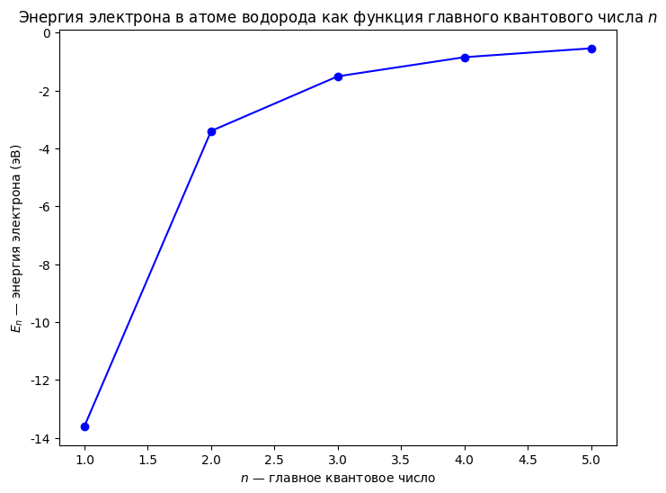
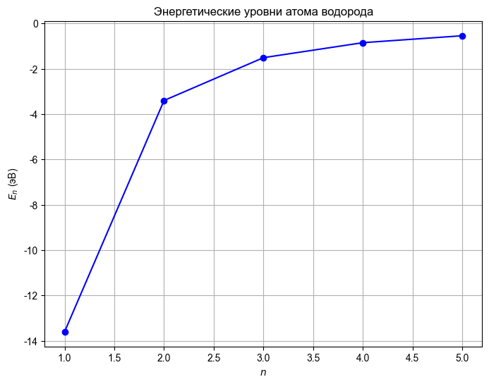
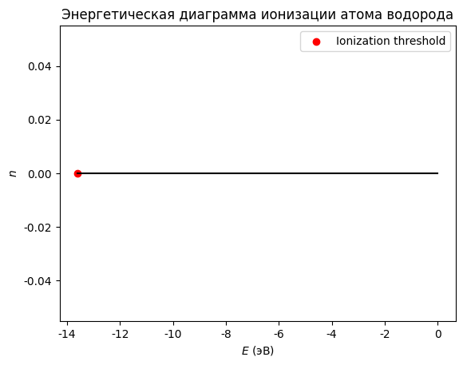

**Этот конспект сгенерирован с помощью AI.**
**Система может допускать ошибки в формулах, вычислениях и специфической терминологии.**
**Пожалуйста, относитесь с понимаем и проверяйте конспект!**

# Строение атома и квантовые основы

Атом водорода в рамках теории Бора описывается двумя основными уравнениями. Первое — уравнение для радиуса $n$-й орбиты:  
$$
r_n = n^2 a_0,
$$  
где $a_0 = 5,29 \cdot 10^{-11}$ м — боровский радиус, $n = 1, 2, 3, \dots$ — главное квантовое число.  
Второе уравнение — для энергии электрона на $n$-й орбите:  
$$
E_n = -\frac{13,6}{n^2} \text{ эВ}.
$$

 
Энергия электрона в атоме водорода как функция главного квантового числа  n 

  
Эти значения получены из условия стационарности движения электрона по круговой орбите и квантования момента импульса:  
$$
m_e v r = n \hbar,
$$  
где $m_e$ — масса электрона, $v$ — его скорость, $\hbar = h/(2\pi)$ — приведённая постоянная Планка.  
Теория Бора объясняет дискретность спектров излучения атома водорода: при переходе с уровня $n_2$ на уровень $n_1$ ($n_2 > n_1$) атом испускает фотон с энергией  
$$
\Delta E = E_{n_2} - E_{n_1} = 13,6 \left( \frac{1}{n_1^2} - \frac{1}{n_2^2} \right) \text{ эВ}.
$$

# Квантовые числа и электронная структура

Ядро с зарядом $+Z$ служит центральной частью системы, описывающей атом водорода и однозарядные ионы — гелий в состоянии $\text{He}^+$, литий в состоянии $\text{Li}^{2+}$ и т.д. Вокруг ядра по круговой орбите движется электрон массой $m_e$. Классическая модель Бора включает одно квантовое условие, обеспечивающее стационарность орбит: момент импульса электрона квантуется как  
$$
L = m_e v r = n \hbar,
$$
где $n$ — главное квантовое число ($n = 1, 2, 3, \dots$). Эта модель применима не только для точных значений $Z$, но и при дробных (нецелых) значениях заряда ядра, что позволяет использовать её для приближённого описания электронной структуры атомов с учётом экранирования.

# Свойства элементов: радиус, электроотрицательность и энергия

Энергия состояния электрона в атоме водорода или одноэлектронном ионе определяется формулой:  
$$
E_n = -\frac{Z^2}{n^2} \cdot 13{,}6~\text{эВ},
$$
где $ Z $ — заряд ядра (число протонов), $ n $ — главное квантовое число ($ n = 1, 2, 3, \dots $).  

Отрицательный знак энергии означает, что система находится в связанном состоянии: электрон удерживается кулоновским притяжением к ядру. За нуль принимается энергия системы при бесконечном удалении электрона от ядра (свободный электрон и ядро), то есть когда взаимодействие отсутствует.  

При переходе электрона с одной орбиты на другую изменяется разность энергий, которая соответствует энергии фотона по закону Планка:  
$$
\Delta E = h c / \lambda,
$$
где $ h $ — постоянная Планка, $ c $ — скорость света, $ \lambda $ — длина волны излучённого или поглощённого света.  

Экспериментальное определение энергетических уровней осуществляется двумя основными методами:  
1) спектроскопия (ИК, УФ, видимая область, ЯМР), основанная на измерении длин волн поглощаемого или испускаемого света;  
2) дифракция и рассеяние электронов и рентгеновских лучей — позволяет определить геометрическую структуру молекул и кристаллических решёток.  

Радиус $ n $-й орбиты электрона в модели Бора выражается как:  
$$
r_n = \frac{n^2}{Z} a_0,
$$
где $ a_0 = 5{,}29 \cdot 10^{-11}~\text{м} = 0{,}0529~\text{нм} $ — **Боровский радиус**, или **атомная единица длины**.  

Скорость электрона на $ n $-й орбите:  
$$
v_n = \frac{Z e^2}{n \hbar},
$$
где $ \hbar = h / 2\pi = 1{,}054 \cdot 10^{-34}~\text{Дж·с} $.  

Значение $ -13{,}6~\text{эВ} $ соответствует энергии ионизации атома водорода

 
Энергетические уровни атома водорода

 (при $ n=1 $, $ Z=1 $) и называется **постоянной Риттберга**.

Энергия состояния электрона в атоме водорода или соответствующем ионе определяется формулой:  
$$ E_n = -\frac{13{,}6~\text{эВ}}{n^2}, $$  
где $ n $ — главное квантовое число. Полная энергия складывается из кинетической и потенциальной составляющих; потенциальная имеет отрицательный знак вследствие кулоновского притяжения между протоном и электроном:  
$$ E_{\text{потенц}} = -\frac{Z e^2}{4 \pi \varepsilon_0 R}, $$  
а кинетическая — положительная, $ E_{\text{кин}} = \frac{mv_n^2}{2} $. Подстановка выражений для скорости $ v_n = \frac{Ze^2}{n\hbar} $ и постоянная величина в итоге даёт значение $ -13{,}6~\text{эВ} $ — это энергия ионизации атома водорода при $ n=1 $, называе

 
Энергетическая диаграмма ионизации атома водорода

мая **постоянной Риттберга**.  

Отрицательный знак энергии означает, что за ноль принята полная энергия системы «ядро + электрон» в состоянии бесконечного удаления (свободные частицы). При отрицательных значениях энергии система является связанной — это дискретный спектр уровней; при положительных — непрерывный, соответствующий свободным электронам. Число связанных состояний конечно и зависит от $ Z $: для нейтрального атома водорода ($ Z=1 $) — одно состояние на каждом уровне $ n $.  

Разность энергий между уровнями $ E_n - E_m = \frac{hc}{\lambda_{nm}} $, где $ h $ — постоянная Планка, $ c $ — скорость света. Если $ n > m $, происходит излучение фотона; если $ n < m $ — поглощение. Частоты переходов измеряются спектроскопически: серия Бальмера ($ n=2 $) соответствует видимому диапазону длин волн, серия Лаймана ($ n=1 $) — ультрафиолету

*Ошибка генерации визуализации для: [GRAPH_TYPE: energy_transitions | GRAPH_TITLE: Энергетические переходы в атоме водорода (спектроскопия) | MOCK_DATA: [{'transition': 'Lyman α', 'from_n': 2, 'to_n': 1, 'lambda_nm': 121.6}, {'transition': 'Balmer H-alpha', 'from_n': 3, 'to_n': 2, 'lambda_nm': 656.3}] | TASK: Построить энергетическую диаграмму уровней для Z=1 и отметить ключевые переходы: серия Бальмера (n→2), Лаймана (n→1). Подписать длины волн λ = hc / ΔE.]*

. Экспериментальные данные полностью согласуются с предсказаниями модели Бора.  

Важнейший вывод: энергия зависит только от одного квантового числа $ n $; такой простой закон выполняется лишь для нейтрального атома водорода. Во всех остальных атомах зависимость энергии более сложная из-за взаимодействия между электронами.  

Выражение $ E_n = -\frac{13{,}6~Z^2}{n^2}~\text{эВ} $ объясняет, например, невозможность пятивалентного состояния азота — его валентные электроны не могут быть полностью ионизированы без нарушения стабильности подуровней.  

Для более точного описания используются квантовомеханические операторы:  
$$ \hat{H} = -\frac{\hbar^2}{2m}\nabla^2 - \frac{Ze^2}{4\pi\varepsilon_0 r}. $$

Для нейтральных атомов, кроме водорода, зависимость энергии электрона от квантовых чисел становится более сложной из-за электронного взаимодействия. В случае атома водорода энергия определяется только главным квантовым числом $ n $ по формуле:  
$$
E_n = -\frac{13{,}6~Z^2}{n^2}~\text{эВ}.
$$  
Это выражение объясняет, например, невозможность существования пятивалентного состояния азота — его валентные электроны не могут быть полностью ионизированы без нарушения стабильности подуровней.  

Уравнение Шрёдингера для атома водорода описывается оператором Гамильтона:  
$$
\hat{H} = -\frac{\hbar^2}{2m}\nabla^2 - \frac{Ze^2}{4\pi\varepsilon_0 r}.
$$  
Решение этого уравнения приводит к пяти квантовым числам, характеризующим состояние электрона: $ n $ — главное квантовое число ($ 1, 2, 3, \dots $), $ l $ — орбитальное квантовое число ($ 0, 1, \dots, n-1 $), $ m_l $ — магнитное квантовое число ($ -l, -l+1, \dots, 0, \dots, +l $), $ s = \frac{1}{2} $ — спин электрона, и $ m_s = \pm\frac{1}{2} $ — проекция спина.  

Главное квантовое число $ n $ определяет энергетический уровень и количество возможных подуровней:  
- При $ n = 1 $: $ l = 0 $ → одна орбиталь $ 1s $.  
- При $ n = 2 $: $ l = 0 $ → $ 2s $; $ l = 1 $ → три орбитали $ 2p $ ($ m_l = -1, 0, +1 $).  
- При $ n = 3 $: $ l = 0 $ → $ 3s $; $ l = 1 $ → $ 3p $ (три орбитали); $ l = 2 $ → пять орбиталей $ 3d $ ($ m_l = -2, -1, 0, +1, +2 $).  
- При $ n = 4 $: появляются $ 4s $, $ 4p $ (три), $ 4d $ (пять) и $ 4f $ (семь орбиталей при $ l = 3 $).  

Орбитали с одинаковым $ n $ образуют энергетический уровень. Количество орбиталей на уровне $ n $: $ n^2 $.  
Спин электрона не зависит от пространственного движения, но влияет на взаимодействие с магнитным полем и определяет принцип Паули — в одной орбитали могут находиться не более двух электронов с противоположными спинами.  

Для описания электронной конфигурации атома используются обозначения типа $ ns $, $ np $, $ nd $, где первая цифра — главное квантовое число, вторая буква — тип подуровня ($ s: l=0 $; $ p: l=1 $; $ d: l=2 $; $ f: l=3 $).

При заданном главном квантовом числе $ n $ возможные значения орбитального квантового числа $ l $ изменяются от 0 до $ n-1 $. Каждому значению $ l $ соответствует определённый тип подуровня:  
- $ l = 0 $ — s-подуровень, одна орбиталь ($ m_l = 0 $);  
- $ l = 1 $ — p-подуровень, три орбитали ($ m_l = -1, 0, +1 $);  
- $ l = 2 $ — d-подуровень, пять орбиталей ($ m_l = -2, -1, 0, +1, +2 $);  
- $ l = 3 $ — f-подуровень, семь орбиталей ($ m_l = -3, -2, -1, 0, +1, +2, +3 $).  

Общее число орбиталей на уровне с главным квантовым числом $ n $ равно сумме:  
$$
\sum_{l=0}^{n-1} (2l + 1) = n^2.
$$  
Это выражение справедливо для любого $ n $ и легко проверяется по индукции.  

Типы подуровней обозначаются буквами: s, p, d, f — далее по алфавиту (g, h и т.д.), но в рамках стандартной классификации используются только первые четыре.  

В атоме водорода энергия электрона зависит **только** от главного квантового числа $ n $. Поэтому все состояния с одинаковым $ n $ имеют одинаковую энергию:  
$$
E_{n} = E_{ns} = E_{np} = E_{nd} = E_{nf}.
$$  
Это уникальное свойство водородоподобных систем (например, $ \text{He}^{2+} $, $ \text{Li}^{2+} $), где из-за наличия одного электрона сохраняется сферическая симметрия поля ядра.  

Для многоэлектронных атомов (например, гелий) энергия уже не сводится к сумме энергий отдельных электронов: появляется дополнительный член — **взаимодействие между электронами**, обозначаемое как $ V_{1,2} $. Полная энергия атома гелия включает три слагаемых:  
- кинетическая энергия первого электрона ($ T_1 $),  
- потенциальная энергия взаимодействия первого электрона с ядром ($ V_1 $),  
- кинетическая энергия второго электрона ($ T_2 $),  
- его взаимодействие с ядром ($ V_2 $),  
- **отталкивание между электронами** ($ V_{1,2} $).  

Таким образом, полная энергия:  
$$
E = T_1 + V_1 + T_2 + V_2 + V_{1,2}.
$$  
Из-за наличия $ V_{1,2} $ система становится **неразложимой** на независимые одноэлектронные подсистемы. Точное решение уравнения Шрёдингера для таких систем невозможно.  

Для описания многоэлектронных атомов используется **одноэлектронное приближение**, при котором полная энергия разбивается на сумму одноэлектронных вкладов с учётом эффективного заряда ядра, компенсирующего экранирование других электронов.

Для атома водорода полная энергия складывается из кинетической энергии электрона $ T_1 $ и его потенциальной энергии взаимодействия с ядром $ V_1 $. При добавлении второго электрона в атом гелия к этим слагаемым добавляются аналогичные члены для второго электрона: $ T_2 $ и $ V_2 $, а также появляется новый член — энергия межэлектронного отталкивания $ V_{1,2} $. В результате полная энергия системы становится неразложимой на сумму независимых одноэлектронных вкладов. Точное решение уравнения Шрёдингера для многоэлектронной системы невозможно.

Для сохранения возможности описания электронов с помощью квантовых чисел и орбитальных представлений используется **одноэлектронное приближение**. В этом приближении полная энергия разбивается на сумму энергий отдельных электронов, но каждый электрон рассматривается как движущийся не в поле точечного ядра заряда $ Z = 2 $ (для гелия), а в эффективном поле с уменьшенным эффективным зарядом ядра — $ Z_{\text{эфф}} $. У гелия $ Z_{\text{эфф}} \approx 1,34 $, что отражает экранирование внутреннего электрона от внешнего.

Таким образом, энергия первого электрона $ E_1 = T_1 + V_1^{\text{эфф}} $ и второго — аналогично. Это позволяет сохранить квантовое описание каждого электрона через главные $ n $ и орбитальные $ l $ квантовые числа, несмотря на наличие межэлектронного взаимодействия. Однако при этом вводится новый параметр — эффективный заряд ядра, зависящий от $ n $ и $ l $:  
$$
E_n = -\frac{R}{Z_{\text{эфф}}^2} \cdot \frac{1}{n^2}, \quad r_{nl} = a_0 \cdot \frac{n^2}{Z_{\text{эфф}}}.
$$

Для атома лития $ Z = 3 $, но для 1s-электрона $ Z_{\text{эфф}} \approx 0,31 $ (сильное экранирование), а для 2s-электрона — уже $ Z_{\text{эфф}} \approx 1,72 $. Это показывает, что эффективный заряд зависит не только от главного квантового числа $ n $, но и от орбитального $ l $.

В результате энергия орбиталей начинает зависеть от двух квантовых чисел:  
$$
E_{nl} = -\frac{R}{Z_{\text{эфф}}(n,l)^2} \cdot \frac{1}{n^2},
$$
что является следствием межэлектронного отталкивания и лежит в основе периодических свойств элементов.

Порядок возрастания энергии орбиталей (эмпирический факт, отражающий структуру периодической системы):  
$ 1s < 2s < 2p < 3s < 3p < 4s < 3d < 4p < 5s < 4d < 5p < 6s < 4f < 5d < 6p < 7s < 5f < 6d < 7p $.  
В каждом периоде заполняются уровни по возрастанию энергии: первый период — $ 1s^2 $ (H, He); второй — $ 2s^2 $, $ 2p^6 $ (Li–Ne); третий — $ 3s^2 $, $ 3p^6 $ (Na–Ar).  
В четвёртом периоде порядок: $ 4s $ заполняется до $ 3d $, несмотря на то что $ 3d $ по энергии ближе к $ 4s $; аналогично в пятом и последующих периодах — сначала заполняются $ ns $-орбитали, затем $ (n-1)d $, после чего $ np $.  
Это отклонение от строгого порядка $ n + l $ объясняется экранированием и электронной корреляцией.

Принцип минимальной энергии: электроны заполняют подуровни в порядке возрастания суммы квантовых чисел $ n + l $. При равенстве $ n + l $ предпочтение отдаётся меньшему значению главного квантового числа $ n $. Этот порядок определяет последовательность заполнения орбиталей — сначала $ 1s $, затем $ 2s $, $ 2p $, $ 3s $, $ 3p $ и т.д. Однако в переходных металлах наблюдается отклонение: после завершения $ ns $-подуровня заполняется $ (n-1)d $, а не следующий по сумме $ n + l $. Например, в третьем периоде до заполнения $ 3d $ проходят $ 4s $, хотя $ 3d $ энергетически ближе к $ 4s $; аналогично — в пятом и последующих периодах сначала заполняются $ ns $-орбитали, затем $ (n-1)d $, после чего $ np $. Такое отклонение объясняется экранированием ядра внутренними электронами и электронной корреляцией.  

Последовательность заполнения подуровней отражает структуру периодической системы: второй период заканчивается неоном ($ Z = 10 $), третий — аргоном ($ Z = 18 $); четвёртый период начинается с натрия, содержит два элемента на $ 4s $-подуровне (натрий и магний), затем десять переходных металлов с заполнением $ 3d $ от скандия до цинка, после чего — восемь элементов на $ 4p $; в итоге четвёртый период включает 18 элементов.  

В пятом периоде порядок аналогичен: рубидий ($ 5s $), затем 10 элементов с заполнением $ 4d $ (от рубидия до цинка), и завершение на $ 5p $ — ксенон ($ Z = 54 $). Шестой период начинается с бария ($ 6s $), за которым следует лантан ($ Z = 57 $) и переход к лантаноидам — элементам с заполнением $ 4f $-подуровня (от лантана до лютеция, $ Z = 71 $). После этого возвращается в основной блок: гафний ($ 5d $), затем $ 6p $-элементы до радона ($ Z = 86 $).  

Седьмой период частично заполнен: начинается с франция ($ 7s $) и радия, далее — актиниды (от актиния до менделевия, $ Z = 103 $), после чего снова $ 6d $ и $ 7p $-элементы. Всего в седьмом периоде — 32 элемента, завершающихся инертным газом радоном ($ Z = 86 $).  

Максимальное число элементов с устойчивыми изотопами — 82 (до висмута, $ Z = 83 $); начиная с технеция ($ Z = 43 $) и полония ($ Z = 84 $), все элементы имеют только радиоактивные изотопы.  

Электронная ёмкость подуровней: $ s $ — 2 электрона, $ p $ — 6, $ d $ — 10, $ f $ — 14. Принцип Паули устанавливает, что на одной орбитали (определяемой квантовыми числами $ n $, $ l $, $ m_l $) может находиться не более двух электронов с противоположными спинами ($ m_s = +\frac{1}{2} $ и $ -\frac{1}{2} $). Это фундаментальное ограничение на распределение электронов в атоме.

Принцип Паули утверждает, что на одной орбитали (определяемой квантовыми числами $ n $, $ l $, $ m_l $) может находиться не более двух электронов с противоположными спинами ($ m_s = +\frac{1}{2} $ и $ -\frac{1}{2} $). Это фундаментальное ограничение на распределение электронов в атоме. Максимальная ёмкость подуровней: s — 2 электрона, p — 6 (3 орбитали по 2), d — 10, f — 14.

Второй принцип — принцип наименьшей энергии: при формировании основного состояния атома электроны заполняют доступные орбитали с минимальной возможной энергией. Например, в основном состоянии водорода электрон находится на 1s-орбитали; в возбуждённых состояниях он может занимать более высокие уровни (2s, 3p и т.д.), но основное состояние всегда соответствует минимальной энергии.

Третье правило — правило Хунда: в пределах одного подуровня (обозначаемого как $ n,l $) максимальное число неспаренных электронов достигается при их распределении с параллельными спинами. Пример: у марганца (Z = 25) конфигурация 3d⁵, что соответствует пяти неспаренным электронам.

Электронная конфигурация элемента строится по последовательности заполнения подуровней: сначала внутренние электроны записываются в виде символа предшествующего инертного газа (например, [Ar] для элементов после аргона), затем добавляются валентные. Для 42-го элемента (молибден) — [Kr] 5s² 4d⁵; реальная конфигурация может отличаться из-за эффекта проскока электрона: более стабильной оказывается конфигурация 5s¹ 4d⁵, что характерно для элементов побочных подгрупп (хром, молибден, вольфрам). Такая конфигурация предсказывает высшую степень окисления +6 и формулу высшего оксида R₂O₇.

Для 53-го элемента (йод) — [Kr] 5s² 4d¹⁰ 5p⁵. Наблюдается полностью заполненная d-оболочка, что соответствует группе галогенов (периодическая система).

У элемента с порядковым номером 42 (молибден) электронная конфигурация в основном состоянии записывается как [Kr] 5s² 4d⁵. Несмотря на то, что по правилу последовательного заполнения подуровней следовало бы ожидать конфигурацию 5s² 4d⁴, наблюдается **эффект проскока электрона**, при котором более стабильной оказывается конфигурация 5s¹ 4d⁵. Это характерно для элементов побочных подгрупп (хром, молибден, вольфрам). Такая конфигурация предсказывает высшую степень окисления +6 и формулу высшего оксида MO₃, а также соответствует кислоте H₂MO₄.

Для элемента с номером 53 (йод) электронная конфигурация — [Kr] 5s² 4d¹⁰ 5p⁵. Наблюдается полностью заполненная d-оболочка, что указывает на принадлежность к группе галогенов. Элемент является p-элементом, не металлом, его высшая степень окисления равна +7, формула высшего оксида — I₂O₇ (существование соединения не подтверждено экспериментально). Низшая степень окисления — –1, так как атом может принять один электрон и достичь конфигурации инертного газа ксенона. По электронной конфигурации можно предсказать тип элемента, его валентные свойства и форму соединений.

Высшая валентность элемента в периодической системе равна номеру группы, к которой он принадлежит. Зная высшую степень окисления, можно определить формулу оксида (ROₓ), гидроксида (R(OH)ᵧ) и кислоты (HₓROᵧ). Для переходных металлов также возможно предсказать число неспаренных электронов в ионном состоянии.

Пример: у атома титана (Z = 22) конфигурация [Ar] 4s² 3d². При образовании иона Ti³⁺ из четырёх валентных электронов удаляются сначала электроны с 4s-подуровня, так как их энергия выше, чем у d-электронов. Конечная конфигурация иона — [Ar] 3d¹, что соответствует одному неспаренному электрону.

Для никеля (Z = 28) атомная конфигурация — [Ar] 4s² 3d⁸. При образовании Ni²⁺ удаляются два электрона с 4s-подуровня, и остаётся [Ar] 3d⁸. В соответствии с правилом Хунда, восемь электронов распределяются по пяти d-орбиталям: четыре орбитали содержат по одному неспаренному электрону (по одному на каждой), одна — пара спаренных. Таким образом, число неспаренных электронов в основном состоянии иона Ni²⁺ равно четырём.

У атома хрома (Z = 24) наблюдается **эффект проскока**: вместо ожидаемой конфигурации [Ar] 4s² 3d⁴ реализуется [Ar] 4s¹ 3d⁵. Это делает систему более устойчивой за счёт полного заполнения d-подуровня (5 неспаренных электронов). Наиболее характерная степень окисления хрома — +3, что соответствует иону Cr³⁺ с конфигурацией [Ar] 3d³ и тремя неспаренными электронами.

Радиус атома уменьшается в периоде слева направо из-за роста эффективного заряда ядра при постоянном главном квантовом числе $n$: $\frac{n^2}{Z_{\text{эфф}}}$, где числитель остаётся неизменным ($n=2$ во втором периоде), а знаменатель увеличивается на единицу при переходе к соседнему элементу. Поскольку один добавленный электрон не полностью компенсирует рост положительного заряда ядра, эффективный заряд растёт (на ~0,6–0,7), что приводит к уменьшению радиуса. Наибольший радиус в периоде — у первого элемента (литий как щелочной металл).  

В группе сверху вниз радиус увеличивается: $Z_{\text{эфф}}$ изменяется незначительно (например, от лития до калия — с ~2,0 до ~1,7), а $n$ растёт, поэтому радиус растёт примерно пропорционально $n^2$.  

Радиус атома определяется по-разному в зависимости от модели:  
- орбитальный радиус — расстояние до максимума электронной плотности (для H: 0,529 Å);  
- ковалентный радиус — половина расстояния между атомами в гомоядерной молекуле (H₂: 0,37 Å);  
- ван-дер-ваальсов радиус — расстояние между ближайшими атомами в твёрдом веществе (H₂: 1,2 Å).  

Для неметаллов обычно используют эквивалентный радиус, для металлов — металлический.  

У положительных ионов (Li⁺, Na⁺ и др.) радиус значительно меньше, чем у нейтральных атомов; у отрицательных ионов (F⁻, Cl⁻ и др.) радиус больше, чем у соответствующих атомов.  

В группе сверху вниз радиус растёт: Li → K → Rb — с 152 до 248 пм.  

Второе периодическое свойство — электроотрицательность.

Радиус атома не является единой величиной — он зависит от модели и условий. В зависимости от контекста выделяют несколько типов радиусов: эквивалентный, ионный (для положительных ионов Li⁺, Na⁺, K⁺, Rb⁺ радиус уменьшается по сравнению с нейтральными атомами), ван-дер-ваальсов (характеризует межмолекулярные взаимодействия; для H₂ — около 1,2 Å) и металлический (определяется в твёрдом состоянии, например, при образовании металлического водорода). У отрицательных ионов (F⁻, Cl⁻, Br⁻, I⁻) радиус больше, чем у нейтральных атомов той же группы: 71 → 99 → 114 → 133 пм. Для металлов в литературе обычно используют металлический радиус, для неметаллов — эквивалентный.

Электроотрицательность — периодическое свойство, характеризующее способность атома притягивать общее электронное облако. Наиболее распространённая шкала — по Полингу (Pauling), где за единицу принята электроотрицательность фтора (4,0). Ряд наиболее электроотрицательных элементов: F (4,0), O (3,5), Cl (3,0), N (3,0), C (2,5), H (2,1). В периоде электроотрицательность возрастает, в группе — уменьшается. Это связано с ростом радиуса в группе и увеличением эффективного заряда ядра в периоде: при увеличении эффективного заряда валентные электроны сильнее притягиваются к ядру, что повышает склонность к принятию электронов и снижает склонность к их отдаче.

Энергия ионизации — минимальная энергия, необходимая для удаления одного валентного электрона из нейтрального атома в газовой фазе. Обозначается как $E_{\text{и}}$; для водорода: $E_{\text{и}} = 13,6$ эВ (соответствует энергии связи $E_1$). Реакция ионизации: $\text{X} \to \text{X}^+ + e^-$. Энергия ионизации растёт в периоде слева направо и убывает в группе сверху вниз. Максимальные значения наблюдаются у инертных газов (например, у гелия — около 24 эВ, у ксенона — около 12 эВ). У галогенов энергия ионизация не максимальна; они склонны принимать электроны, а не отдавать. Энергия ионизации обратно коррелирует с электроотрицательностью: чем выше $E_{\text{и}}$, тем сильнее выражены неметаллические свойства.

Все три свойства — радиус, электроотрицательность, энергия ионизации — демонстрируют чёткую периодичность в таблице Менделеева.

Энергия ионизации — это минимальная энергия, необходимая для удаления валентного электрона из нейтрального атома в газовой фазе: $$\text{X} \to \text{X}^+ + e^-$$, где $E_{\text{и}}$ — энергия ионизации. Она измеряется в электрон-вольтах (эВ): у гелия — около 24 эВ, у ксенона — около 12 эВ. Энергия ионизация возрастает по периоду слева направо и уменьшается вниз по группе. Максимальное значение наблюдается у инертных газов, минимальное — у щелочных металлов.  

Энергия ионизации обратно коррелирует с электроотрицательностью: чем выше $E_{\text{и}}$, тем сильнее выражены неметаллические свойства элемента. Галогены имеют относительно низкую энергию ионизации по сравнению с инертными газами, несмотря на высокую электроотрицательность — они склонны принимать электроны, а не отдавать.  

Периодические закономерности для энергии ионизации аналогичны зависимости радиуса атома: она растёт в периоде (аналогично уменьшению радиуса) и уменьшается при переходе к следующему периоду. Таким образом, энергия ионизация демонстрирует чёткую периодичность в таблице Менделеева, симметричную по отношению к радиусу — это «перевернутая» зависимость.  

Важно различать энергию ионизации и работу выхода электрона: первая характеризует свойства атома, вторая — поведение электрона на границе металл–вакуум (фотоэффект). Эти величины не связаны напрямую.  

Основные понятия по атомам включают: квантовые числа, электронную конфигурацию, принципы заполнения подуровней (принцип наименьшей энергии, правило Хунда), принцип Паули, периодические свойства элементов и радиус атома.  

На следующем занятии будут рассмотрены молекулярные структуры: предсказывание валентности, степени окисления, формальных зарядов, геометрической формы молекул, дипольного момента и полярности связей — всё на основе электронной конфигурации атомов.  

Для подготовки рекомендуется ознакомиться с материалами объединённой лекции по молекулам. Учебники для поступления в химический факультет: «Физическая химия» (олимпиадный уровень) — наиболее актуальный источник по построению атома; учебник Гринкевича не рекомендуется как устаревший и ориентированный на «чайников». Глава о квантовых числах и электронной конфигурации из более продвинутых пособий подходит для самостоятельного изучения.
